# API — Аутентификация и Сессии

---
# CORS / Origin Policy

API поддерживает кросс-доменные запросы для фронтенда и внешних приложений.
Во время разработки разрешены следующие источники:

https://api.301.st

https://301.st

https://301st.pages.dev

http://localhost:8787

http://localhost:3000

В production включается строгая политик Access-Control-Allow-Origin только для доменов платформы.

## Базовый URL

```
https://api.301.st/auth
```
---

# Роли и типы пользователей (комбинированная модель)

| **user_type** | **account_role** | **Комбинированно** | **Где используется** |
|---------------|------------------|--------------------|-----------------------|
| `client`      | `owner`          | `client:owner`     | **Создатель аккаунта** — полный доступ к своему аккаунту |
| `client`      | `editor`         | `client:editor`    | **Приглашённый редактор** — редактирование TDS, доменов, редиректов |
| `client`      | `viewer`         | `client:viewer`    | **Приглашённый наблюдатель** — только просмотр |
| `client`      | `none`           | `client:none`      | **Регистрация / вход без аккаунтов** — временный доступ (анонимный) |
| `admin`       | `none`           | `admin:none`       | **Вход в админку** — доступ к панели управления платформой |
| `admin`       | `viewer`         | `admin:viewer`     | **Глобальный админ смотрит аккаунт клиента** — чтение любых данных |

---

# 1. Основы авторизации

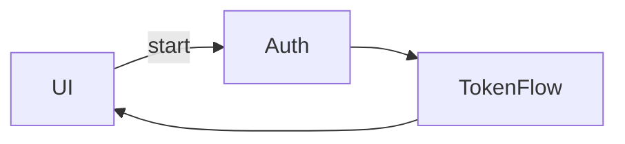

## 1.1 Архитектура авторизации 301.st

* Использует короткоживущий **Access Token (JWT)**
* Долгоживущий **Refresh Cookie** для автоматического входа
* Действия регистрации и восстановления проходят через **OmniFlow**
* Login работает напрямую (password-login или Telegram mini-app)

## 1.2 Turnstile: обязательная проверка на UI

Turnstile используется для защиты от ботов:

* Обязателен при **register**
* Обязателен при **password-login** (email/phone)
* НЕ используется при login через Telegram mini-app

UI обязан:

* загрузить Turnstile widget
* получить клиентский токен
* передать его в API: `turnstile_token`

## 1.3 Access Token и Refresh Cookie

* **Access Token** живёт ~15 мин
* Хранится только в памяти приложения, НЕ в localStorage
* **Refresh Cookie** выдаётся HTTP-only cookie
* UI автоматически отправляет его при обращении к серверу
* При истечении Access Token UI вызывает `/auth/refresh`

## 1.4 OmniFlow

Используется только для:

* регистрации (email confirm, phone OTP)
* восстановления доступа

НЕ используется для login.

## 1.5 Каналы аутентификации

Поддерживаются:

* email (register + password-login)
* phone (register + password-login)
* Telegram mini-app (initData)
* Google OAuth (реализован)

---

# 2. Регистрация (Sign‑Up)

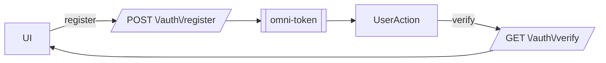

## 2.1 POST /auth/register — Старт регистрации

**Описание:**
Запускает OmniFlow регистрации. В зависимости от канала инициирует:

* email подтверждение (письмо)
* phone OTP (код через SMS/мессенджер)
* Telegram mini-app (через initData)
* Google OAuth 
* Github OAuth (todo)

**Заголовки:**

```
Content-Type: application/json
```

**Пример запроса:**

```bash
curl -X POST https://api.301.st/auth/register \
 -H "Content-Type: application/json" \
 -d '{
   "identifier": "user@example.com",
   "password": "Secret123",
   "turnstile_token": "CLIENT_TURNSTILE_TOKEN"
 }'
```

**Пример ответа:**

```json
{
  "status": "pending",
  "mode": "register",
  "channel": "email",
  "token": "omni_123abc"
}
```

---

## 2.2 Подтверждение email

Пользователь получает письмо со ссылкой вида:

```
https://ui.301.st/auth/verify?token=omni_123abc
```

**Важно:** переход по ссылке **не авторизует автоматически**.

Краткий флоу после клика:

1. Пользователь нажимает ссылку → UI открывается.
2. UI извлекает токен из URL.
3. UI вызывает API: `GET /auth/verify?token=...`.
4. `/auth/verify` завершает регистрацию:

   * создаёт пользователя;
   * создаёт аккаунт и membership;
   * создаёт серверную session;
   * ставит refresh-cookie;
   * выдаёт `access_token`.
5. UI получает ответ → сохраняет access_token (только в памяти).
6. UI выполняет redirect в личный кабинет.

---

## 2.3 Регистрация по телефону (OTP)

UI после `/auth/register` получает:

```json
{
  "status": "code_required",
  "channel": "phone",
  "token": "omni_otp_abc123"
}
```

На UI появляется форма ввода кода.
Валидация выполняется через `/auth/verify?token=...&code=XXXXXX`.

---

## 2.4 Регистрация через Telegram Mini‑App

Telegram передает **initData** внутри WebApp.

UI вызывает:

```bash
POST /auth/register
{
  "identifier": "telegram",
  "tg_init": { ...initData... }
}
```

Ответ:

```json
{
  "status": "auto",
  "mode": "register",
  "channel": "telegram"
}
```

Регистрация завершается внутри `/auth/verify`.

---

# 2.5 Регистрация через Google OAuth

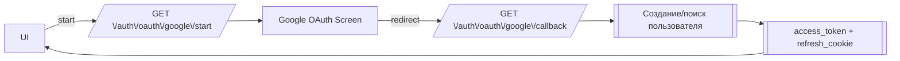

## Описание

Регистрация через Google OAuth — быстрый способ создания учётной записи.
Google гарантирует подлинность email, поэтому:

* **нет Turnstile**
* **нет писем подтверждения**
* **нет OTP**
* **нет OmniFlow**

---

## Шаг 1 — Старт OAuth

**Метод:** `GET /auth/oauth/google/start`

Вызывается UI:

```bash
GET https://api.301.st/auth/oauth/google/start
```

Сервер:

1. создаёт `state`
2. записывает state в KV
3. перенаправляет пользователя в Google OAuth

---

## Шаг 2 — Callback

После успешной авторизации Google перенаправляет браузер:

```
GET /auth/oauth/google/callback?code=...&state=...
```

Сервер:

1. проверяет `state`
2. обменивает `code → id_token`
3. извлекает email и google_sub
4. ищет пользователя:

```sql
SELECT id FROM users
WHERE email = ?1
   OR (oauth_provider = 'google' AND oauth_id = ?2)
```

5. если нет — создаёт нового пользователя
6. создаёт аккаунт и membership (owner)
7. создаёт refresh-cookie
8. создаёт access_token и возвращает UI

---

## Пример ответа

```json
{
  "ok": true,
  "user": { "id": 10, "email": "user@gmail.com" },
  "accounts": [
    { "id": 22, "role": "owner", "status": "active" }
  ],
  "active_account_id": 22,
  "access_token": "...jwt...",
  "expires_in": 900
}
```

## Поведение UI

1. UI открывает всплывающее окно Google OAuth.
2. Ждёт redirect на `/auth/oauth/google/callback`.
3. UI получает итоговый access_token.
4. Сохраняет его в памяти.
5. Делает redirect в личный кабинет.

---
## 2.6 Поведение UI

* Проверка Turnstile перед отправкой формы
* Переход в режим ожидания (pending)
* Для email — ожидание клика по ссылке
* Для phone — форма для ввода OTP
* Для Telegram — автоматический переход
* После verify — получение access_token + refresh cookie

# 3. Вход (Login)

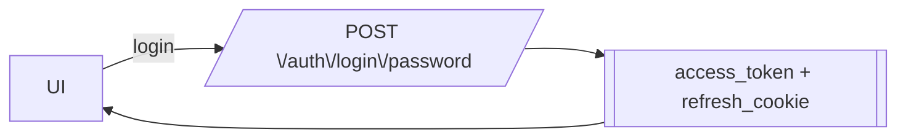

## 3.1 Email / Phone + Password — POST /auth/login/password

**Описание:**
Классический вход по паролю. Без писем, без SMS, без OmniFlow.
Возвращает `access_token`, устанавливает `refresh_cookie`, определяет `active_account_id`.

**Пример запроса:**

```bash
curl -X POST https://api.301.st/auth/login/password \
 -H "Content-Type: application/json" \
 -d '{
   "email": "user@example.com",
   "password": "Secret123",
   "turnstile_token": "CLIENT_TURNSTILE_TOKEN"
 }'
```

**Пример ответа:**

```json
{
  "ok": true,
  "access_token": "...jwt...",
  "expires_in": 900,
  "active_account_id": 1
}
```

## 3.2 Telegram Mini-App Auto-Login — GET /auth/login/tg

**Описание:**
Telegram WebApp передаёт `initData`, подписанное Telegram. API автоматически авторизует пользователя без пароля и без OTP.

**Пример ответа:**

```json
{
  "ok": true,
  "access_token": "...jwt...",
  "expires_in": 900,
  "active_account_id": 5
}
```

## 3.3 Что НЕ используется при Login

* нет писем
* нет SMS
* нет OmniFlow
* нет OTP (кроме будущего desktop-входа через Telegram)

## 3.4 Поведение UI после Login

1. UI получает `access_token`.
2. Сохраняет его в оперативной памяти.
3. Сервер автоматически выдал `refresh_cookie`.
4. UI делает redirect в рабочий интерфейс.

# 4. OmniFlow (Verify)

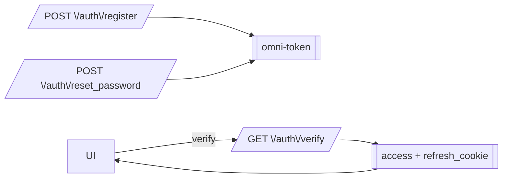

## 4.1 Что такое omni-token

OmniFlow — это универсальный механизм подтверждения критичных действий:

* регистрация (email-подтверждение / phone-OTP)
* восстановление доступа (reset)

Login **не** использует OmniFlow.

Omni-token содержит:

* type: `register` / `reset`
* identifier: email или phone
* channel: email / phone
* TTL: ограниченное время жизни (KV)

---

## 4.2 GET /auth/verify — завершение register/reset

**Описание:**
Используется для завершения OmniFlow. По omni-token выполняет:

* создание пользователя (если новый)
* создание аккаунта (для register)
* создание membership (роль owner)
* создание server-side session
* установку refresh-cookie
* выдачу access_token

**Пример запроса:**

```bash
curl "https://api.301.st/auth/verify?token=omni_123abc"
```

**Пример ответа:**

```json
{
  "ok": true,
  "user": {
    "id": 1,
    "email": "user@example.com"
  },
  "accounts": [
    {
      "id": 5,
      "role": "owner"
    }
  ],
  "active_account_id": 5,
  "access_token": "...jwt...",
  "expires_in": 900
}
```

---

## 4.3 Поддержка кода (OTP)

Если канал требует OTP (телефон или email OTP):
UI вызывает:

```
GET /auth/verify?token=omni_otp_abc123&code=123456
```

* код проверяется
* OmniFlow завершается
* выдаются токены

---

## 4.4 UI-логика состояний

1. После `/auth/register` или `/auth/reset_password` UI получает `token`.
2. Если channel = email → ждёт перехода по ссылке.
3. Если channel = phone → показывает форму ввода OTP.
4. Вызывает `/auth/verify`.
5. Получает `access_token` + `refresh_cookie`.
6. Сохраняет access_token в памяти.
7. Делает redirect в личный кабинет.

---

# 4.5 Reset Password — Start

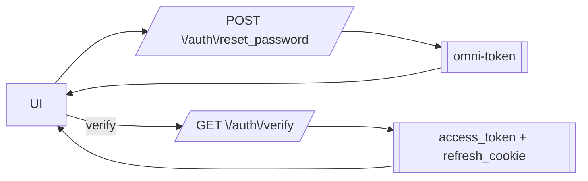

## POST /auth/reset_password — старт восстановления доступа

**Описание:**
Запускает OmniFlow восстановления. Пользователь вводит email или телефон, получает omni-token, затем подтверждает действие (email-link или OTP).

**Заголовки:**

```
Content-Type: application/json
```

**Пример запроса:**

```bash
curl -X POST https://api.301.st/auth/reset_password \
 -H "Content-Type: application/json" \
 -d '{
   "identifier": "user@example.com"
 }'
```

**Пример ответа:**

```json
{
  "status": "pending",
  "mode": "reset",
  "channel": "email",
  "token": "omni_reset_abc123"
}
```

## Поведение UI

### Email

1. UI отправляет `/auth/reset_password`.
2. Получает `token`.
3. Пользователь нажимает ссылку из письма.
4. UI вызывает `/auth/verify?token=...`.
5. Получает access_token.
6. Делает redirect на форму смены пароля.

### Phone (OTP)

1. UI отправляет `/auth/reset_password`.
2. Получает `status: code_required`.
3. UI отображает форму OTP.
4. После ввода кода UI вызывает:

```
GET /auth/verify?token=...&code=123456
```

5. После verify получает access_token.
6. Делает redirect на форму смены пароля.

---

# 4.6 Confirm Password — установка нового пароля

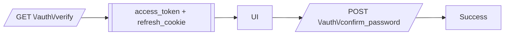

## Описание

`/auth/confirm_password` — завершающий шаг восстановления пароля.
Вызывается только после успешного `/auth/verify` (режим reset), когда пользователь уже авторизован и имеет access_token.

Пользователь вводит новый пароль → UI отправляет запрос.

---

## POST /auth/confirm_password

**Заголовки:**

```
Authorization: Bearer <access_token>
Content-Type: application/json
```

**Пример запроса:**

```bash
curl -X POST https://api.301.st/auth/confirm_password \
 -H "Authorization: Bearer eyJhbGci..." \
 -H "Content-Type: application/json" \
 -d '{
   "new_password": "NewSecret123"
 }'
```

**Пример ответа:**

```json
{ "ok": true }
```

---

## Поведение UI

1. После `/auth/verify` UI получает access_token.
2. Пользователь видит форму смены пароля.
3. UI вызывает `/auth/confirm_password`.
4. Сервер обновляет пароль в D1 (`password_hash`).
5. UI показывает успешное сообщение и делает

---

# 5. Работа с сессиями

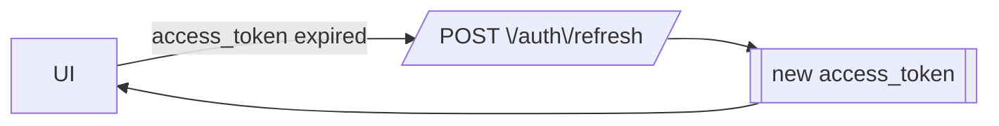

## 5.1 Refresh cookie — как клиент использует его

* Refresh token хранится **только** в HttpOnly cookie `refresh_id`.
* UI не имеет доступа к refresh-токену напрямую.
* UI лишь делает запрос `/auth/refresh`, cookie отправляется автоматически.

Поведение:

1. `access_token` живёт ~15 минут.
2. Когда он истекает — UI вызывает `/auth/refresh`.
3. Сервер выдаёт новый `access_token`.
4. Refresh-токен действует 7 дней (или до logout).

---

## 5.2 POST /auth/refresh — получение нового access_token

**Описание:**
Обновляет access token по действующему refresh cookie.

**Пример запроса:**

```bash
curl -X POST https://api.301.st/auth/refresh \
 -H "Cookie: refresh_id=abcd-1234"
```

**Пример ответа:**

```json
{
  "ok": true,
  "access_token": "...new_jwt...",
  "expires_in": 900
}
```

---

# 5.3 Logout — завершение сессии

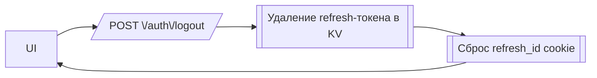

## POST /auth/logout

**Описание:**
Корректно завершает сессию на сервере:

* удаляет refresh-токен из KV;
* очищает `refresh_id` cookie;
* возвращает **204 No Content**;
* не модифицирует записи в таблице `sessions` (D1).

---

## Заголовки

```
Cookie: refresh_id=<uuid>
```

---

## Пример запроса

```bash
curl -X POST https://api.301.st/auth/logout \
  -H "Cookie: refresh_id=fc5b2c90-bd0a-42b1-8043-0f02e7b87abf"
```

---

## Пример ответа (204 No Content)

```
Set-Cookie: refresh_id=; Max-Age=0; Path=/; HttpOnly; Secure; SameSite=Strict
```

---

## Поведение UI

1. UI вызывает `/auth/logout`.
2. Сервер возвращает **204** и очищает cookie.
3. UI должен удалить `access_token` из памяти.
4. UI выполняет redirect на экран входа.

---

## 5.4 Типичное поведение UI при истечении токена

1. UI вызывает защищённый API.
2. API отвечает `401 unauthorized`.
3. UI делает `POST /auth/refresh`.
4. Если refresh валиден → получает новый access token.
5. Повторяет предыдущий запрос.
6. Если refresh недействителен → redirect на страницу логина.

---

# 6. Информация о пользователе

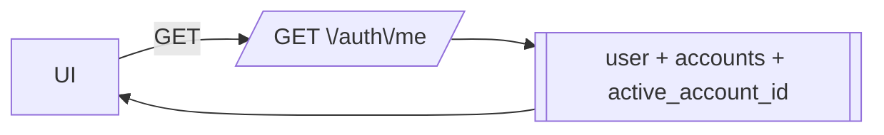

## 6.1 GET /auth/me — какие данные возвращаются

**Описание:**
Возвращает информацию о текущем пользователе и всех его аккаунтах.

**Пример ответа:**

```json
{
  "ok": true,
  "user": {
    "id": 9,
    "email": "user@example.com",
    "phone": "+79991234567",
    "tg_id": 123456,
    "name": "John Doe",
    "user_type": "client"
  },
  "accounts": [
    {
      "id": 5,
      "role": "owner",
      "status": "active",
      "owner_user_id": 9
    },
    {
      "id": 7,
      "role": "editor",
      "status": "active",
      "owner_user_id": 11
    }
  ],
  "active_account_id": 5
}
```

---

## 6.2 Список аккаунтов — что выводить на UI

UI должен отображать:

* название / идентификатор аккаунта (если есть)
* роль пользователя: `owner`, `editor`, `viewer`
* статус аккаунта: `active` / `suspended`

UI может дать пользователю выбор смены активного аккаунта.

---

## 6.3 active_account_id — логика выбора

* при login / verify сервер передаёт актуальный `active_account_id`
* если пользователь имеет несколько аккаунтов — UI может переключать их
* UI должен передавать `account_id` в рабочие API (по мере интеграции)

Алгоритм выбора active_account_id на бэкенде:

1. если есть `owner` аккаунт → он приоритетный
2. иначе выбирается первый доступный из списка
3. если в JWT есть `account_id`, он используется как активный

---

# 7. Обработка ошибок на UI

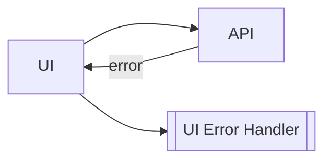

## 7.1 Общие ошибки (400 / 401 / 403)

* **400 Bad Request** — неверные данные в запросе (отсутствует поле, неверный формат).
* **401 Unauthorized** — нет access_token или он неверен.
* **403 Forbidden** — нет доступа к ресурсу (нет аккаунта или роли).

UI должен показывать: *"Проверьте данные или войдите заново"*.

---

## 7.2 Ошибки Turnstile

Возникают при регистрации и password-login.

Типичные ошибки:

* `turnstile_invalid`
* `turnstile_required`
* `turnstile_failed`

UI действия:

1. перезагрузить widget Turnstile
2. дать пользователю повторить отправку

---

## 7.3 Ошибки OmniFlow

Возникают при verify:

* `invalid_or_expired_token`
* `token_required`
* `wrong_code`
* `code_required`

UI действия:

* для email: запросить новую ссылку
* для phone: дать снова ввести код

---

## 7.4 Ошибки логина

* `invalid_login` — неправильный email/phone или пароль
* `no_account` — пользователь существует, но нет аккаунтов (редкий случай)
* `missing_credentials` — UI не передал email/phone/password

UI действия:

* показать понятное сообщение
* позволить повторить ввод
* предложить reset password

---

# 8. Примеры UI-флоу

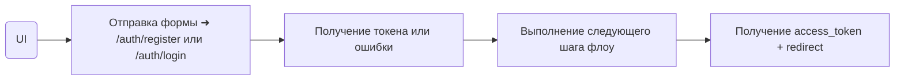

---

## 8.1 Регистрация: email

1. UI отправляет `/auth/register` c email + password + Turnstile.
2. API возвращает `status: pending` и `token`.
3. Пользователь нажимает ссылку из письма.
4. UI вызывает `/auth/verify?token=...`.
5. Получает токены → redirect в личный кабинет.

---

## 8.2 Регистрация: phone + OTP

1. UI отправляет `/auth/register` с phone + password.
2. API возвращает `status: code_required`.
3. UI показывает форму OTP.
4. Пользователь вводит код.
5. UI вызывает `/auth/verify?token=...&code=XXXXXX`.
6. Получает токены → redirect.

---

## 8.3 Регистрация: Telegram Mini-App

1. Пользователь открывает WebApp.
2. UI получает `initData`.
3. UI отправляет `/auth/register` с `tg_init`.
4. `/auth/verify` завершает регистрацию автоматически.
5. UI получает access_token.

---

## 8.4 Вход: password-login

1. UI отправляет `/auth/login/password`.
2. Получает access_token + refresh_cookie.
3. UI делает redirect в личный кабинет.

---

## 8.5 Автообновление токена

1. UI вызывает защищённый endpoint.
2. Получает `401 unauthorized`.
3. UI делает `POST /auth/refresh`.
4. Сервер возвращает новый access_token.
5. UI повторяет запрос.

---

# 9. Безопасность на стороне UI

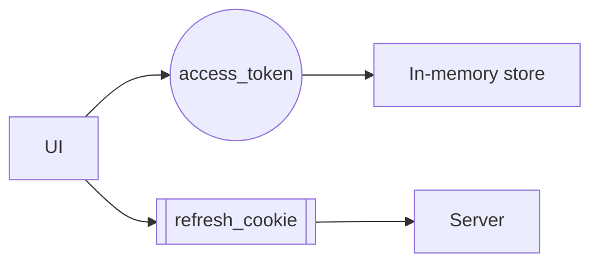

## 9.1 Требования к хранению access_token

* **Хранить только в памяти** приложения (Vuex/Pinia/Redux/Zustand).
* Не сохранять в `localStorage`, `sessionStorage`, `IndexedDB`.
* Нельзя передавать через URL.
* Передавать только в заголовке `Authorization: Bearer <token>`.

---

## 9.2 Требования к cookie

* Refresh-токен хранится только в `HttpOnly` cookie.
* UI не имеет доступа к его содержимому.
* Cookie отправляется браузером автоматически.
* Нельзя хранить refresh в памяти или где-либо ещё.

---

## 9.3 Turnstile — обязательная проверка

* Всегда активировать Turnstile для `/auth/register`.
* Всегда для `/auth/login/password`.
* Не использовать Turnstile для Telegram Mini-App.
* При ошибке Turnstile — UI предлагает повторить.

**Проверка Cloudflare Turnstile** — антибот‑механизм от Cloudflare, аналог reCAPTCHA.
   Проверяет, что запрос выполнен человеком. Отправляется `token` с фронтенда на API:

    Пример для UI JavaScript API

    ```js
    // При клике на "Зарегистрироваться"
    async function handleRegister(email, password) {
      // 1. Получить токен от Turnstile
      const turnstileToken = await turnstile.execute();

      // 2. Отправить на API
      const response = await fetch('https://api.301.st/auth/register', {
        method: 'POST',
        headers: { 'Content-Type': 'application/json' },
        body: JSON.stringify({
          email,
          password,
          turnstile_token: turnstileToken  // ← Backend проверит
        })
      });
    }
```

   ```bash
   curl -X POST https://api.301.st/auth/register \
     -H "Content-Type: application/json" \
     -d '{"email":"user@site.com","password":"secret123","turnstile_token":"..."}'
   ```

   Воркер обращается к API Turnstile:

   ```js
   // Проверка токена от фронтенда
    const verify = await fetch(
      'https://challenges.cloudflare.com/turnstile/v0/siteverify',
      {
        method: 'POST',
        body: new URLSearchParams({
          secret: env.TURNSTILE_SECRET,  // Secret Key из secrets
          response: turnstile_token,      // От фронтенда
          remoteip: ip
        })
      }
    );

    const data = await verify.json();
    if (!data.success) {
      return false;  // Бот обнаружен
    }
   ```

   При неуспешной верификации возвращается `403 Forbidden`.

---

## 9.4 Защита от повторных запросов в OmniFlow

* UI должен блокировать повторную отправку OTP.
* UI должен отображать таймер повторной отправки.
* При `invalid_or_expired_token` — выводить вариант запроса новой ссылки/OTP.
* Не повторять вызов `/auth/verify` без изменения входных данных.

---

