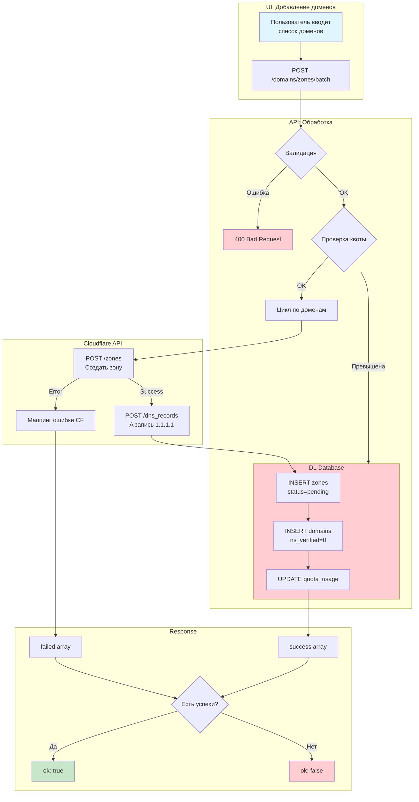
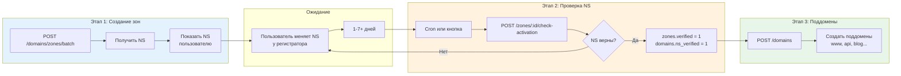

##  Domains API

### Базовый URL

```
https://api.301.st/domains
```

---

### 1 GET /domains

Список всех доменов аккаунта с группировкой по root domain (2-го уровня).

**Требует:** `Authorization: Bearer <access_token>`

**Query параметры:**

| Параметр | Тип | Описание |
|----------|-----|----------|
| `role` | string | Фильтр по роли: `acceptor`, `donor`, `reserve` |
| `blocked` | boolean | Фильтр по блокировке: `true`, `false` |
| `zone_id` | number | Фильтр по зоне |
| `site_id` | number | Фильтр по сайту |
| `project_id` | number | Фильтр по проекту |

**Пример запроса:**

```bash
curl -X GET "https://api.301.st/domains" \
  -H "Authorization: Bearer <access_token>"
```

**Успешный ответ:**

```json
{
  "ok": true,
  "total": 5,
  "groups": [
    {
      "root": "example.com",
      "zone_id": 1,
      "domains": [
        {
          "id": 1,
          "site_id": 10,
          "zone_id": 1,
          "key_id": 42,
          "parent_id": null,
          "domain_name": "example.com",
          "role": "acceptor",
          "ns": "ns1.cloudflare.com,ns2.cloudflare.com",
          "ns_verified": 1,
          "proxied": 1,
          "blocked": 0,
          "blocked_reason": null,
          "ssl_status": "valid",
          "expired_at": null,
          "created_at": "2025-01-10T08:00:00Z",
          "updated_at": "2025-01-10T08:00:00Z",
          "site_name": "Main Landing",
          "site_status": "active",
          "project_id": 5,
          "project_name": "Brand Campaign Q1"
        },
        {
          "id": 2,
          "site_id": 10,
          "zone_id": 1,
          "key_id": 42,
          "parent_id": 1,
          "domain_name": "api.example.com",
          "role": "acceptor",
          "ns": "ns1.cloudflare.com,ns2.cloudflare.com",
          "ns_verified": 1,
          "proxied": 1,
          "blocked": 0,
          "blocked_reason": null,
          "ssl_status": "valid",
          "expired_at": null,
          "created_at": "2025-01-11T09:00:00Z",
          "updated_at": "2025-01-11T09:00:00Z",
          "site_name": "Main Landing",
          "site_status": "active",
          "project_id": 5,
          "project_name": "Brand Campaign Q1"
        },
        {
          "id": 3,
          "site_id": null,
          "zone_id": 1,
          "key_id": 42,
          "parent_id": 1,
          "domain_name": "blog.example.com",
          "role": "reserve",
          "ns": "ns1.cloudflare.com,ns2.cloudflare.com",
          "ns_verified": 1,
          "proxied": 1,
          "blocked": 0,
          "blocked_reason": null,
          "ssl_status": "valid",
          "expired_at": null,
          "created_at": "2025-01-11T10:00:00Z",
          "updated_at": "2025-01-11T10:00:00Z",
          "site_name": null,
          "site_status": null,
          "project_id": null,
          "project_name": null
        }
      ]
    },
    {
      "root": "promo-brand.io",
      "zone_id": 2,
      "domains": [
        {
          "id": 4,
          "site_id": 10,
          "zone_id": 2,
          "key_id": 42,
          "parent_id": null,
          "domain_name": "promo-brand.io",
          "role": "donor",
          "ns": "ns3.cloudflare.com,ns4.cloudflare.com",
          "ns_verified": 1,
          "proxied": 1,
          "blocked": 0,
          "blocked_reason": null,
          "ssl_status": "valid",
          "expired_at": null,
          "created_at": "2025-01-12T08:00:00Z",
          "updated_at": "2025-01-12T08:00:00Z",
          "site_name": "Main Landing",
          "site_status": "active",
          "project_id": 5,
          "project_name": "Brand Campaign Q1"
        }
      ]
    }
  ]
}
```

**С фильтрами:**

```bash
# Только заблокированные домены
curl -X GET "https://api.301.st/domains?blocked=true" \
  -H "Authorization: Bearer <access_token>"

# Только доноры
curl -X GET "https://api.301.st/domains?role=donor" \
  -H "Authorization: Bearer <access_token>"

# Домены конкретного сайта
curl -X GET "https://api.301.st/domains?site_id=10" \
  -H "Authorization: Bearer <access_token>"

# Домены конкретного проекта
curl -X GET "https://api.301.st/domains?project_id=5" \
  -H "Authorization: Bearer <access_token>"
```

---

### 2 GET /domains/:id

Получить детали конкретного домена.

**Требует:** `Authorization: Bearer <access_token>`

**Пример запроса:**

```bash
curl -X GET "https://api.301.st/domains/2" \
  -H "Authorization: Bearer <access_token>"
```

**Успешный ответ:**

```json
{
  "ok": true,
  "domain": {
    "id": 2,
    "account_id": 1,
    "site_id": 10,
    "zone_id": 1,
    "key_id": 42,
    "parent_id": 1,
    "domain_name": "api.example.com",
    "role": "acceptor",
    "ns": "ns1.cloudflare.com,ns2.cloudflare.com",
    "ns_verified": 1,
    "proxied": 1,
    "blocked": 0,
    "blocked_reason": null,
    "ssl_status": "valid",
    "expired_at": null,
    "created_at": "2025-01-11T09:00:00Z",
    "updated_at": "2025-01-11T09:00:00Z",
    "cf_zone_id": "abc123def456",
    "zone_status": "active",
    "ns_expected": "ns1.cloudflare.com,ns2.cloudflare.com",
    "site_name": "Main Landing",
    "site_status": "active",
    "project_id": 5,
    "project_name": "Brand Campaign Q1"
  }
}
```

**Ошибки:**

```json
{
  "ok": false,
  "error": "domain_not_found"
}
```

---

### 3 POST /domains

Создать поддомен (3-го/4-го уровня).

**Требует:** `Authorization: Bearer <access_token>` (owner или editor)

> **Важно:** 
> - Root домены (2-го уровня) создаются через `POST /domains/zones/batch`
> - Зона должна быть верифицирована (`zones.verified = 1`)
> - Создаётся DNS A запись в Cloudflare

**Параметры запроса:**

| Поле | Тип | Обязательно | Описание |
|------|-----|-------------|----------|
| `domain_name` | string | да | Полное имя домена (только 3-й+ уровень) |
| `zone_id` | number | **да** | ID зоны (должна быть verified) |
| `parent_id` | number | нет | ID родительского домена |
| `role` | string | нет | Роль: `acceptor`, `donor`, `reserve` (по умолчанию: `reserve`) |

**Пример запроса:**

```bash
curl -X POST "https://api.301.st/domains" \
  -H "Authorization: Bearer <access_token>" \
  -H "Content-Type: application/json" \
  -d '{
    "domain_name": "promo.example.com",
    "zone_id": 1,
    "parent_id": 1,
    "role": "donor"
  }'
```

**Успешный ответ:**

```json
{
  "ok": true,
  "domain": {
    "id": 6,
    "domain_name": "promo.example.com",
    "zone_id": 1,
    "parent_id": 1,
    "role": "donor",
    "cf_dns_record_id": "abc123def456"
  }
}
```

**Ошибки:**

```json
// Попытка создать root domain
{
  "ok": false,
  "error": "cannot_create_root_domain",
  "message": "Root domains (2nd level) are created via /domains/zones/batch."
}

// Не указан zone_id
{
  "ok": false,
  "error": "zone_id_required"
}

// Зона не верифицирована (NS не настроены)
{
  "ok": false,
  "error": "zone_not_verified",
  "message": "NS записи ещё не подтверждены. Проверьте статус зоны."
}

// Домен уже существует
{
  "ok": false,
  "error": "domain_already_exists"
}

// Зона не найдена
{
  "ok": false,
  "error": "zone_not_found"
}

// Родительский домен не найден
{
  "ok": false,
  "error": "parent_not_found"
}

// Превышена квота доменов
{
  "ok": false,
  "error": "quota_exceeded",
  "limit": 200,
  "used": 200
}

// Ошибка создания DNS в CF
{
  "ok": false,
  "error": "dns_create_failed",
  "message": "Record already exists"
}
```

---

### 4 PATCH /domains/:id

Обновить домен.

**Требует:** `Authorization: Bearer <access_token>` (owner или editor)

**Параметры запроса:**

| Поле | Тип | Описание |
|------|-----|----------|
| `role` | string | Новая роль: `acceptor`, `donor`, `reserve` |
| `site_id` | number/null | Привязка к сайту |
| `blocked` | boolean | Статус блокировки |
| `blocked_reason` | string/null | Причина блокировки |

**Пример запроса:**

```bash
curl -X PATCH "https://api.301.st/domains/2" \
  -H "Authorization: Bearer <access_token>" \
  -H "Content-Type: application/json" \
  -d '{
    "role": "donor",
    "blocked": true,
    "blocked_reason": "ad_network"
  }'
```

**Успешный ответ:**

```json
{
  "ok": true
}
```

**Ошибки:**

```json
// Домен не найден
{
  "ok": false,
  "error": "domain_not_found"
}

// Нет полей для обновления
{
  "ok": false,
  "error": "no_fields_to_update"
}
```

---

### 5 DELETE /domains/:id

Удалить домен (поддомен).

**Требует:** `Authorization: Bearer <access_token>` (owner или editor)

> **Важно:** 
> - Root домены (2-го уровня) удалить нельзя — они управляются через зоны
> - При удалении поддомена также удаляется DNS запись в Cloudflare
> - Квота доменов уменьшается на 1

**Пример запроса:**

```bash
curl -X DELETE "https://api.301.st/domains/6" \
  -H "Authorization: Bearer <access_token>"
```

**Успешный ответ:**

```json
{
  "ok": true,
  "dns_deleted": true
}
```

**Поля ответа:**

| Поле | Тип | Описание |
|------|-----|----------|
| `ok` | boolean | Успех операции |
| `dns_deleted` | boolean | Была ли удалена DNS запись в CF |

> **Примечание:** `dns_deleted: false` означает что DNS запись не найдена в CF или произошла ошибка при удалении. Домен всё равно удаляется из D1.

**Ошибки:**

```json
// Домен не найден
{
  "ok": false,
  "error": "domain_not_found"
}

// Нельзя удалить root домен
{
  "ok": false,
  "error": "cannot_delete_root_domain",
  "message": "Root domain is managed by zone. Delete the zone instead."
}
```
---

### 6 Роли доменов

| Роль | Описание | Может быть primary? |
|------|----------|---------------------|
| `acceptor` | Основной домен (лендинг, TDS) — принимает трафик | ✅ Да |
| `donor` | Донор для редиректов (используется в рекламе) | ❌ Нет |
| `reserve` | В резерве, не привязан к сайту | ❌ Нет |

---

### 7 Причины блокировки

| Причина | Описание |
|---------|----------|
| `unavailable` | Домен недоступен технически |
| `ad_network` | Заблокирован рекламной сетью |
| `hosting_registrar` | Заблокирован хостингом/регистратором |
| `government` | Государственная блокировка |
| `manual` | Ручная блокировка пользователем |

---

### 8 Связь с Site/Project

Домены связаны с проектами через сайты:

```
Domain.site_id → Site.project_id → Project
```

**Поля из связанных таблиц:**

| Поле | Источник | Описание |
|------|----------|----------|
| `site_name` | sites.site_name | Название сайта |
| `site_status` | sites.status | Статус сайта: `active`, `paused`, `archived` |
| `project_id` | projects.id | ID проекта |
| `project_name` | projects.project_name | Название проекта |

> **Примечание:** Если `site_id = null`, домен находится в резерве (Free Domains) и не привязан к проекту.

---

### 9 Таблица endpoints

| Endpoint | Метод | Auth | Описание |
|----------|-------|------|----------|
| `/domains` | GET | ✅ JWT | Список доменов с группировкой |
| `/domains/:id` | GET | ✅ JWT | Детали домена |
| `/domains` | POST | ✅ JWT (editor) | Создать поддомен + DNS |
| `/domains/batch` | POST | ✅ JWT (editor) | **Batch поддомены (до 10)** |
| `/domains/:id` | PATCH | ✅ JWT (editor) | Обновить домен |
| `/domains/:id` | DELETE | ✅ JWT (editor) | Удалить домен + DNS |
| `/domains/zones/batch` | POST | ✅ JWT (owner) | **Batch создание зон (до 10)** |

---

### 10 POST /domains/zones/batch

Batch создание зон в Cloudflare для списка root доменов.

**Требует:** `Authorization: Bearer <access_token>` (только owner)

> **Этап 1 из 3:** Создание зон → получение NS. После этого пользователь настраивает NS у регистратора. Проверка NS — отдельный этап (cron или `/zones/:id/check-activation`).

**Параметры запроса:**

| Поле | Тип | Обязательно | Описание |
|------|-----|-------------|----------|
| `account_key_id` | number | да | ID ключа Cloudflare из `account_keys` |
| `domains` | string[] | да | Массив root доменов (max 10) |

**Лимиты:**

| Параметр | Значение |
|----------|----------|
| Max доменов за запрос | 10 |
| CF API rate limit | 1,200 req / 5 min (на аккаунт) |

**Пример запроса:**

```bash
curl -X POST "https://api.301.st/domains/zones/batch" \
  -H "Authorization: Bearer <access_token>" \
  -H "Content-Type: application/json" \
  -d '{
    "account_key_id": 42,
    "domains": ["example.com", "mysite.co.uk", "promo.net"]
  }'
```

**Успешный ответ (partial success):**

```json
{
  "ok": true,
  "results": {
    "success": [
      {
        "domain": "example.com",
        "zone_id": 1,
        "cf_zone_id": "abc123def456",
        "name_servers": ["ns1.cloudflare.com", "ns2.cloudflare.com"],
        "status": "pending"
      },
      {
        "domain": "mysite.co.uk",
        "zone_id": 2,
        "cf_zone_id": "def456ghi789",
        "name_servers": ["ns3.cloudflare.com", "ns4.cloudflare.com"],
        "status": "pending"
      }
    ],
    "failed": [
      {
        "domain": "promo.net",
        "error": "zone_in_another_account",
        "error_message": "Домен уже добавлен в другой Cloudflare аккаунт"
      }
    ]
  }
}
```

**Полный успех:**

```json
{
  "ok": true,
  "results": {
    "success": [
      {
        "domain": "example.com",
        "zone_id": 1,
        "cf_zone_id": "abc123def456",
        "name_servers": ["ns1.cloudflare.com", "ns2.cloudflare.com"],
        "status": "pending"
      }
    ],
    "failed": []
  }
}
```

**Полная ошибка:**

```json
{
  "ok": false,
  "results": {
    "success": [],
    "failed": [
      {
        "domain": "banned-domain.com",
        "error": "zone_banned",
        "error_message": "Домен заблокирован Cloudflare (blacklist)"
      }
    ]
  }
}
```

---

#### 10.1 Коды ошибок Cloudflare

| CF Code | Наш код | Описание |
|---------|---------|----------|
| 1061 | `not_registrable` | Это поддомен, не регистрируемый домен. Сначала добавьте root domain |
| 1097 | `zone_already_in_cf` | Зона уже существует в этом Cloudflare аккаунте |
| 1049 | `zone_banned` | Домен заблокирован Cloudflare (blacklist) |
| 1099 | `zone_held` | Домен заблокирован (held) в Cloudflare |
| 1105 | `zone_in_another_account` | Домен уже добавлен в другой Cloudflare аккаунт |
| 1224 | `zone_already_pending` | Домен уже ожидает активации в этом аккаунте |

---

#### 10.2 Ошибки валидации

```json
// Не указан ключ
{
  "ok": false,
  "error": "missing_field",
  "field": "account_key_id"
}

// Пустой список доменов
{
  "ok": false,
  "error": "missing_field",
  "field": "domains"
}

// Превышен лимит доменов
{
  "ok": false,
  "error": "too_many_domains",
  "max": 10,
  "received": 15
}

// Ключ не найден
{
  "ok": false,
  "error": "key_not_found"
}

// Ключ не Cloudflare
{
  "ok": false,
  "error": "key_not_cloudflare"
}

// Не указан CF Account ID
{
  "ok": false,
  "error": "cf_account_id_missing"
}

// Превышена квота зон
{
  "ok": false,
  "error": "quota_exceeded:zones:need=5:available=2"
}
```

---

#### 10.3 Flow диаграмма



---

#### 10.4 UX Flow (3 этапа)



---

#### 10.5 Что происходит при создании

Для каждого домена в batch:

1. **CF: Создание зоны** — `POST /zones`
2. **CF: A запись** — `POST /zones/{id}/dns_records` с `1.1.1.1` (placeholder)
3. **D1: zones** — `INSERT` с `status='pending'`, `verified=0`
4. **D1: domains** — `INSERT` с `ns_verified=0`, `role='reserve'`
5. **D1: quota_usage** — `UPDATE` инкремент `zones_used`, `domains_used`

---

### 11 POST /domains/batch

Batch создание поддоменов (до 10 за раз).

**Требует:** `Authorization: Bearer <access_token>` (owner или editor)

> **Этап 3:** Создание поддоменов после верификации зоны (`zones.verified = 1`).

**Параметры запроса:**

| Поле | Тип | Обязательно | Описание |
|------|-----|-------------|----------|
| `zone_id` | number | да | ID зоны (должна быть verified) |
| `domains` | array | да | Массив поддоменов (max 10) |
| `domains[].name` | string | да | Короткое имя: `www`, `api`, `blog` |
| `domains[].role` | string | нет | Роль: `acceptor`, `donor`, `reserve` (по умолчанию: `reserve`) |

**Лимиты:**

| Параметр | Значение |
|----------|----------|
| Max доменов за запрос | 10 |
| Проверка квоты | Перед созданием |

**Пример запроса:**

```bash
curl -X POST "https://api.301.st/domains/batch" \
  -H "Authorization: Bearer <access_token>" \
  -H "Content-Type: application/json" \
  -d '{
    "zone_id": 1,
    "domains": [
      { "name": "www", "role": "acceptor" },
      { "name": "api", "role": "acceptor" },
      { "name": "blog" },
      { "name": "promo", "role": "donor" }
    ]
  }'
```

**Успешный ответ (partial success):**

```json
{
  "ok": true,
  "results": {
    "success": [
      {
        "domain": "www.example.com",
        "id": 10,
        "cf_dns_record_id": "abc123"
      },
      {
        "domain": "api.example.com",
        "id": 11,
        "cf_dns_record_id": "def456"
      },
      {
        "domain": "promo.example.com",
        "id": 12,
        "cf_dns_record_id": "ghi789"
      }
    ],
    "failed": [
      {
        "domain": "blog.example.com",
        "error": "domain_already_exists"
      }
    ]
  }
}
```

**Полный успех:**

```json
{
  "ok": true,
  "results": {
    "success": [
      {
        "domain": "www.example.com",
        "id": 10,
        "cf_dns_record_id": "abc123"
      }
    ],
    "failed": []
  }
}
```

---

#### 11.1 Ошибки валидации

```json
// Не указан zone_id
{
  "ok": false,
  "error": "missing_field",
  "field": "zone_id"
}

// Пустой список доменов
{
  "ok": false,
  "error": "missing_field",
  "field": "domains"
}

// Превышен лимит
{
  "ok": false,
  "error": "too_many_domains",
  "max": 10,
  "received": 15
}

// Зона не найдена
{
  "ok": false,
  "error": "zone_not_found"
}

// Зона не верифицирована
{
  "ok": false,
  "error": "zone_not_verified",
  "message": "NS записи ещё не подтверждены. Проверьте статус зоны."
}

// Превышена квота
{
  "ok": false,
  "error": "quota_exceeded",
  "limit": 200,
  "used": 195,
  "requested": 10
}
```

---

#### 11.2 Ошибки в failed array

| Код | Описание |
|-----|----------|
| `domain_already_exists` | Домен уже существует в D1 |
| `dns_create_failed: <message>` | Ошибка создания DNS в CF |
| `db_write_failed` | Ошибка записи в D1 (DNS создан) |

---

#### 11.3 Что происходит при создании

Для каждого поддомена в batch:

1. **Валидация** — проверка уникальности в D1
2. **CF: A запись** — `POST /zones/{id}/dns_records` с `1.1.1.1`
3. **D1: domains** — `INSERT` с `ns_verified=1`, `parent_id` от root
4. **Quota** — инкремент `domains_used` по завершению


