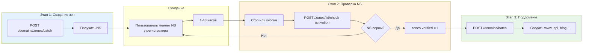

## Domains API

### Базовый URL

```
https://api.301.st/domains
```

---

### 1 GET /domains

Список всех доменов аккаунта с группировкой по root domain (2-го уровня).

**Требует:** `Authorization: Bearer <access_token>`

**Query параметры:**

| Параметр | Тип | Описание |
|----------|-----|----------|
| `role` | string | Фильтр по роли: `acceptor`, `donor`, `reserve` |
| `blocked` | boolean | Фильтр по блокировке: `true`, `false` |
| `zone_id` | number | Фильтр по зоне |
| `site_id` | number | Фильтр по сайту |
| `project_id` | number | Фильтр по проекту |

**Пример запроса:**

```bash
curl -X GET "https://api.301.st/domains" \
  -H "Authorization: Bearer <access_token>"
```

**Успешный ответ:**

```json
{
  "ok": true,
  "total": 5,
  "groups": [
    {
      "root": "example.com",
      "zone_id": 1,
      "domains": [
        {
          "id": 1,
          "site_id": 10,
          "zone_id": 1,
          "key_id": 42,
          "project_id": 5,
          "domain_name": "example.com",
          "role": "acceptor",
          "ns": "ns1.cloudflare.com,ns2.cloudflare.com",
          "ns_verified": 1,
          "proxied": 1,
          "blocked": 0,
          "blocked_reason": null,
          "ssl_status": "valid",
          "expired_at": null,
          "created_at": "2025-01-10T08:00:00Z",
          "updated_at": "2025-01-10T08:00:00Z",
          "site_name": "Main Landing",
          "site_status": "active",
          "project_name": "Brand Campaign Q1",
          "health": {
            "status": "healthy",
            "threat_score": null,
            "categories": null,
            "checked_at": null
          }
        },
        {
          "id": 2,
          "site_id": 10,
          "zone_id": 1,
          "key_id": 42,
          "project_id": 5,
          "domain_name": "api.example.com",
          "role": "acceptor",
          "ns": "ns1.cloudflare.com,ns2.cloudflare.com",
          "ns_verified": 1,
          "proxied": 1,
          "blocked": 0,
          "blocked_reason": null,
          "ssl_status": "valid",
          "expired_at": null,
          "created_at": "2025-01-11T09:00:00Z",
          "updated_at": "2025-01-11T09:00:00Z",
          "site_name": "Main Landing",
          "site_status": "active",
          "project_name": "Brand Campaign Q1",
          "health": {
            "status": "warning",
            "threat_score": 2,
            "categories": ["spam"],
            "checked_at": "2025-01-15T10:00:00Z"
          }
        },
        {
          "id": 3,
          "site_id": null,
          "zone_id": 1,
          "key_id": 42,
          "project_id": null,
          "domain_name": "blog.example.com",
          "role": "reserve",
          "ns": "ns1.cloudflare.com,ns2.cloudflare.com",
          "ns_verified": 1,
          "proxied": 1,
          "blocked": 1,
          "blocked_reason": "phishing",
          "ssl_status": "valid",
          "expired_at": null,
          "created_at": "2025-01-11T10:00:00Z",
          "updated_at": "2025-01-11T10:00:00Z",
          "site_name": null,
          "site_status": null,
          "project_name": null,
          "health": {
            "status": "blocked",
            "threat_score": null,
            "categories": null,
            "checked_at": null
          }
        }
      ]
    },
    {
      "root": "promo-brand.io",
      "zone_id": 2,
      "domains": [
        {
          "id": 4,
          "site_id": 10,
          "zone_id": 2,
          "key_id": 42,
          "project_id": 5,
          "domain_name": "promo-brand.io",
          "role": "donor",
          "ns": "ns3.cloudflare.com,ns4.cloudflare.com",
          "ns_verified": 1,
          "proxied": 1,
          "blocked": 0,
          "blocked_reason": null,
          "ssl_status": "valid",
          "expired_at": null,
          "created_at": "2025-01-12T08:00:00Z",
          "updated_at": "2025-01-12T08:00:00Z",
          "site_name": "Main Landing",
          "site_status": "active",
          "project_name": "Brand Campaign Q1",
          "health": {
            "status": "unknown",
            "threat_score": null,
            "categories": null,
            "checked_at": null
          }
        }
      ]
    }
  ]
}
```

**Поле `health` (для UI светофора):**

| Поле | Тип | Описание |
|------|-----|----------|
| `status` | string | Статус здоровья: `blocked`, `warning`, `healthy`, `unknown` |
| `threat_score` | number/null | Количество malicious детекций (VT) |
| `categories` | string[]/null | Категории угроз: `["gambling", "spam", "phishing"]` |
| `checked_at` | string/null | Время последней проверки (ISO 8601) |

**Светофор UI:**

| Статус | Цвет | Условие |
|--------|------|---------|
| `blocked` | 🔴 | `blocked = 1` |
| `warning` | 🟡 | `threat_score > 0` или traffic anomaly |
| `healthy` | 🟢 | Проверен, угроз нет |
| `unknown` | ⚪ | Нет данных о проверке |

**С фильтрами:**

```bash
# Только заблокированные домены
curl -X GET "https://api.301.st/domains?blocked=true" \
  -H "Authorization: Bearer <access_token>"

# Только доноры
curl -X GET "https://api.301.st/domains?role=donor" \
  -H "Authorization: Bearer <access_token>"

# Домены конкретного сайта
curl -X GET "https://api.301.st/domains?site_id=10" \
  -H "Authorization: Bearer <access_token>"

# Домены конкретного проекта
curl -X GET "https://api.301.st/domains?project_id=5" \
  -H "Authorization: Bearer <access_token>"
```

---

### 2 GET /domains/:id

Получить детали конкретного домена.

**Требует:** `Authorization: Bearer <access_token>`

**Пример запроса:**

```bash
curl -X GET "https://api.301.st/domains/2" \
  -H "Authorization: Bearer <access_token>"
```

**Успешный ответ:**

```json
{
  "ok": true,
  "domain": {
    "id": 2,
    "account_id": 1,
    "site_id": 10,
    "zone_id": 1,
    "key_id": 42,
    "project_id": 5,
    "domain_name": "api.example.com",
    "role": "acceptor",
    "ns": "ns1.cloudflare.com,ns2.cloudflare.com",
    "ns_verified": 1,
    "proxied": 1,
    "blocked": 0,
    "blocked_reason": null,
    "ssl_status": "valid",
    "expired_at": null,
    "created_at": "2025-01-11T09:00:00Z",
    "updated_at": "2025-01-11T09:00:00Z",
    "cf_zone_id": "abc123def456",
    "zone_status": "active",
    "ns_expected": "ns1.cloudflare.com,ns2.cloudflare.com",
    "site_name": "Main Landing",
    "site_status": "active",
    "project_name": "Brand Campaign Q1"
  }
}
```

**Ошибки:**

```json
{
  "ok": false,
  "error": "domain_not_found"
}
```

---

### 3 POST /domains

Создать поддомен (3-го/4-го уровня).

**Требует:** `Authorization: Bearer <access_token>` (owner или editor)

> **Важно:**
> - Root домены (2-го уровня) создаются через `POST /domains/zones/batch`
> - Зона должна быть верифицирована (`zones.verified = 1`)
> - Создаётся DNS A запись в Cloudflare автоматически
> - Роль всегда `reserve` при создании (управляется автоматически)

**Параметры запроса:**

| Поле | Тип | Обязательно | Описание |
|------|-----|-------------|----------|
| `domain_name` | string | да | Полное имя домена (только 3-й+ уровень) |
| `zone_id` | number | **да** | ID зоны (должна быть verified) |

**Пример запроса:**

```bash
curl -X POST "https://api.301.st/domains" \
  -H "Authorization: Bearer <access_token>" \
  -H "Content-Type: application/json" \
  -d '{
    "domain_name": "promo.example.com",
    "zone_id": 1
  }'
```

**Успешный ответ:**

```json
{
  "ok": true,
  "domain": {
    "id": 6,
    "domain_name": "promo.example.com",
    "zone_id": 1,
    "role": "reserve",
    "cf_dns_record_id": "abc123def456"
  }
}
```

**Ошибки:**

```json
// Попытка создать root domain
{
  "ok": false,
  "error": "cannot_create_root_domain",
  "message": "Root domains (2nd level) are created via /domains/zones/batch."
}

// Не указан zone_id
{
  "ok": false,
  "error": "zone_id_required"
}

// Зона не верифицирована (NS не настроены)
{
  "ok": false,
  "error": "zone_not_verified",
  "message": "NS записи ещё не подтверждены. Проверьте статус зоны."
}

// Домен уже существует
{
  "ok": false,
  "error": "domain_already_exists"
}

// Зона не найдена
{
  "ok": false,
  "error": "zone_not_found"
}

// Превышена квота доменов
{
  "ok": false,
  "error": "quota_exceeded",
  "limit": 200,
  "used": 200
}

// Ошибка создания DNS в CF
{
  "ok": false,
  "error": "dns_create_failed",
  "message": "Record already exists"
}
```

---

### 4 PATCH /domains/:id

Обновить домен.

**Требует:** `Authorization: Bearer <access_token>` (owner или editor)

**Параметры запроса:**

| Поле | Тип | Описание |
|------|-----|----------|
| `role` | string | Новая роль: `acceptor`, `donor`, `reserve` |
| `site_id` | number/null | Привязка к сайту |
| `project_id` | number/null | Привязка к проекту |
| `blocked` | boolean | Статус блокировки |
| `blocked_reason` | string/null | Причина блокировки |

**Пример запроса:**

```bash
curl -X PATCH "https://api.301.st/domains/2" \
  -H "Authorization: Bearer <access_token>" \
  -H "Content-Type: application/json" \
  -d '{
    "role": "donor",
    "blocked": true,
    "blocked_reason": "ad_network"
  }'
```

**Успешный ответ:**

```json
{
  "ok": true
}
```

**Ошибки:**

```json
// Домен не найден
{
  "ok": false,
  "error": "domain_not_found"
}

// Нет полей для обновления
{
  "ok": false,
  "error": "no_fields_to_update"
}
```

---

### 5 DELETE /domains/:id

Удалить домен (поддомен).

**Требует:** `Authorization: Bearer <access_token>` (owner или editor)

> **Важно:**
> - Root домены (2-го уровня) удалить нельзя — они управляются через зоны
> - При удалении поддомена также удаляется DNS запись в Cloudflare
> - Удаляются связанные записи: `redirect_rules`, `rule_domain_map`
> - Квота доменов уменьшается на 1

**Пример запроса:**

```bash
curl -X DELETE "https://api.301.st/domains/6" \
  -H "Authorization: Bearer <access_token>"
```

**Успешный ответ:**

```json
{
  "ok": true,
  "dns_deleted": true
}
```

**Поля ответа:**

| Поле | Тип | Описание |
|------|-----|----------|
| `ok` | boolean | Успех операции |
| `dns_deleted` | boolean | Была ли удалена DNS запись в CF |

> **Примечание:** `dns_deleted: false` означает что DNS запись не найдена в CF или произошла ошибка при удалении. Домен всё равно удаляется из D1.

**Ошибки:**

```json
// Домен не найден
{
  "ok": false,
  "error": "domain_not_found"
}

// Нельзя удалить root домен
{
  "ok": false,
  "error": "cannot_delete_root_domain",
  "message": "Root domain is managed by zone. Delete the zone instead."
}
```

---

### 6 Роли доменов

| Роль | Описание | TDS | site_id |
|------|----------|-----|---------|
| `acceptor` | Принимает трафик (лендинг, TDS активен) | ✅ ON | обязателен |
| `donor` | Редиректит на acceptor (бывший сайт) | ❌ OFF | NULL |
| `reserve` | В резерве, готов к назначению | — | NULL |

**Ключевые правила:**

1. **Только acceptor имеет активный TDS** — при откреплении от сайта TDS отключается
2. **donor всегда имеет site_id=NULL** — он больше не "сайт", только источник редиректа
3. **reserve может быть в проекте** — через project_id, но без site_id

---

### 6.1 Состояния домена

| Состояние | site_id | project_id | role | TDS | Описание |
|-----------|---------|------------|------|-----|----------|
| Свободный | NULL | NULL | reserve | — | Не привязан к проекту |
| Резерв проекта | NULL | **project.id** | reserve | — | В проекте, готов к назначению |
| Активный сайт | **site.id** | project.id | acceptor | ✅ | Принимает трафик |
| Донор | NULL | project.id | donor | ❌ | Редиректит на acceptor |

---

### 6.2 Управление ролями (операции)

| Действие UI | Изменения в БД | TDS |
|-------------|----------------|-----|
| **Добавить домен в резерв проекта** | `project_id = :projectId` | — |
| **Назначить домен на сайт** | `site_id = :siteId, project_id = site.project_id, role = 'acceptor'` | Настроить |
| **Открепить домен от сайта** | `site_id = NULL, role = 'donor'` | **ОТКЛЮЧИТЬ** |
| **Удалить домен из проекта** | `project_id = NULL, site_id = NULL, role = 'reserve'` | — |
| **Создать редирект T1/T5/T6/T7** | `role = 'donor'` (если был reserve) | — |
| **Удалить все редиректы** | `role = 'reserve'` (если site_id=NULL) | — |

---

### 6.3 Автоматическое управление ролями

| Событие | Результат |
|---------|-----------|
| Создание домена (через зону) | `reserve`, site_id=NULL, project_id=NULL |
| Добавление в резерв проекта | `reserve`, site_id=NULL, project_id=:id |
| Назначение на сайт (первый домен) | `acceptor`, site_id=:id, TDS доступен |
| **Открепление от сайта** | `donor`, site_id=NULL, **TDS отключён** |
| Создан редирект T1/T5/T6/T7 (из reserve) | `donor` |
| Создан редирект T3/T4 (www canonical) | Роль не меняется |
| Удалены все редиректы (donor без site) | `reserve` |
| Удалён из проекта | `reserve`, project_id=NULL |

> **Важно:** T3/T4 (www canonical) не меняют роль — это внутренняя нормализация, а не перенаправление трафика на другой домен.

---

### 6.4 Workflow: Блокировка и замена

```
Исходное состояние:
┌─────────────────────────────────────────────────────┐
│ Project: "Brand Campaign"                           │
├─────────────────────────────────────────────────────┤
│ Site: "Main Landing" (id=10)                        │
│   └── example.com [acceptor, TDS: ON]               │
│                                                     │
│ Reserve:                                            │
│   └── backup.com [reserve, site_id=NULL]            │
└─────────────────────────────────────────────────────┘

После блокировки example.com:
┌─────────────────────────────────────────────────────┐
│ Project: "Brand Campaign"                           │
├─────────────────────────────────────────────────────┤
│ Site: "Main Landing" (id=10)                        │
│   └── backup.com [acceptor, TDS: ON]                │
│                                                     │
│ Donors:                                             │
│   └── example.com [donor, TDS: OFF]                 │
│       └── redirect → backup.com                     │
└─────────────────────────────────────────────────────┘
```

---

### 6.5 API операции для смены состояния

**Открепить домен от сайта (сделать донором):**

```bash
curl -X PATCH "https://api.301.st/domains/1" \
  -H "Authorization: Bearer <token>" \
  -H "Content-Type: application/json" \
  -d '{
    "site_id": null,
    "role": "donor",
    "blocked": true,
    "blocked_reason": "ad_network"
  }'
```

**Назначить резервный домен на сайт:**

```bash
curl -X POST "https://api.301.st/sites/10/domains" \
  -H "Authorization: Bearer <token>" \
  -H "Content-Type: application/json" \
  -d '{
    "domain_id": 2
  }'
```

**Создать редирект donor → acceptor:**

```bash
curl -X POST "https://api.301.st/redirects" \
  -H "Authorization: Bearer <token>" \
  -H "Content-Type: application/json" \
  -d '{
    "domain_id": 1,
    "template_id": "T1",
    "params": {
      "target_url": "https://backup.com",
      "preserve_path": true,
      "preserve_query": true
    }
  }'
```

---

### 7 GET /domains/:id/health

Детальная информация о здоровье домена для Security Tab в UI drawer.

**Требует:** `Authorization: Bearer <access_token>`

**Пример запроса:**

```bash
curl -X GET "https://api.301.st/domains/2/health" \
  -H "Authorization: Bearer <access_token>"
```

**Успешный ответ:**

```json
{
  "ok": true,
  "health": {
    "status": "warning",
    "blocked": false,
    "blocked_reason": null,
    "threats": {
      "score": 3,
      "categories": ["gambling", "spam"],
      "reputation": -15,
      "source": "virustotal",
      "checked_at": "2025-01-15T09:55:00Z"
    },
    "traffic": {
      "yesterday": 150,
      "today": 45,
      "change_percent": -70,
      "anomaly": true
    }
  }
}
```

**Поля ответа:**

| Поле | Тип | Описание |
|------|-----|----------|
| `status` | string | Общий статус: `blocked`, `warning`, `healthy`, `unknown` |
| `blocked` | boolean | Флаг блокировки |
| `blocked_reason` | string/null | Причина блокировки |
| `threats` | object/null | Данные об угрозах (VT/CF Intel) |
| `threats.score` | number | Количество malicious детекций |
| `threats.categories` | string[] | Категории угроз |
| `threats.reputation` | number | Репутация (-100 to +100) |
| `threats.source` | string | Источник: `virustotal`, `cloudflare_intel` |
| `threats.checked_at` | string | Время проверки |
| `traffic` | object/null | Статистика трафика |
| `traffic.yesterday` | number | Клики за вчера |
| `traffic.today` | number | Клики за сегодня |
| `traffic.change_percent` | number | Изменение в % |
| `traffic.anomaly` | boolean | Обнаружена аномалия |

**Ошибки:**

```json
{
  "ok": false,
  "error": "domain_not_found"
}
```

---

### 8 Причины блокировки

| Причина | Описание |
|---------|----------|
| `unavailable` | Домен недоступен технически |
| `ad_network` | Заблокирован рекламной сетью |
| `hosting_registrar` | Заблокирован хостингом/регистратором |
| `government` | Государственная блокировка |
| `manual` | Ручная блокировка пользователем |
| `phishing` | Заблокирован CF Trust & Safety за phishing |

---

### 9 Связь с Project/Site

Домены привязываются напрямую к проектам и сайтам:

```
Domain.project_id → Project
Domain.site_id → Site (тег = точка приёма трафика)
```

**Поля из связанных таблиц:**

| Поле | Источник | Описание |
|------|----------|----------|
| `site_name` | sites.site_name | Название сайта |
| `site_status` | sites.status | Статус сайта: `active`, `paused`, `archived` |
| `project_id` | domains.project_id | ID проекта |
| `project_name` | projects.project_name | Название проекта |

> **Примечание:** Если `site_id = null`, домен находится в резерве и не привязан к точке приёма трафика.

---

### 10 Архитектура доменов

```
Project (логическая группа)
    │
    ├── Sites (теги = точки приёма трафика)
    │     └── status: active/paused/archived
    │
    └── Domains (привязаны к проекту)
          ├── role: acceptor (принимает трафик, имеет site_id)
          ├── role: donor (редиректит на acceptor)
          └── role: reserve (запас)
```

**Поведение при блокировке:**
1. Домен `acceptor` получает soft-блок
2. Тег `site` перевешивается на резервный домен
3. Заблокированный становится `donor` → редиректит на новый `acceptor`

---

### 11 POST /domains/zones/batch

Batch создание зон в Cloudflare для списка root доменов.

**Требует:** `Authorization: Bearer <access_token>` (только owner)

> **Этап 1 из 3:** Создание зон → получение NS. После этого пользователь настраивает NS у регистратора. Проверка NS — отдельный этап (cron или `/zones/:id/check-activation`).

**Параметры запроса:**

| Поле | Тип | Обязательно | Описание |
|------|-----|-------------|----------|
| `account_key_id` | number | да | ID ключа Cloudflare из `account_keys` |
| `domains` | string[] | да | Массив root доменов (max 10) |

**Лимиты:**

| Параметр | Значение |
|----------|----------|
| Max доменов за запрос | 10 |
| CF API rate limit | 1,200 req / 5 min (на аккаунт) |

**Пример запроса:**

```bash
curl -X POST "https://api.301.st/domains/zones/batch" \
  -H "Authorization: Bearer <access_token>" \
  -H "Content-Type: application/json" \
  -d '{
    "account_key_id": 42,
    "domains": ["example.com", "mysite.co.uk", "promo.net"]
  }'
```

**Успешный ответ (partial success):**

```json
{
  "ok": true,
  "results": {
    "success": [
      {
        "domain": "example.com",
        "zone_id": 1,
        "cf_zone_id": "abc123def456",
        "name_servers": ["ns1.cloudflare.com", "ns2.cloudflare.com"],
        "status": "pending"
      },
      {
        "domain": "mysite.co.uk",
        "zone_id": 2,
        "cf_zone_id": "def456ghi789",
        "name_servers": ["ns3.cloudflare.com", "ns4.cloudflare.com"],
        "status": "pending"
      }
    ],
    "failed": [
      {
        "domain": "promo.net",
        "error": "zone_in_another_account",
        "error_message": "Домен уже добавлен в другой Cloudflare аккаунт"
      }
    ]
  }
}
```

---

#### 11.1 Коды ошибок Cloudflare

| CF Code | Наш код | Описание |
|---------|---------|----------|
| 1061 | `not_registrable` | Это поддомен, не регистрируемый домен |
| 1097 | `zone_already_in_cf` | Зона уже существует в этом CF аккаунте |
| 1049 | `zone_banned` | Домен заблокирован Cloudflare (blacklist) |
| 1099 | `zone_held` | Домен заблокирован (held) в Cloudflare |
| 1105 | `zone_in_another_account` | Домен в другом CF аккаунте |
| 1224 | `zone_already_pending` | Домен уже ожидает активации |

---

#### 11.2 Ошибки валидации

```json
// Не указан ключ
{ "ok": false, "error": "missing_field", "field": "account_key_id" }

// Пустой список доменов
{ "ok": false, "error": "missing_field", "field": "domains" }

// Превышен лимит
{ "ok": false, "error": "too_many_domains", "max": 10, "received": 15 }

// Ключ не найден
{ "ok": false, "error": "key_not_found" }

// Ключ не Cloudflare
{ "ok": false, "error": "key_not_cloudflare" }

// Превышена квота зон
{ "ok": false, "error": "quota_exceeded:zones:need=5:available=2" }
```

---

#### 11.3 UX Flow (3 этапа)



---

### 12 POST /domains/batch

Batch создание поддоменов (до 10 за раз).

**Требует:** `Authorization: Bearer <access_token>` (owner или editor)

> **Этап 3:** Создание поддоменов после верификации зоны (`zones.verified = 1`).
> Все домены создаются с ролью `reserve` (управляется автоматически через привязку к Site и создание редиректов).

**Параметры запроса:**

| Поле | Тип | Обязательно | Описание |
|------|-----|-------------|----------|
| `zone_id` | number | да | ID зоны (должна быть verified) |
| `domains` | array | да | Массив поддоменов (max 10) |
| `domains[].name` | string | да | Короткое имя: `www`, `api`, `blog` |

**Пример запроса:**

```bash
curl -X POST "https://api.301.st/domains/batch" \
  -H "Authorization: Bearer <access_token>" \
  -H "Content-Type: application/json" \
  -d '{
    "zone_id": 1,
    "domains": [
      { "name": "www" },
      { "name": "api" },
      { "name": "blog" },
      { "name": "promo" }
    ]
  }'
```

**Успешный ответ:**

```json
{
  "ok": true,
  "results": {
    "success": [
      { "domain": "www.example.com", "id": 10, "cf_dns_record_id": "abc123" },
      { "domain": "api.example.com", "id": 11, "cf_dns_record_id": "def456" },
      { "domain": "promo.example.com", "id": 12, "cf_dns_record_id": "ghi789" }
    ],
    "failed": [
      { "domain": "blog.example.com", "error": "domain_already_exists" }
    ]
  }
}
```

---

#### 12.1 Ошибки валидации

```json
// Не указан zone_id
{ "ok": false, "error": "missing_field", "field": "zone_id" }

// Зона не верифицирована
{ "ok": false, "error": "zone_not_verified", "message": "NS записи ещё не подтверждены." }

// Превышена квота
{ "ok": false, "error": "quota_exceeded", "limit": 200, "used": 195, "requested": 10 }
```

---

#### 12.2 Ошибки в failed array

| Код | Описание |
|-----|----------|
| `domain_already_exists` | Домен уже существует в D1 |
| `dns_create_failed: <msg>` | Ошибка создания DNS в CF |
| `db_write_failed` | Ошибка записи в D1 |

---

### 13 Таблица endpoints

| Endpoint | Метод | Auth | Описание |
|----------|-------|------|----------|
| `/domains` | GET | JWT | Список доменов с группировкой + health |
| `/domains/:id` | GET | JWT | Детали домена |
| `/domains/:id/health` | GET | JWT | Health Check (Security Tab) |
| `/domains` | POST | editor | Создать поддомен + DNS |
| `/domains/batch` | POST | editor | Batch поддомены (до 10) |
| `/domains/:id` | PATCH | editor | Обновить домен |
| `/domains/:id` | DELETE | editor | Удалить домен + DNS |
| `/domains/zones/batch` | POST | owner | Batch создание зон (до 10) |

