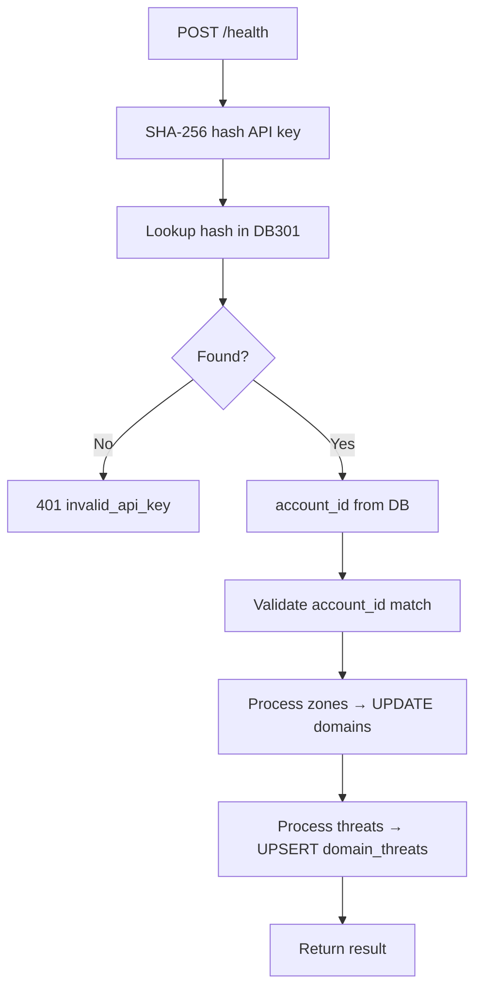
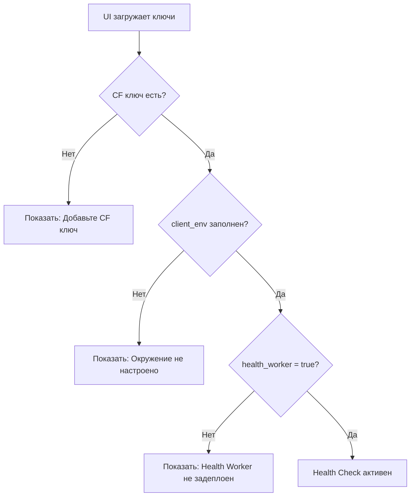

# Health API

## Базовый URL

```
https://api.301.st
```

> **Концепция и архитектура:** см. [Health_Check](Health_Check)
> **Клиентское окружение:** см. [API_ClientEnvironment](API_ClientEnvironment)

---

## Обзор

API для системы мониторинга здоровья доменов. Три уровня:

1. **301.st API** — endpoints для UI (JWT auth)
2. **Webhook** (`webhook.301.st`) — приём данных от Client Worker (API key auth)
3. **Client Worker** — локальные endpoints на клиентском CF аккаунте

---

## 1. 301.st API Endpoints

### GET /domains

Список доменов с `health.status` в ответе.

**Auth:** `Authorization: Bearer <access_token>`

Поле `health` в каждом домене содержит светофор:

| Значение | Условие |
|----------|---------|
| `danger` | `blocked = 1` |
| `warning` | `threat_score > 0` OR traffic anomaly |
| `ok` | Всё в порядке |
| `unknown` | Нет данных |

---

### GET /domains/:id/health

Детальная информация о здоровье домена.

**Auth:** `Authorization: Bearer <access_token>`

**Ответ:**

```json
{
  "status": "warning",
  "blocked": false,
  "blocked_reason": null,
  "threats": {
    "score": 3,
    "categories": ["gambling"],
    "source": "virustotal",
    "checked_at": "2025-01-15T09:55:00Z"
  },
  "traffic": {
    "yesterday": 150,
    "today": 45,
    "change_percent": -70,
    "anomaly": true
  }
}
```

---

### POST /health/client/setup

Ручной setup Client Health Worker.

**Auth:** `Authorization: Bearer <access_token>` (editor/owner)

> Обычно вызывается автоматически через `ensureClientEnvironment()`.
> См. [API_ClientEnvironment](API_ClientEnvironment) для полного описания setup flow.

---

### GET /health/client/status

Статус настройки клиентского окружения для health.

**Auth:** `Authorization: Bearer <access_token>`

---

### POST /integrations/virustotal/init

Сохранить VT API key в клиентском KV.

**Auth:** `Authorization: Bearer <access_token>` (editor/owner)

---

### GET /integrations/virustotal/quota

Проверить текущее использование VT квоты.

**Auth:** `Authorization: Bearer <access_token>`

---

## 2. Webhook Endpoints (webhook.301.st)

Приём данных от Client Worker. Auth через API key (SHA-256 hash lookup в DB301).

### POST /health

Данные мониторинга: VT threats + phishing zones.

**Auth:** `Authorization: Bearer <WORKER_API_KEY>`

**Request:**

```json
{
  "account_id": "19",
  "timestamp": "2025-01-15T10:00:00Z",
  "zones": [
    {
      "zone_id": "abc123",
      "phishing_detected": true,
      "checked_at": "2025-01-15T10:00:00Z"
    }
  ],
  "threats": [
    {
      "domain_name": "example.com",
      "threat_score": 3,
      "categories": ["gambling", "spam"],
      "reputation": -15,
      "source": "virustotal",
      "checked_at": "2025-01-15T09:55:00Z"
    }
  ]
}
```

**Response:**

```json
{
  "ok": true,
  "result": {
    "zones_processed": 1,
    "domains_blocked": 5,
    "threats_upserted": 10,
    "errors": []
  }
}
```

**Обработка:**



### POST /deploy

Self-check после деплоя воркера.

**Auth:** `Authorization: Bearer <WORKER_API_KEY>`

> Подробности: см. [API_ClientEnvironment](API_ClientEnvironment#post-deploy)

---

## 3. Client Worker API (301-health)

Endpoints на клиентском CF аккаунте. Доступны по URL воркера `301-health`.

### GET /health

Health check (public). Проверяет, что воркер работает.

### POST /run

Manual trigger проверок (VT + phishing).

### GET /stats

Статистика очереди проверок.

---

## 4. Bindings (Client Worker)

| Тип | Имя | Назначение |
|-----|-----|------------|
| Secret | `WORKER_API_KEY` | Auth для webhook → 301.st (nanoid 32, бессрочный) |
| Env Var | `ACCOUNT_ID` | ID аккаунта в 301.st |
| Env Var | `WEBHOOK_URL` | `https://webhook.301.st/health` |
| Env Var | `DEPLOY_WEBHOOK_URL` | `https://webhook.301.st/deploy` |
| D1 | `DB` | Client D1 database (301-client) |
| KV | `KV` | Integration keys (VT_API_KEY, etc.) (301-keys) |

---

## 5. UI: Проверка статуса клиентского окружения

**Health Check работает ТОЛЬКО если клиентское окружение настроено.**

UI проверяет поле `client_env` в ключах CF перед отображением health-функций.

### Проверка готовности



### GET /integrations/keys — поле client_env

```json
{
  "id": 18,
  "provider": "cloudflare",
  "client_env": "{\"d1_id\":\"xxx\",\"kv_id\":\"yyy\",\"health_worker\":true}"
}
```

### Зависимости функций от client_env

| Функция | Требует client_env | Без client_env |
|---------|-------------------|----------------|
| GET /domains | Нет | Работает |
| GET /domains/:id/health | Да | Частичные данные (только blocked) |
| Webhook /health | Да | 401/403 |
| VT проверки | Да (kv_id для VT key) | Не работают |
| Traffic anomaly detection | Да | Не работает |

---

## 6. Таблица endpoints

| Endpoint | Метод | Auth | Описание |
|----------|-------|------|----------|
| `/domains` | GET | JWT | Список доменов с health.status |
| `/domains/:id/health` | GET | JWT | Детальная информация |
| `/health/client/setup` | POST | editor | Setup Client Worker |
| `/health/client/status` | GET | JWT | Статус настройки |
| `/integrations/virustotal/init` | POST | editor | Сохранить VT ключ |
| `/integrations/virustotal/quota` | GET | JWT | VT квота |
| `webhook.301.st/health` | POST | API key | Данные от Health Worker |
| `webhook.301.st/deploy` | POST | API key | Self-check результат |
| Client: `/health` | GET | public | Health check воркера |
| Client: `/run` | POST | — | Manual trigger |
| Client: `/stats` | GET | — | Queue statistics |
