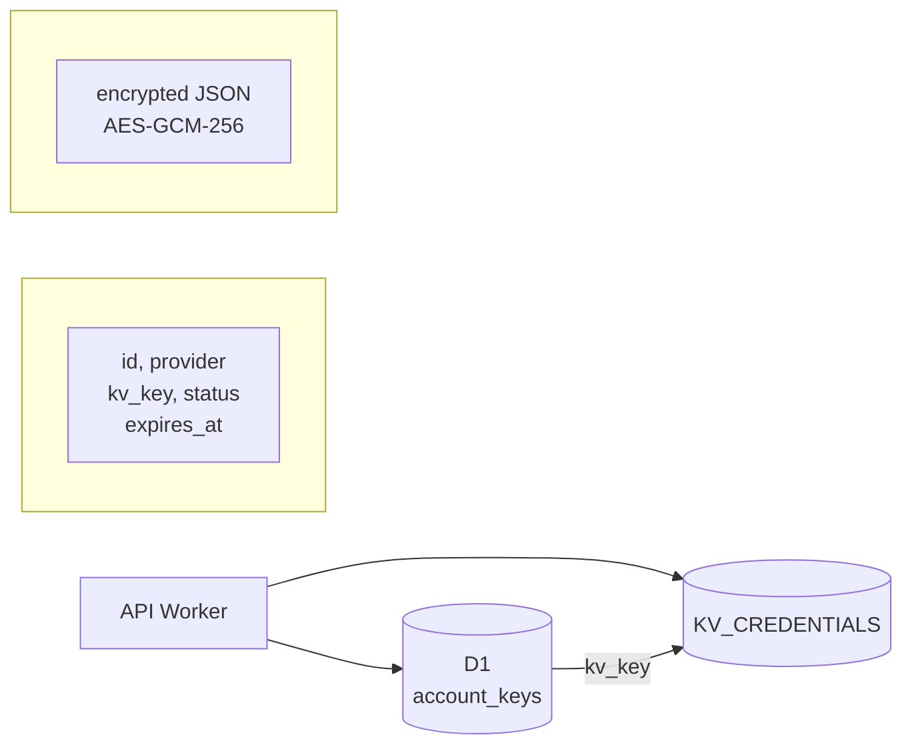
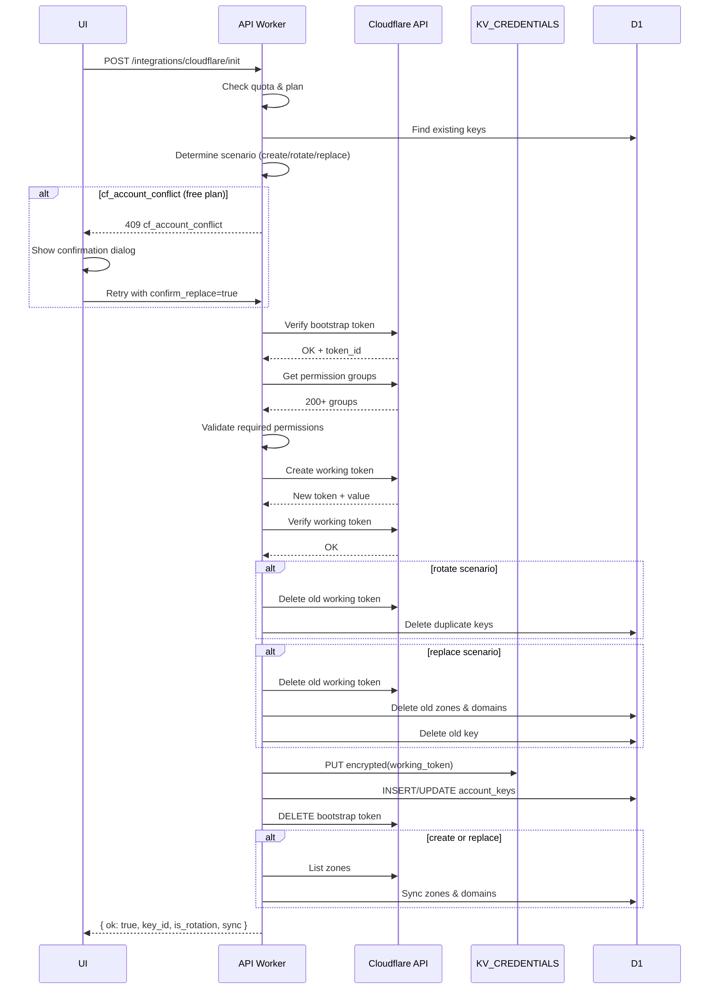

# API — Интеграции

## Базовый URL

```
https://api.301.st/integrations
```

---

## 1. Обзор

API интеграций отвечает за:
- Безопасное хранение API-ключей внешних сервисов
- Инициализацию подключений к провайдерам
- CRUD операции с ключами

### Поддерживаемые провайдеры

| Provider | ID | Описание | Статус |
|----------|-----|----------|--------|
| Cloudflare | `cloudflare` | DNS, Workers, KV, Redirects | ✅ Реализован |
| Namecheap | `namecheap` | Регистратор доменов | ✅ Реализован |
| Namesilo | `namesilo` | Регистратор доменов | 🔜 Planned |
| HostTracker | `hosttracker` | Мониторинг доступности | 🔜 Planned |
| Google Analytics | `google_analytics` | Аналитика | 🔜 Planned |
| Yandex Metrica | `yandex_metrica` | Аналитика | 🔜 Planned |

### Архитектура хранения



> **Безопасность:** Все secrets шифруются AES-GCM-256 перед сохранением в KV. См. [Security.md](Security.md#5-хранение-секретов).

---

## 2. Cloudflare Integration

### 2.1 POST /integrations/cloudflare/init

Инициализация интеграции с Cloudflare. Использует **bootstrap → working token** flow.

**Требует:** `Authorization: Bearer <access_token>`

Логика:

create → syncZones 
replace → syncZones 
rotate → syncZones 
УсловиеДействие
`zones.count === 0` syncZones ✅
`zones.count > 0` Пропустить sync (экономия API)

**Параметры запроса:**

| Поле | Тип | Обязательно | Описание |
|------|-----|-------------|----------|
| `cf_account_id` | string | да | ID аккаунта Cloudflare |
| `bootstrap_token` | string | да | Временный токен с правами создания токенов |
| `key_alias` | string | нет | Название для UI (по умолчанию: `301st-YYYYMMDD-HHMMSS`) |
| `confirm_replace` | boolean | нет | Подтверждение замены CF аккаунта (для free плана) |

**Пример запроса:**

```bash
curl -X POST https://api.301.st/integrations/cloudflare/init \
  -H "Authorization: Bearer <access_token>" \
  -H "Content-Type: application/json" \
  -d '{
    "cf_account_id": "abc123def456",
    "bootstrap_token": "temp_token_with_create_permissions",
    "key_alias": "Main CF Account"
  }'

```

**Успешный ответ:**

```json
**Успешный ответ:**
```json
{
  "ok": true,
  "key_id": 42,
  "is_rotation": false,
  "sync": {
    "zones": 5,
    "domains": 12
  }
}
```

| Поле | Тип | Описание |
|------|-----|----------|
| `key_id` | number | ID созданного/обновлённого ключа |
| `is_rotation` | boolean | `true` — обновлён существующий ключ, `false` — создан новый |
| `sync` | object | Результат синхронизации зон (только при create/replace) |


**Flow:**



**Ошибки:**

| Код | HTTP | recoverable | Описание |
|-----|------|-------------|----------|
| `invalid_json` | 400 | ✗ | Невалидный JSON в теле запроса |
| `missing_fields` | 400 | ✗ | Не переданы обязательные поля |
| `owner_required` | 403 | ✗ | Требуются права owner |
| `quota_exceeded` | 403 | ✗ | Превышен лимит CF аккаунтов для тарифа |
| `cf_account_conflict` | 409 | ✗ | На free плане уже есть другой CF аккаунт |
| `bootstrap_invalid` | 400 | ✗ | Bootstrap token невалиден |
| `bootstrap_expired` | 400 | ✗ | Bootstrap token истёк |
| `bootstrap_not_active` | 400 | ✗ | Bootstrap token не активен |
| `permissions_missing` | 400 | ✗ | Недостаточно прав у bootstrap |
| `cf_rejected` | 400 | ✗ | CF API отклонил запрос |
| `cf_unavailable` | 503 | ✓ | CF API недоступен (можно retry) |
| `storage_failed` | 500 | ✓ | Ошибка сохранения (context содержит данные для cleanup) |
| `cleanup_failed` | 500 | ✗ | Ошибка очистки старой интеграции |
| `external_account_already_used` | 409 | ✗ | CF аккаунт уже используется в другом аккаунте 301.st |


**Примеры ошибок:**

**Примеры ошибок:**

```json
// Отсутствуют поля
{
  "ok": false,
  "error": "missing_fields",
  "fields": ["cf_account_id", "bootstrap_token"]
}

// Превышена квота
{
  "ok": false,
  "error": "quota_exceeded",
  "recoverable": false,
  "context": {
    "limit": 1,
    "current": 1,
    "plan": "free"
  }
}

// Конфликт CF аккаунтов (требуется подтверждение замены)
{
  "ok": false,
  "error": "cf_account_conflict",
  "recoverable": false,
  "context": {
    "existing_account_id": "abc123def456",
    "existing_key_id": 45,
    "new_account_id": "xyz789new123",
    "resolution": "confirm_replace"
  }
}

// Недостаточно прав у bootstrap
{
  "ok": false,
  "error": "permissions_missing",
  "missing": ["Zone Read", "DNS Write", "Workers Scripts Write"]
}

// Bootstrap не активен
{
  "ok": false,
  "error": "bootstrap_not_active",
  "status": "expired"
}

// Ошибка CF API
{
  "ok": false,
  "error": "cf_rejected",
  "recoverable": false,
  "context": {
    "code": 1000,
    "message": "Invalid API Token"
  }
}

// Ошибка сохранения (с контекстом для ручного cleanup)
{
  "ok": false,
  "error": "storage_failed",
  "recoverable": true,
  "context": {
    "cf_token_id": "token_abc123",
    "cf_account_id": "abc123def456"
  }
}

// CF аккаунт уже используется в другом аккаунте 301.st
{
  "ok": false,
  "error": "external_account_already_used",
  "recoverable": false,
  "context": {
    "provider": "cloudflare",
    "external_account_id": "7fadeb365dc925694b8dcfb313412345"
  }
}
```


### POST /integrations/cloudflare/init
 Создание working token из bootstrap token

#### Переменные (заменить на свои)

API_URL="https://api.301.st"
JWT_TOKEN="your_jwt_token"
CF_ACCOUNT_ID="your_cloudflare_account_id"
CF_BOOTSTRAP_TOKEN="your_bootstrap_token"
KEY_ALIAS="my-cloudflare-key"  # опционально

curl -X POST https://api.301.st/integrations/cloudflare/init \
  -H "Authorization: Bearer <access_token>" \
  -H "Content-Type: application/json" \
  -d '{
    "cf_account_id": "abc123def456",
    "bootstrap_token": "temp_token_with_create_permissions",
    "key_alias": "Main CF Account"
  }'

RESPONSES

```
 SUCCESS (200)
 {
   "ok": true,
   "key_id": 123
 }

 ERROR: Missing fields (400)
 {
   "ok": false,
   "error": "missing_fields",
   "fields": ["cf_account_id", "bootstrap_token"]
 }

 ERROR: Invalid bootstrap token (400)
 {
   "ok": false,
   "error": "bootstrap_invalid",
   "message": "Invalid API Token"
 }

 ERROR: Bootstrap not active (400)
 {
   "ok": false,
   "error": "bootstrap_not_active",
   "status": "expired"
 }

 ERROR: Permission groups failed (400)
 {
   "ok": false,
   "error": "permission_groups_failed",
   "message": "Authentication error"
 }

 ERROR: Missing permissions (400)
 {
   "ok": false,
   "error": "permissions_missing",
   "missing": ["D1 Read", "D1 Write", "Workers KV Storage Read"]
 }

 ERROR: Token creation failed (500)
 {
   "ok": false,
   "error": "token_creation_failed",
   "message": "..."
 }

 ERROR: Working token invalid (500)
 {
   "ok": false,
   "error": "working_token_invalid",
   "message": "..."
 }

 ERROR: Storage failed (500)
 {
   "ok": false,
   "error": "storage_failed"
 }
```

### 2.2 Требуемые права Cloudflare

Bootstrap token должен иметь право создавать токены. Working token создаётся с permissions:

| Permission | Scope | Описание |
|------------|-------|----------|
| Zone Read | Account | Чтение списка зон |
| Zone Settings Read | Account | Чтение настроек зон |
| Zone Settings Write | Account | Изменение настроек |
| DNS Read | Account | Чтение DNS записей |
| DNS Write | Account | Создание/изменение DNS |
| Workers Scripts Read | Account | Чтение воркеров |
| Workers Scripts Write | Account | Деплой воркеров |
| Workers KV Storage Read | Account | Чтение KV |
| Workers KV Storage Write | Account | Запись в KV |
| Workers Routes Read | Account | Чтение маршрутов |
| Workers Routes Write | Account | Создание маршрутов |
| Rules Read | Zone | Чтение Redirect Rules |
| Rules Write | Zone | Создание Redirect Rules |

---
### 2.3 Сценарии инициализации

#### Определение сценария

| Сценарий | Условие | Действие |
|----------|---------|----------|
| **CREATE** | Нет активных CF ключей ИЛИ новый CF аккаунт (paid план в пределах лимита) | Создать ключ → syncZones |
| **ROTATE** | Есть активный ключ с тем же `cf_account_id` | Обновить токен, удалить дубликаты |
| **REPLACE** | Free план + другой CF аккаунт + `confirm_replace=true` | Удалить старый → создать новый → syncZones |

#### Лимиты по тарифам

| План | Макс. CF аккаунтов | Описание |
|------|-------------------|----------|
| free | 1 | Один CF аккаунт, один ключ |
| pro | 10 | До 10 разных CF аккаунтов |
| buss | 100 | До 100 разных CF аккаунтов |

> **Правило:** 1 CF аккаунт = 1 ключ в 301.st (дубликаты автоматически удаляются при ротации)

#### Пример: Замена CF аккаунта на free плане

**Шаг 1:** Запрос без подтверждения
```bash
curl -X POST https://api.301.st/integrations/cloudflare/init \
  -H "Authorization: Bearer <token>" \
  -H "Content-Type: application/json" \
  -d '{
    "cf_account_id": "new_cf_account_id",
    "bootstrap_token": "bootstrap_for_new_account"
  }'
```

**Ответ:** 409 Conflict
```json
{
  "ok": false,
  "error": "cf_account_conflict",
  "recoverable": false,
  "context": {
    "existing_account_id": "old_cf_account_id",
    "existing_key_id": 45,
    "new_account_id": "new_cf_account_id",
    "resolution": "confirm_replace"
  }
}
```

**Шаг 2:** UI показывает диалог

> ⚠️ У вас уже подключён CF аккаунт `old_cf_account_id`.
> На бесплатном плане можно использовать только 1 аккаунт.
> 
> При замене будут удалены:
> - Текущий ключ интеграции
> - Все синхронизированные зоны
> - Все связанные домены
>
> [Отмена] [Заменить аккаунт]

**Шаг 3:** Запрос с подтверждением
```bash
curl -X POST https://api.301.st/integrations/cloudflare/init \
  -H "Authorization: Bearer <token>" \
  -H "Content-Type: application/json" \
  -d '{
    "cf_account_id": "new_cf_account_id",
    "bootstrap_token": "bootstrap_for_new_account",
    "confirm_replace": true
  }'
```

**Ответ:** 200 OK
```json
{
  "ok": true,
  "key_id": 46,
  "is_rotation": false,
  "sync": {
    "zones": 3,
    "domains": 7
  }
}
```

---

## 3. Namecheap Integration

### 3.1 POST /integrations/namecheap/init

Инициализация интеграции с Namecheap.

**Требует:** `Authorization: Bearer <access_token>`, роль `owner`

**Параметры запроса:**

| Поле | Тип | Обязательно | Описание |
|------|-----|-------------|----------|
| `username` | string | да | Namecheap username |
| `api_key` | string | да | API Key из Namecheap Dashboard |
| `key_alias` | string | нет | Название для UI (по умолчанию: `namecheap-{username}`) |

**Пример запроса (из browser console):**

```js
fetch("https://api.301.st/integrations/namecheap/init", {
  method: "POST",
  headers: {
    "Content-Type": "application/json",
    "Authorization": "Bearer " + token
  },
  body: JSON.stringify({
    username: "myuser",
    api_key: "abc123secretkey",
    key_alias: "Personal Namecheap"
  })
}).then(r => r.json()).then(console.log)
```

> **Тестирование:** JWT содержит fingerprint (хэш IP + User-Agent). Тестировать можно ТОЛЬКО из браузера на `app.301.st`. curl с любого другого IP/UA вернёт `owner_required` из-за несовпадения fingerprint.

**Успешный ответ (200):**

```json
{
  "ok": true,
  "key_id": 22,
  "message": "Namecheap integration configured successfully",
  "balance": "8.32"
}
```

| Поле | Тип | Описание |
|------|-----|----------|
| `key_id` | number | ID созданного ключа в D1 `account_keys` |
| `balance` | string | Баланс аккаунта Namecheap (USD) |

**Ошибки:**

| Код | HTTP | Описание | UI действие |
|-----|------|----------|-------------|
| `invalid_json` | 400 | Невалидный JSON | Показать общую ошибку |
| `username_required` | 400 | Не передан username | Валидация формы |
| `api_key_required` | 400 | Не передан api_key | Валидация формы |
| `owner_required` | 403 | Нет прав owner или невалидный токен | Перелогин |
| `invalid_api_key` | 400 | Неверный API key | «Проверьте API ключ» |
| `ip_not_whitelisted` | 400 | IP relay не в whitelist Namecheap | Показать IP из `ips` |
| `namecheap_key_already_exists` | 409 | Ключ для этого username уже есть | Показать `existing_key_id` |
| `no_relay_configured` | 400 | Relay не настроен (нет KV) | «Сервис временно недоступен» |
| `relay_timeout` | 400 | Relay не ответил за 10 сек | «Повторите попытку» |
| `relay_http_*` | 400 | Relay вернул HTTP ошибку | «Сервис временно недоступен» |
| `namecheap_error_*` | 400 | Ошибка Namecheap API | Показать message |

**Пример ошибки `ip_not_whitelisted`:**

```json
{
  "ok": false,
  "error": "ip_not_whitelisted",
  "message": "Add these IPs to your Namecheap API whitelist",
  "ips": "51.68.21.133"
}
```

**Пример ошибки `namecheap_key_already_exists`:**

```json
{
  "ok": false,
  "error": "namecheap_key_already_exists",
  "existing_key_id": 22
}
```

---

### 3.2 Архитектура прокси (Traefik relay)

Worker не может обращаться к Namecheap API напрямую — Namecheap проверяет IP, а IP Cloudflare Workers динамические. Используется Traefik reverse-proxy на VPS.

```
Browser → CF Worker (api.301.st)
              ↓ fetch("https://relay.301.st/xml.response?...")
         Traefik relay (relay.301.st / 51.68.21.133)
              ↓ passHostHeader: false → Host: api.namecheap.com
         api.namecheap.com ← видит IP: 51.68.21.133 (whitelisted)
```

**Ключевые моменты:**
- Worker обращается к `https://relay.301.st/...` (по hostname, НЕ по IP — Traefik требует TLS SNI)
- Traefik заменяет `Host` header на `api.namecheap.com` (`passHostHeader: false`)
- Basic Auth защищает relay от несанкционированного доступа
- `ClientIp` в query string = IP relay-сервера (51.68.21.133), этот IP whitelisted в Namecheap

**Хранение конфига в KV (`KV_CREDENTIALS`, ключ `proxy:namecheap`):**

```json
{
  "relay_url": "https://relay.301.st",
  "relay_host": "relay.301.st",
  "relay_auth": "Basic <base64(user:pass)>",
  "ip": "51.68.21.133"
}
```

| Поле | Назначение |
|------|------------|
| `relay_url` | Base URL для `fetch()` из Worker |
| `relay_host` | Hostname relay (используется для валидации конфига) |
| `relay_auth` | Basic Auth header для Traefik |
| `ip` | IP relay-сервера — подставляется как `ClientIp` в Namecheap API запросы и возвращается через `proxy-ips` |

---

### 3.3 UI Flow подключения Namecheap

**Шаг 1: Получение IP для whitelist**

UI вызывает `GET /integrations/namecheap/proxy-ips` и показывает IP пользователю.

**Шаг 2: Пользователь настраивает Namecheap**

Пользователь заходит в Namecheap → Profile → Tools → API Access:
1. Включает API Access (если выключен)
2. Добавляет IP из шага 1 в Whitelisted IPs
3. Копирует API Key

**Шаг 3: Ввод credentials**

UI показывает форму:
- Username (обязательное)
- API Key (обязательное)
- Alias (необязательное)

**Шаг 4: Инициализация**

UI вызывает `POST /integrations/namecheap/init`.

**Шаг 5: Обработка результата**

| Ответ | UI действие |
|-------|-------------|
| `ok: true` | Показать success, сохранить `key_id`, показать `balance` |
| `ip_not_whitelisted` | Показать IP из `ips` с инструкцией добавить в Namecheap |
| `invalid_api_key` / `namecheap_error_1011102` | «Неверный API ключ или API доступ не включён» |
| `namecheap_key_already_exists` | «Интеграция уже существует» + ссылка на existing_key_id |
| `relay_timeout` / `relay_http_*` | «Сервис временно недоступен, повторите позже» |

---

### 3.4 GET /integrations/namecheap/proxy-ips

Получение списка IP relay-сервера для whitelist в Namecheap.

**Требует:** `Authorization: Bearer <access_token>`, роль `owner`

**Успешный ответ (200):**

```json
{
  "ok": true,
  "ips": ["51.68.21.133"]
}
```

**UI:** Вызвать при открытии формы подключения Namecheap. Показать IP с инструкцией: «Добавьте эти IP в Namecheap → Profile → Tools → API Access → Whitelisted IPs».

---

### 3.5 GET /integrations/namecheap/domains

Получение списка доменов из аккаунта Namecheap.

**Требует:** `Authorization: Bearer <access_token>`, роль `owner`

**Query параметры:**

| Параметр | Тип | Обязательно | Описание |
|----------|-----|-------------|----------|
| `key_id` | number | да | ID ключа Namecheap из account_keys |

**Успешный ответ (200):**

```json
{
  "ok": true,
  "domains": [
    { "domain": "corecash.pro", "expires": "09/22/2026" },
    { "domain": "finatron.pro", "expires": "09/22/2026" },
    { "domain": "swerte.club", "expires": "10/01/2026" },
    { "domain": "taskcenter.pro", "expires": "12/28/2026" }
  ]
}
```

| Поле | Тип | Описание |
|------|-----|----------|
| `domains[].domain` | string | FQDN домена |
| `domains[].expires` | string | Дата истечения (формат MM/DD/YYYY от Namecheap) |

**Ошибки:**

| Код | HTTP | Описание | UI действие |
|-----|------|----------|-------------|
| `owner_required` | 403 | Нет прав owner | Перелогин |
| `key_id_required` | 400 | Не передан key_id | Валидация |
| `key_not_found` | 404 | Ключ не найден | «Интеграция не найдена» |
| `no_relay_configured` | 500 | Relay не настроен | «Сервис недоступен» |
| `relay_timeout` | 500 | Таймаут relay | «Повторите попытку» |

**UI:** Показать список доменов с возможностью выбрать домен для подключения к 301.st (установка NS через `set-ns`). Формат даты `expires` — американский (MM/DD/YYYY), при отображении конвертировать в локальный формат.

---

### 3.6 POST /integrations/namecheap/set-ns

Установка кастомных nameservers для домена в Namecheap (обычно NS от Cloudflare зоны).

**Требует:** `Authorization: Bearer <access_token>`, роль `owner`

**Параметры запроса:**

| Поле | Тип | Обязательно | Описание |
|------|-----|-------------|----------|
| `key_id` | number | да | ID ключа Namecheap |
| `domain` | string | да | FQDN домена (например, `example.com`) |
| `nameservers` | string[] | да | Массив NS серверов (минимум 1) |

**Пример запроса (из browser console):**

```js
fetch("https://api.301.st/integrations/namecheap/set-ns", {
  method: "POST",
  headers: {
    "Content-Type": "application/json",
    "Authorization": "Bearer " + token
  },
  body: JSON.stringify({
    key_id: 22,
    domain: "example.com",
    nameservers: ["ns1.cloudflare.com", "ns2.cloudflare.com"]
  })
}).then(r => r.json()).then(console.log)
```

**Успешный ответ (200):**

```json
{
  "ok": true,
  "message": "nameservers_updated"
}
```

**Ошибки:**

| Код | HTTP | Описание | UI действие |
|-----|------|----------|-------------|
| `owner_required` | 403 | Нет прав owner | Перелогин |
| `key_id_required` | 400 | Не передан key_id | Валидация |
| `domain_required` | 400 | Не передан domain | Валидация |
| `nameservers_required` | 400 | Пустой массив nameservers | Валидация |
| `key_not_found` | 404 | Ключ не найден | «Интеграция не найдена» |
| `no_nameservers` | 400 | Пустой список NS | Валидация |
| `invalid_domain` | 400 | Невалидный формат домена | «Неверный формат домена» |
| `no_relay_configured` | 400 | Relay не настроен | «Сервис недоступен» |
| `relay_timeout` | 400 | Таймаут relay | «Повторите попытку» |

**UI flow: подключение домена к Cloudflare через Namecheap:**

1. Пользователь выбирает домен из списка (`GET /namecheap/domains`)
2. UI создаёт зону в CF (если ещё нет) → получает NS серверы
3. UI вызывает `POST /namecheap/set-ns` с NS от Cloudflare
4. Показать success: «NS серверы обновлены. Изменения вступят в силу через 1-48 часов.»

---

## 4. Keys API (CRUD)

### 4.1 GET /integrations/keys

Список всех ключей аккаунта.

**Требует:** `Authorization: Bearer <access_token>`

**Query параметры:**

| Параметр | Тип | Описание |
|----------|-----|----------|
| `account_id` | number | ID аккаунта (из JWT) |
| `provider` | string | Фильтр по провайдеру (опционально) |

**Пример запроса:**

```bash
curl -X GET "https://api.301.st/integrations/keys?account_id=1" \
  -H "Authorization: Bearer <access_token>"
```

**Пример ответа:**

```json
{
  "ok": true,
  "keys": [
    {
      "id": 42,
      "account_id": 1,
      "provider": "cloudflare",
      "key_alias": "Main CF Account",
      "external_account_id": "abc123def456",
      "status": "active",
      "expires_at": "2030-01-15T12:00:00Z",
      "last_used": "2025-01-17T10:30:00Z",
      "created_at": "2025-01-10T08:00:00Z"
    },
    {
      "id": 15,
      "account_id": 1,
      "provider": "namecheap",
      "key_alias": "Personal Namecheap",
      "external_account_id": "myuser",
      "status": "active",
      "expires_at": null,
      "last_used": "2025-01-16T14:20:00Z",
      "created_at": "2025-01-12T09:15:00Z"
    }
  ]
}
```

> **Важно:** Secrets (токены, API keys) никогда не возвращаются в ответах.

---

### 4.2 GET /integrations/keys/:id

Получить информацию о конкретном ключе.

**Пример запроса:**

```bash
curl -X GET https://api.301.st/integrations/keys/42 \
  -H "Authorization: Bearer <access_token>"
```

**Пример ответа:**

```json
{
  "ok": true,
  "key": {
    "id": 42,
    "account_id": 1,
    "provider": "cloudflare",
    "provider_scope": {
      "cf_token_id": "token_abc123",
      "cf_token_name": "301st-20250110-080000",
      "cf_account_name": "user@example.com's Account"
    },
    "key_alias": "Main CF Account",
    "external_account_id": "abc123def456",
    "status": "active",
    "expires_at": "2030-01-15T12:00:00Z",
    "last_used": "2025-01-17T10:30:00Z",
    "created_at": "2025-01-10T08:00:00Z"
  }
}
```

---

### 4.3 PATCH /integrations/keys/:id

Обновить метаданные ключа.

**Параметры запроса:**

| Поле | Тип | Описание |
|------|-----|----------|
| `key_alias` | string | Новое название |
| `status` | string | Новый статус: `active`, `revoked` |

**Пример запроса:**

```bash
curl -X PATCH https://api.301.st/integrations/keys/42 \
  -H "Authorization: Bearer <access_token>" \
  -H "Content-Type: application/json" \
  -d '{
    "key_alias": "Production CF"
  }'
```

**Пример ответа:**

```json
{
  "ok": true
}
```

---

### 4.4 DELETE /integrations/keys/:id

Удалить ключ полностью (KV + D1).

**Пример запроса:**

```bash
curl -X DELETE https://api.301.st/integrations/keys/42 \
  -H "Authorization: Bearer <access_token>"
```

**Пример ответа:**

```json
{
  "ok": true
}
```

**Что происходит:**
1. Удаляется запись из KV_CREDENTIALS
2. Удаляется запись из D1 account_keys
3. Токен у провайдера НЕ удаляется (ответственность пользователя)

---

## 5. Статусы ключей

| Статус | Описание |
|--------|----------|
| `active` | Ключ активен и готов к использованию |
| `expired` | Срок действия истёк (автоматически при проверке) |
| `revoked` | Отозван пользователем |

---

## 6. Таблица endpoints

| Endpoint | Метод | Auth | Роль | Описание |
|----------|-------|------|------|----------|
| `/integrations/cloudflare/init` | POST | ✅ JWT | owner | Инициализация Cloudflare |
| `/integrations/namecheap/init` | POST | ✅ JWT | owner | Инициализация Namecheap |
| `/integrations/namecheap/proxy-ips` | GET | ✅ JWT | owner | IP relay для whitelist Namecheap |
| `/integrations/namecheap/domains` | GET | ✅ JWT | owner | Список доменов из Namecheap |
| `/integrations/namecheap/set-ns` | POST | ✅ JWT | owner | Установка NS для домена |
| `/integrations/keys` | GET | ✅ JWT | owner | Список ключей аккаунта |
| `/integrations/keys/:id` | GET | ✅ JWT | owner | Получить ключ |
| `/integrations/keys/:id` | PATCH | ✅ JWT | owner | Обновить ключ |
| `/integrations/keys/:id` | DELETE | ✅ JWT | owner | Удалить ключ |

---


© 301.st — API Integrations Documentation

