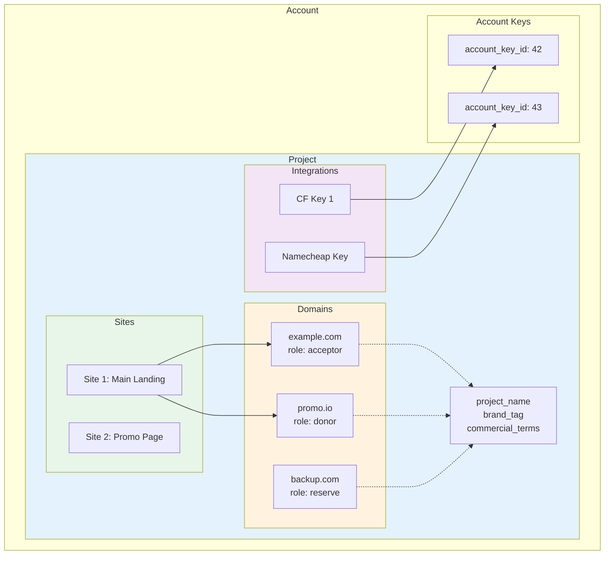

## Projects API

### Базовый URL

```
https://api.301.st/projects
```

---

### Концепция

**Project** = логическая группа для управления доменами и сайтами.

- Домены привязываются к проектам через `domains.project_id`
- Каждый проект имеет минимум один сайт (создаётся автоматически)
- Интеграции (CF ключи) привязываются через `project_integrations`

**Иерархия:**

```
Account
  └── Project (логическая группа)
        ├── Sites (точки приёма трафика)
        ├── Domains (привязаны к проекту)
        └── Integrations (CF ключи для проекта)
```

---

### 1 GET /projects

Список проектов аккаунта.

**Требует:** `Authorization: Bearer <access_token>`

**Пример запроса:**

```bash
curl -X GET "https://api.301.st/projects" \
  -H "Authorization: Bearer <access_token>"
```

**Успешный ответ:**

```json
{
  "ok": true,
  "total": 2,
  "projects": [
    {
      "id": 5,
      "project_name": "Brand Campaign Q1",
      "description": "Кампания для бренда X",
      "brand_tag": "brand-x",
      "commercial_terms": "CPA $5",
      "start_date": "2025-01-01",
      "end_date": "2025-03-31",
      "created_at": "2025-01-01T08:00:00Z",
      "updated_at": "2025-01-15T10:00:00Z",
      "sites_count": 2,
      "domains_count": 5
    },
    {
      "id": 6,
      "project_name": "Summer Promo",
      "description": null,
      "brand_tag": "summer-2025",
      "commercial_terms": null,
      "start_date": "2025-06-01",
      "end_date": "2025-08-31",
      "created_at": "2025-01-10T12:00:00Z",
      "updated_at": "2025-01-10T12:00:00Z",
      "sites_count": 1,
      "domains_count": 3
    }
  ]
}
```

---

### 2 GET /projects/:id

Детали проекта + сайты + интеграции.

**Требует:** `Authorization: Bearer <access_token>`

**Пример запроса:**

```bash
curl -X GET "https://api.301.st/projects/5" \
  -H "Authorization: Bearer <access_token>"
```

**Успешный ответ:**

```json
{
  "ok": true,
  "project": {
    "id": 5,
    "account_id": 1,
    "project_name": "Brand Campaign Q1",
    "description": "Кампания для бренда X",
    "brand_tag": "brand-x",
    "commercial_terms": "CPA $5",
    "start_date": "2025-01-01",
    "end_date": "2025-03-31",
    "created_at": "2025-01-01T08:00:00Z",
    "updated_at": "2025-01-15T10:00:00Z",
    "sites_count": 2,
    "domains_count": 5
  },
  "sites": [
    {
      "id": 10,
      "site_name": "Main Landing",
      "site_tag": "landing-v1",
      "status": "active",
      "created_at": "2025-01-01T08:00:00Z"
    },
    {
      "id": 11,
      "site_name": "Promo Page",
      "site_tag": "promo-v2",
      "status": "active",
      "created_at": "2025-01-15T10:00:00Z"
    }
  ],
  "integrations": [
    {
      "id": 1,
      "account_key_id": 42,
      "created_at": "2025-01-01T08:00:00Z",
      "provider": "cloudflare",
      "key_alias": "Main CF Account",
      "status": "active",
      "external_account_id": "abc123def456"
    }
  ]
}
```

**Ошибки:**

```json
{
  "ok": false,
  "error": "project_not_found"
}
```

---

### 3 POST /projects

Создать проект.

**Требует:** `Authorization: Bearer <access_token>` (owner или editor)

> При создании проекта автоматически создаётся первый сайт.

**Параметры запроса:**

| Поле | Тип | Обязательно | Описание |
|------|-----|-------------|----------|
| `project_name` | string | да | Название проекта |
| `description` | string | нет | Описание |
| `brand_tag` | string | нет | Тег бренда |
| `commercial_terms` | string | нет | Коммерческие условия |
| `start_date` | string | нет | Дата начала (YYYY-MM-DD) |
| `end_date` | string | нет | Дата окончания (YYYY-MM-DD) |
| `site_name` | string | нет | Название первого сайта (default: `{project_name} - Main`) |

**Пример запроса:**

```bash
curl -X POST "https://api.301.st/projects" \
  -H "Authorization: Bearer <access_token>" \
  -H "Content-Type: application/json" \
  -d '{
    "project_name": "Black Friday 2025",
    "description": "Акция Чёрная Пятница",
    "brand_tag": "bf-2025",
    "commercial_terms": "RevShare 30%",
    "start_date": "2025-11-20",
    "end_date": "2025-11-30",
    "site_name": "BF Landing"
  }'
```

**Успешный ответ:**

```json
{
  "ok": true,
  "project": {
    "id": 7,
    "project_name": "Black Friday 2025",
    "description": "Акция Чёрная Пятница",
    "brand_tag": "bf-2025"
  },
  "site": {
    "id": 15,
    "site_name": "BF Landing",
    "status": "active"
  }
}
```

**Ошибки:**

```json
// Не указано имя
{
  "ok": false,
  "error": "missing_field",
  "field": "project_name"
}

// Превышена квота проектов
{
  "ok": false,
  "error": "quota_exceeded",
  "limit": 10,
  "used": 10
}

// Превышена квота сайтов (для автосоздания)
{
  "ok": false,
  "error": "site_quota_exceeded",
  "limit": 50,
  "used": 50
}
```

---

### 4 PATCH /projects/:id

Обновить проект.

**Требует:** `Authorization: Bearer <access_token>` (owner или editor)

**Параметры запроса:**

| Поле | Тип | Описание |
|------|-----|----------|
| `project_name` | string | Новое название |
| `description` | string | Новое описание |
| `brand_tag` | string | Новый тег бренда |
| `commercial_terms` | string | Новые условия |
| `start_date` | string | Новая дата начала |
| `end_date` | string | Новая дата окончания |

**Пример запроса:**

```bash
curl -X PATCH "https://api.301.st/projects/5" \
  -H "Authorization: Bearer <access_token>" \
  -H "Content-Type: application/json" \
  -d '{
    "commercial_terms": "CPA $7",
    "end_date": "2025-04-30"
  }'
```

**Успешный ответ:**

```json
{
  "ok": true
}
```

**Ошибки:**

```json
// Проект не найден
{
  "ok": false,
  "error": "project_not_found"
}

// Нет полей для обновления
{
  "ok": false,
  "error": "no_fields_to_update"
}
```

---

### 5 DELETE /projects/:id

Удалить проект.

**Требует:** `Authorization: Bearer <access_token>` (только owner)

> **Важно:**
> - Каскадно удаляются все сайты проекта
> - Каскадно удаляются все интеграции проекта
> - Домены получают `project_id = NULL` (остаются в аккаунте)
> - Квоты projects и sites уменьшаются

**Пример запроса:**

```bash
curl -X DELETE "https://api.301.st/projects/7" \
  -H "Authorization: Bearer <access_token>"
```

**Успешный ответ:**

```json
{
  "ok": true
}
```

**Ошибки:**

```json
// Проект не найден
{
  "ok": false,
  "error": "project_not_found"
}

// Нет прав (не owner)
{
  "ok": false,
  "error": "owner_required"
}
```

---

### 6 GET /projects/:id/integrations

Список интеграций (привязанных ключей) проекта.

**Требует:** `Authorization: Bearer <access_token>`

**Query параметры:**

| Параметр | Тип | Описание |
|----------|-----|----------|
| `provider` | string | Фильтр по провайдеру: `cloudflare`, `namecheap` |

**Пример запроса:**

```bash
# Все интеграции
curl -X GET "https://api.301.st/projects/5/integrations" \
  -H "Authorization: Bearer <access_token>"

# Только Cloudflare
curl -X GET "https://api.301.st/projects/5/integrations?provider=cloudflare" \
  -H "Authorization: Bearer <access_token>"
```

**Успешный ответ:**

```json
{
  "ok": true,
  "integrations": [
    {
      "id": 1,
      "account_key_id": 42,
      "created_at": "2025-01-01T08:00:00Z",
      "provider": "cloudflare",
      "key_alias": "Main CF Account",
      "status": "active",
      "external_account_id": "abc123def456"
    },
    {
      "id": 2,
      "account_key_id": 43,
      "created_at": "2025-01-05T10:00:00Z",
      "provider": "namecheap",
      "key_alias": "Namecheap API",
      "status": "active",
      "external_account_id": "myusername"
    }
  ]
}
```

**Ошибки:**

```json
{
  "ok": false,
  "error": "project_not_found"
}
```

---

### 7 POST /projects/:id/integrations

Привязать ключ к проекту.

**Требует:** `Authorization: Bearer <access_token>` (owner или editor)

**Параметры запроса:**

| Поле | Тип | Обязательно | Описание |
|------|-----|-------------|----------|
| `account_key_id` | number | да | ID ключа из `account_keys` |

**Пример запроса:**

```bash
curl -X POST "https://api.301.st/projects/5/integrations" \
  -H "Authorization: Bearer <access_token>" \
  -H "Content-Type: application/json" \
  -d '{
    "account_key_id": 44
  }'
```

**Успешный ответ:**

```json
{
  "ok": true,
  "integration": {
    "id": 3,
    "project_id": 5,
    "account_key_id": 44,
    "provider": "cloudflare",
    "key_alias": "Secondary CF Account"
  }
}
```

**Ошибки:**

```json
// Проект не найден
{
  "ok": false,
  "error": "project_not_found"
}

// Не указан ключ
{
  "ok": false,
  "error": "missing_field",
  "field": "account_key_id"
}

// Ключ не найден
{
  "ok": false,
  "error": "key_not_found"
}

// Интеграция уже существует
{
  "ok": false,
  "error": "integration_already_exists"
}
```

---

### 8 DELETE /projects/:id/integrations/:keyId

Отвязать ключ от проекта.

**Требует:** `Authorization: Bearer <access_token>` (owner или editor)

**Пример запроса:**

```bash
curl -X DELETE "https://api.301.st/projects/5/integrations/44" \
  -H "Authorization: Bearer <access_token>"
```

**Успешный ответ:**

```json
{
  "ok": true
}
```

**Ошибки:**

```json
// Проект не найден
{
  "ok": false,
  "error": "project_not_found"
}

// Интеграция не найдена
{
  "ok": false,
  "error": "integration_not_found"
}
```

---

### 9 Поля проекта

| Поле | Тип | Описание |
|------|-----|----------|
| `id` | number | ID проекта |
| `account_id` | number | ID аккаунта |
| `project_name` | string | Название |
| `description` | string | Описание |
| `brand_tag` | string | Тег бренда для идентификации |
| `commercial_terms` | string | Коммерческие условия (CPA, RevShare) |
| `start_date` | string | Дата начала проекта |
| `end_date` | string | Дата окончания проекта |
| `created_at` | string | Дата создания |
| `updated_at` | string | Дата обновления |
| `sites_count` | number | Количество сайтов (computed) |
| `domains_count` | number | Количество доменов (computed) |

---

### 10 Архитектура



---

### 11 Workflow: Создание проекта


---

### 12 Таблица endpoints

| Endpoint | Метод | Auth | Описание |
|----------|-------|------|----------|
| `/projects` | GET | JWT | Список проектов |
| `/projects/:id` | GET | JWT | Детали проекта |
| `/projects` | POST | editor | Создать проект (+site) |
| `/projects/:id` | PATCH | editor | Обновить проект |
| `/projects/:id` | DELETE | owner | Удалить проект |
| `/projects/:id/integrations` | GET | JWT | Интеграции проекта |
| `/projects/:id/integrations` | POST | editor | Привязать ключ |
| `/projects/:id/integrations/:keyId` | DELETE | editor | Отвязать ключ |

---

### 13 Квоты

| План | max_projects |
|------|--------------|
| Free | 1 |
| Pro | 10 |
| Business | 50 |

При превышении квоты создание нового проекта возвращает `quota_exceeded`.

---

## Client Environment API

Управление клиентским окружением на CF аккаунте. Подробная архитектура: [API_ClientEnvironment.md](API_ClientEnvironment.md)

### 14 POST /client-env/setup

Создать клиентское окружение (D1, KV, Health Worker, TDS Worker).

**Требует:** `Authorization: Bearer <access_token>`

**Предусловие:** Активная CF интеграция (`POST /integrations/cloudflare/init`)

```bash
curl -X POST "https://api.301.st/client-env/setup" \
  -H "Authorization: Bearer <access_token>"
```

**Успешный ответ:**

```json
{
  "ok": true,
  "client_env": {
    "d1_id": "f38f6b00-5c7c-4f3e-ad25-fe5511066881",
    "kv_id": "6f51af9550ea4dc7bbeb68119a75917c",
    "health_worker": true,
    "tds_worker": true,
    "ready": true
  },
  "initial_sync": {
    "domains_synced": 16
  }
}
```

**Если уже создано:**

```json
{
  "ok": true,
  "status": "already_ready",
  "client_env": { ... }
}
```

**Ошибки:**

```json
// Нет CF интеграции
{
  "ok": false,
  "error": "cloudflare_integration_required",
  "message": "Add Cloudflare integration first via POST /integrations/cloudflare/init"
}
```

---

### 15 GET /client-env/status

Статус клиентского окружения.

**Требует:** `Authorization: Bearer <access_token>`

**Query параметры:**

| Параметр | Тип | Описание |
|----------|-----|----------|
| `live` | boolean | `true` — проверить ресурсы на CF (~2-5 сек). Default: `false` (~1 мс) |

```bash
# Быстрая проверка (из DB)
curl -X GET "https://api.301.st/client-env/status" \
  -H "Authorization: Bearer <access_token>"

# Live-проверка (из CF API)
curl -X GET "https://api.301.st/client-env/status?live=true" \
  -H "Authorization: Bearer <access_token>"
```

**Успешный ответ (fast):**

```json
{
  "ok": true,
  "status": "ready",
  "client_env": {
    "d1_id": "...",
    "kv_id": "...",
    "health_worker": true,
    "tds_worker": true,
    "ready": true
  }
}
```

**Успешный ответ (live=true):**

```json
{
  "ok": true,
  "status": "ready",
  "client_env": { ... },
  "live_check": {
    "d1": true,
    "kv": true,
    "health_worker": true,
    "tds_worker": true,
    "health_crons": ["*/1 * * * *", "0 */12 * * *"]
  }
}
```

**Статусы:**

| status | Описание |
|--------|----------|
| `ready` | Всё создано и работает |
| `not_configured` | Окружение не создано |
| `partial` | Создано частично (ошибка при setup) |
| `no_integration` | Нет активной CF интеграции |

---

### 16 DELETE /client-env

Удалить клиентское окружение. Удаляет все ресурсы на CF аккаунте клиента.

**Требует:** `Authorization: Bearer <access_token>` (только owner)

```bash
curl -X DELETE "https://api.301.st/client-env" \
  -H "Authorization: Bearer <access_token>"
```

**Успешный ответ:**

```json
{
  "ok": true,
  "deleted": {
    "health_worker": true,
    "tds_worker": true,
    "kv": true,
    "d1": true
  }
}
```

---

## Health API

Мониторинг здоровья доменов: VT threats, phishing, traffic anomalies.

### 17 GET /domains/:id/health

Детальная информация о здоровье домена.

**Требует:** `Authorization: Bearer <access_token>`

```bash
curl -X GET "https://api.301.st/domains/42/health" \
  -H "Authorization: Bearer <access_token>"
```

**Успешный ответ:**

```json
{
  "status": "warning",
  "blocked": false,
  "blocked_reason": null,
  "threats": {
    "score": 3,
    "categories": ["gambling"],
    "source": "virustotal",
    "checked_at": "2026-02-26T09:55:00Z"
  },
  "traffic": {
    "yesterday": 150,
    "today": 45,
    "change_percent": -70,
    "anomaly": true
  }
}
```

**Светофор для UI:**

| Цвет | Условие |
|------|---------|
| Red | `blocked = 1` |
| Yellow | `threat_score > 0` OR traffic anomaly |
| Green | Всё OK |
| Gray | Нет данных |

> Health данные доступны только если `client_env.health_worker = true`.
> Без client_env — только поле `blocked` (из DB301).

---

### 18 POST /integrations/virustotal/init

Сохранить VirusTotal API key.

**Требует:** `Authorization: Bearer <access_token>`

```bash
curl -X POST "https://api.301.st/integrations/virustotal/init" \
  -H "Authorization: Bearer <access_token>" \
  -H "Content-Type: application/json" \
  -d '{ "api_key": "your_vt_api_key_here" }'
```

**Успешный ответ:**

```json
{
  "ok": true,
  "key_id": 25
}
```

---

### 19 GET /integrations/virustotal/quota

Текущее использование VT квоты.

**Требует:** `Authorization: Bearer <access_token>`

```json
{
  "ok": true,
  "quota": {
    "daily_limit": 500,
    "used_today": 42,
    "remaining": 458
  }
}
```

---

## UI: Зависимости от client_env

**Health Check работает ТОЛЬКО если клиентское окружение настроено.**

### Проверка готовности

```
UI загружает ключи (GET /integrations/keys)
  │
  ├─ CF ключ есть?
  │   └─ Нет → "Добавьте CF ключ"
  │
  ├─ client_env заполнен?
  │   └─ Нет → "Окружение не настроено" + кнопка "Создать"
  │
  ├─ health_worker = true?
  │   └─ Нет → "Health Worker не задеплоен"
  │
  └─ Да → "Health Check активен"
```

### Что показывать

| client_env | UI |
|------------|-----|
| `null` | "Клиентское окружение не создано. Health Check недоступен" |
| `health_worker: false` | "Health Worker не задеплоен" |
| `health_worker: true` | "Health Check активен. Данные обновляются каждые 12 часов" |

### Зависимости функций

| Функция | Требует client_env | Без client_env |
|---------|-------------------|----------------|
| GET /domains | Нет | Работает |
| GET /domains/:id/health | Да | Частичные данные (только blocked) |
| VT проверки | Да | Не работают |
| Traffic anomaly | Да | Не работает |

---

### 20 Полная таблица endpoints

| Endpoint | Метод | Auth | Описание |
|----------|-------|------|----------|
| `/projects` | GET | JWT | Список проектов |
| `/projects/:id` | GET | JWT | Детали проекта |
| `/projects` | POST | editor | Создать проект (+site) |
| `/projects/:id` | PATCH | editor | Обновить проект |
| `/projects/:id` | DELETE | owner | Удалить проект |
| `/projects/:id/integrations` | GET | JWT | Интеграции проекта |
| `/projects/:id/integrations` | POST | editor | Привязать ключ |
| `/projects/:id/integrations/:keyId` | DELETE | editor | Отвязать ключ |
| `/client-env/setup` | POST | JWT | Создать окружение |
| `/client-env/status` | GET | JWT | Статус окружения |
| `/client-env` | DELETE | owner | Удалить окружение |
| `/domains/:id/health` | GET | JWT | Здоровье домена |
| `/integrations/virustotal/init` | POST | JWT | Сохранить VT key |
| `/integrations/virustotal/quota` | GET | JWT | VT квота |
