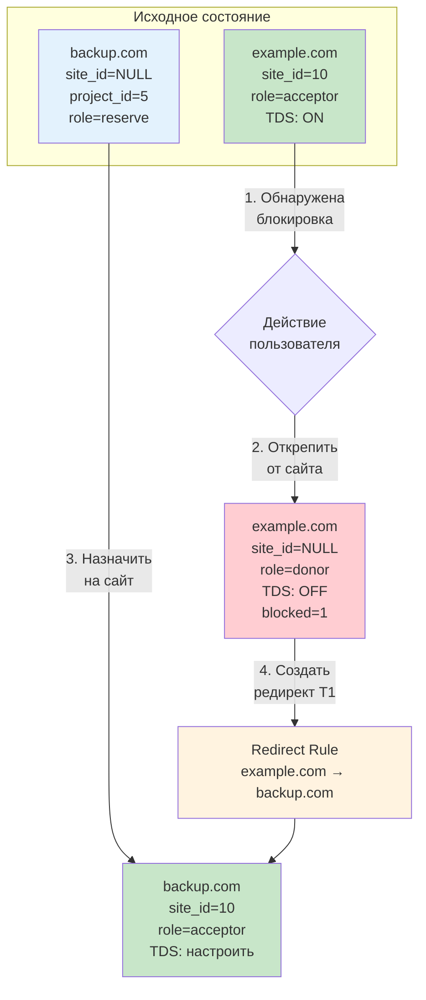
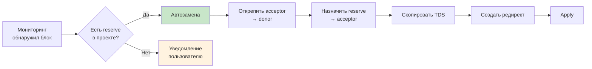

## Sites API

### Базовый URL

```
https://api.301.st/sites
https://api.301.st/projects/:id/sites
```

---

### Концепция

**Site** = тег / точка приёма трафика.

- Каждый проект имеет минимум один сайт
- При создании проекта автоматически создаётся первый сайт
- Домены привязываются к сайтам через `domains.site_id`
- При блокировке домена-acceptor тег site перевешивается на резервный домен

**Статусы сайта:**

| Статус | Описание |
|--------|----------|
| `active` | Принимает трафик |
| `paused` | Временно приостановлен |
| `archived` | Архивирован |

---

### 1 GET /projects/:id/sites

Список сайтов проекта.

**Требует:** `Authorization: Bearer <access_token>`

**Query параметры:**

| Параметр | Тип | Описание |
|----------|-----|----------|
| `status` | string | Фильтр по статусу: `active`, `paused`, `archived` |

**Пример запроса:**

```bash
curl -X GET "https://api.301.st/projects/5/sites" \
  -H "Authorization: Bearer <access_token>"
```

**Успешный ответ:**

```json
{
  "ok": true,
  "project": {
    "id": 5,
    "project_name": "Brand Campaign Q1"
  },
  "total": 2,
  "sites": [
    {
      "id": 10,
      "project_id": 5,
      "site_name": "Main Landing",
      "site_tag": "landing-v1",
      "status": "active",
      "created_at": "2025-01-10T08:00:00Z",
      "updated_at": "2025-01-10T08:00:00Z",
      "domains_count": 3,
      "acceptor_domain": "example.com"
    },
    {
      "id": 11,
      "project_id": 5,
      "site_name": "Promo Page",
      "site_tag": "promo-v2",
      "status": "active",
      "created_at": "2025-01-15T10:00:00Z",
      "updated_at": "2025-01-15T10:00:00Z",
      "domains_count": 1,
      "acceptor_domain": "promo.example.com"
    }
  ]
}
```

**С фильтром по статусу:**

```bash
curl -X GET "https://api.301.st/projects/5/sites?status=active" \
  -H "Authorization: Bearer <access_token>"
```

**Ошибки:**

```json
{
  "ok": false,
  "error": "project_not_found"
}
```

---

### 2 GET /sites/:id

Детали сайта + список привязанных доменов.

**Требует:** `Authorization: Bearer <access_token>`

**Пример запроса:**

```bash
curl -X GET "https://api.301.st/sites/10" \
  -H "Authorization: Bearer <access_token>"
```

**Успешный ответ:**

```json
{
  "ok": true,
  "site": {
    "id": 10,
    "project_id": 5,
    "site_name": "Main Landing",
    "site_tag": "landing-v1",
    "status": "active",
    "created_at": "2025-01-10T08:00:00Z",
    "updated_at": "2025-01-10T08:00:00Z",
    "project_name": "Brand Campaign Q1"
  },
  "domains": [
    {
      "id": 1,
      "domain_name": "example.com",
      "role": "acceptor",
      "blocked": 0,
      "blocked_reason": null
    },
    {
      "id": 4,
      "domain_name": "promo-brand.io",
      "role": "donor",
      "blocked": 0,
      "blocked_reason": null
    },
    {
      "id": 5,
      "domain_name": "backup.example.com",
      "role": "reserve",
      "blocked": 0,
      "blocked_reason": null
    }
  ]
}
```

> **Примечание:** Домены сортируются: acceptor → donor → reserve → по алфавиту.

**Ошибки:**

```json
{
  "ok": false,
  "error": "site_not_found"
}
```

---

### 3 POST /projects/:id/sites

Создать сайт в проекте.

**Требует:** `Authorization: Bearer <access_token>` (owner или editor)

**Параметры запроса:**

| Поле | Тип | Обязательно | Описание |
|------|-----|-------------|----------|
| `site_name` | string | да | Название сайта |
| `site_tag` | string | нет | Тег для идентификации |

**Пример запроса:**

```bash
curl -X POST "https://api.301.st/projects/5/sites" \
  -H "Authorization: Bearer <access_token>" \
  -H "Content-Type: application/json" \
  -d '{
    "site_name": "New Landing Page",
    "site_tag": "landing-v3"
  }'
```

**Успешный ответ:**

```json
{
  "ok": true,
  "site": {
    "id": 12,
    "project_id": 5,
    "site_name": "New Landing Page",
    "site_tag": "landing-v3",
    "status": "active"
  }
}
```

**Ошибки:**

```json
// Проект не найден
{
  "ok": false,
  "error": "project_not_found"
}

// Не указано имя
{
  "ok": false,
  "error": "missing_field",
  "field": "site_name"
}

// Превышена квота сайтов
{
  "ok": false,
  "error": "quota_exceeded",
  "limit": 50,
  "used": 50
}
```

---

### 4 PATCH /sites/:id

Обновить сайт.

**Требует:** `Authorization: Bearer <access_token>` (owner или editor)

**Параметры запроса:**

| Поле | Тип | Описание |
|------|-----|----------|
| `site_name` | string | Новое название |
| `site_tag` | string | Новый тег |
| `status` | string | Новый статус: `active`, `paused`, `archived` |

**Пример запроса:**

```bash
curl -X PATCH "https://api.301.st/sites/10" \
  -H "Authorization: Bearer <access_token>" \
  -H "Content-Type: application/json" \
  -d '{
    "status": "paused"
  }'
```

**Успешный ответ:**

```json
{
  "ok": true
}
```

**Ошибки:**

```json
// Сайт не найден
{
  "ok": false,
  "error": "site_not_found"
}

// Невалидный статус
{
  "ok": false,
  "error": "invalid_status"
}

// Нет полей для обновления
{
  "ok": false,
  "error": "no_fields_to_update"
}
```

---

### 5 DELETE /sites/:id

Удалить сайт.

**Требует:** `Authorization: Bearer <access_token>` (owner или editor)

> **Важно:**
> - Нельзя удалить последний сайт проекта
> - При удалении сайта привязанные домены получают `site_id = NULL` и `role = 'reserve'`

**Пример запроса:**

```bash
curl -X DELETE "https://api.301.st/sites/11" \
  -H "Authorization: Bearer <access_token>"
```

**Успешный ответ:**

```json
{
  "ok": true
}
```

**Ошибки:**

```json
// Сайт не найден
{
  "ok": false,
  "error": "site_not_found"
}

// Последний сайт проекта
{
  "ok": false,
  "error": "cannot_delete_last_site",
  "message": "Project must have at least one site. Delete the project instead."
}
```

---

### 6 POST /sites/:id/domains

Привязать домен к сайту (назначить тег).

**Требует:** `Authorization: Bearer <access_token>` (owner или editor)

> **Логика роли:**
> - При привязке домена автоматически устанавливается `project_id` от сайта
> - Первый домен сайта автоматически получает роль `acceptor`
> - Последующие домены сохраняют текущую роль (`reserve`)

**Параметры запроса:**

| Поле | Тип | Обязательно | Описание |
|------|-----|-------------|----------|
| `domain_id` | number | да | ID домена |

**Пример запроса:**

```bash
curl -X POST "https://api.301.st/sites/10/domains" \
  -H "Authorization: Bearer <access_token>" \
  -H "Content-Type: application/json" \
  -d '{
    "domain_id": 6
  }'
```

**Успешный ответ:**

```json
{
  "ok": true,
  "domain": {
    "id": 6,
    "domain_name": "new-domain.com",
    "site_id": 10,
    "project_id": 5,
    "role": "acceptor",
    "became_acceptor": true
  }
}
```

> **Поля ответа:**
> - `project_id` — устанавливается от сайта, сохраняется при откреплении
> - `became_acceptor` — true если домен стал acceptor (был первым)
```

**Ошибки:**

```json
// Сайт не найден
{
  "ok": false,
  "error": "site_not_found"
}

// Домен не найден
{
  "ok": false,
  "error": "domain_not_found"
}

// Домен принадлежит другому проекту
{
  "ok": false,
  "error": "domain_in_different_project",
  "message": "Domain belongs to a different project. Reassign it first."
}
```

---

### 7 DELETE /sites/:id/domains/:domainId

Отвязать домен от сайта (убрать тег).

**Требует:** `Authorization: Bearer <access_token>` (owner или editor)

> **Поведение:**
> - `site_id` = NULL
> - `role` = 'reserve'
> - `project_id` **сохраняется** — домен остаётся в проекте

**Пример запроса:**

```bash
curl -X DELETE "https://api.301.st/sites/10/domains/6" \
  -H "Authorization: Bearer <access_token>"
```

**Успешный ответ:**

```json
{
  "ok": true
}
```

**Ошибки:**

```json
// Сайт не найден
{
  "ok": false,
  "error": "site_not_found"
}

// Домен не привязан к этому сайту
{
  "ok": false,
  "error": "domain_not_assigned"
}
```

---

### 8 Связь Site ↔ Domain

**Правила:**
- У сайта  один активный `acceptor` домен
- При блокировке `acceptor` — тег перевешивается на `reserve`
- Заблокированный домен становится `donor`

**Site** = тег, точка приёма трафика. Домен с `site_id != NULL` и `role = 'acceptor'` — это активный сайт.

```
Site (тег = точка приёма трафика)
  │
  └── Acceptor Domain
        ├── site_id = site.id
        ├── role = 'acceptor'
        └── TDS: ON (активен)

Project (логическая группа)
  │
  ├── Sites (точки приёма)
  │     └── 1 acceptor на каждый site
  │
  ├── Reserve Domains (site_id=NULL, role='reserve')
  │     └── Готовы к назначению на site
  │
  └── Donor Domains (site_id=NULL, role='donor')
        └── Редиректят на acceptor, TDS отключён
```

**Ключевые правила:**

| Правило | Описание |
|---------|----------|
| 1 acceptor на site | У сайта один активный домен-acceptor |
| TDS только у acceptor | При откреплении от сайта TDS отключается |
| donor без site_id | Донор не привязан к сайту, только редиректит |
| reserve в проекте | Резерв может иметь project_id без site_id |

---


### 9 Workflow: Переключение домена при блокировке



---

### 9.1 Пошаговая инструкция

| Шаг | Действие пользователя | API вызов | Изменения в БД |
|-----|----------------------|-----------|----------------|
| 1 | Обнаружить блокировку | — | `blocked=1, blocked_reason='ad_network'` |
| 2 | Открепить домен от сайта | `PATCH /domains/:id` | `site_id=NULL, role='donor'` |
| 3 | **TDS автоматически отключается** | — | TDS правила деактивируются |
| 4 | Назначить резервный домен | `POST /sites/:id/domains` | `site_id=10, role='acceptor'` |
| 5 | Настроить TDS | `POST /tds/...` | Скопировать/создать TDS правила |
| 6 | Создать редирект | `POST /redirects` | `template_id='T1', donor→acceptor` |
| 7 | Применить изменения | `POST /apply` | Деплой в Cloudflare |

---

### 9.2 Что происходит с TDS при откреплении

**До откреплении:**
```json
{
  "domain": "example.com",
  "site_id": 10,
  "role": "acceptor",
  "tds_rules": [
    { "geo": ["RU"], "target": "https://offer-ru.com" },
    { "geo": ["US"], "target": "https://offer-us.com" }
  ]
}
```

**После открепления:**
```json
{
  "domain": "example.com",
  "site_id": null,
  "role": "donor",
  "tds_rules": []  // ← TDS отключён!
}
```

> **Важно:** TDS правила НЕ удаляются из БД, но деактивируются. Пользователь может скопировать их на новый acceptor.

---

### 9.3 Контрольные точки UI

При откреплении домена от сайта UI должен:

1. **Показать предупреждение:**
   > "TDS на домене example.com будет отключён. Скопировать настройки TDS на новый домен?"

2. **Предложить действия:**
   - [ ] Скопировать TDS на резервный домен
   - [ ] Создать редирект example.com → [выбрать домен]
   - [ ] Назначить резервный домен на сайт

3. **Валидация:**
   - Нельзя открепить последний acceptor без назначения нового
   - Предупреждение если нет резервных доменов в проекте

---

### 9.4 Сравнение состояний

| Параметр | До блокировки | После замены |
|----------|---------------|--------------|
| **Acceptor сайта** | example.com | backup.com |
| **TDS активен на** | example.com | backup.com |
| **Редиректы** | — | example.com → backup.com |
| **Донор** | — | example.com |
| **Трафик идёт на** | example.com | backup.com (+ редирект с example.com) |

---

### 9.5 Автоматизация (будущее)

TODO: в  можно автоматизировать процесс:
> Пока это ручной процесс — пользователь контролирует каждый шаг.



---

### 10 Таблица endpoints

| Endpoint | Метод | Auth | Описание |
|----------|-------|------|----------|
| `/projects/:id/sites` | GET | JWT | Список сайтов проекта |
| `/projects/:id/sites` | POST | editor | Создать сайт |
| `/sites/:id` | GET | JWT | Детали сайта + домены |
| `/sites/:id` | PATCH | editor | Обновить сайт |
| `/sites/:id` | DELETE | editor | Удалить сайт |
| `/sites/:id/domains` | POST | editor | Привязать домен |
| `/sites/:id/domains/:domainId` | DELETE | editor | Отвязать домен |

---

### 11 Квоты

| План | max_sites |
|------|-----------|
| Free | 2 |
| Pro | 50 |
| Business | 200 |

При превышении квоты создание нового сайта возвращает `quota_exceeded`.


