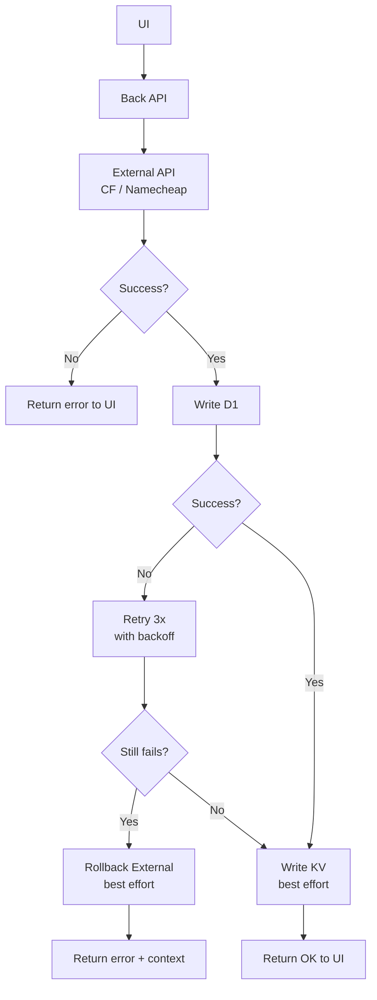
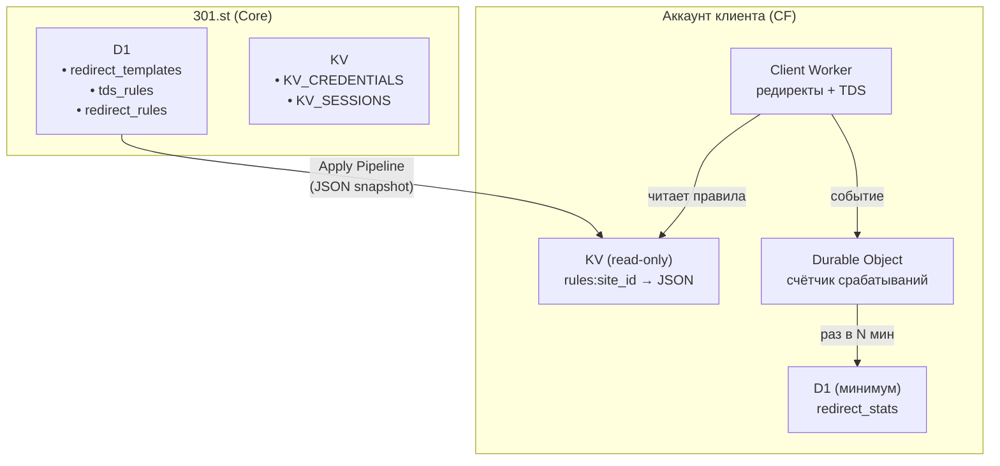
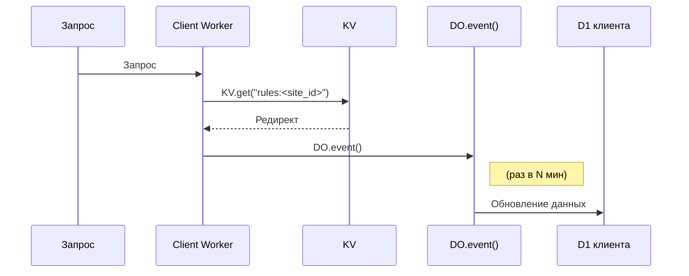
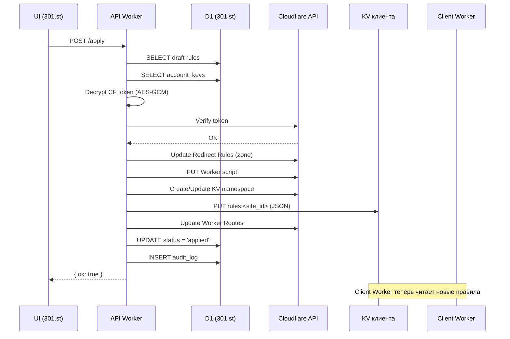

# Архитектура 301.st

## 1. Концепция платформы

**301.st** — SaaS-платформа для управления доменами, редиректами и TDS через инфраструктуру Cloudflare.

### Ключевая идея

Клиенты работают на **бесплатном тарифе Cloudflare**, вся бизнес-логика выполняется на стороне 301.st.

### Разделение ответственности

| Сторона | Что хранит/выполняет |
|---------|---------------------|
| **301.st (Core)** | Управление, шаблоны, правила, секреты, биллинг |
| **Аккаунт клиента (CF)** | Исполнение редиректов, статистика срабатываний |

### Принципы

- **Клиенту не нужен платный Cloudflare** — всё работает на Free Workers
- **Шаблоны и логика** хранятся на 301.st, применяются через API
- **Клиент управляет через UI** — платформа обновляет данные, не код

#### Вариант A: 1 зона (1 домен + поддомены)
- **Пример**: Зона `brand.com` с поддоменами `ru.brand.com`, `us.brand.com`.
- **Плюсы**: Дешево (1 домен), просто (один SSL, один маршрут Worker).
- **Минусы**: Нет изоляции — блокировка `brand.com` (по IP/SNI) затрагивает все поддомены. Redirect Rules: 10 на зону. Увеличивает вложенность правил Worker.
- **Когда использовать**: Low-risk гео (US, EU), где блокировки редки.

**Плюсы**
- Простота: Один домен → одна зона → один SSL-сертификат → проще в UI и API.
- Дешевизна: 1 домен, поддомены — бесплатно.
- Легко масштабировать: Добавить jp.brand-global.com — просто новая DNS-запись.

**Минусы**
- Нет изоляции при блокировке: Если brand-global.com заблокирован по IP/SNI — все поддомены недоступны , даже если трафик идёт на ru.brand-global.com.
- Один IP-адрес - (часто) Cloudflare может отдавать один и тот же IP для всех поддоменов → блокировка по IP убивает всё.
- Redirect Rules: 10 на зону. Хватит, но если делать редиректы не только по домену, а по путям — быстро закончится.


#### Вариант B: N зон (N доменов 2-го уровня)
- **Пример**: `brand-ru.org` (зона 1), `brand-us.com` (зона 2).
- **Плюсы**: Изоляция при блокировке (отдельный IP/SNI). Redirect Rules: 10 на зону (итого 50+). Worker: Плоская логика (по hostname, без вложенных if).
- **Минусы**: Дороже (N доменов ~$5–15/год каждый).
- **Когда использовать**: High-risk гео (RU, EU), арбитраж с гео-сплитом.

**Плюсы** 
- Изоляция при блокировке - Если brand-ru.org заблокирован в стране — остальные домены полностью независимы (свой IP, свой SNI, своя зона).
- Гибкость DNS Можно поставить разные A-записи, разные прокси, разные TTL.
- Redirect Rules - 10 правил на каждый домен → итого 50 возможных редиректов.
- SEO / Trust Отдельные домены 2-го уровня воспринимаются как независимые проекты (лучше для некоторых ниш).

**Минусы**
- Сложность управления - Нужно покупать и продлевать 5 доменов.
- Настройка в CF - 5 зон → 5 маршрутов для Workers → больше операций через API.
- Стоимость Домены стоят денег ($5–15/год каждый).


#### Гибридный подход (для разных стратегий)
- High-risk: Отдельные домены/зоны.
- Low-risk: Поддомены в одной зоне.
- В платформе: При создании сайта — выбор «Поддомен (дешевле)» или «Отдельный домен (надёжнее)».


---

## 2. Бизнес-модель

### Иерархия сущностей

```
Account
 ├── Free Domains (reserve)               ← домены, не привязанные к сайту
 │       └── Zones (технические, скрытые) ← каждая зона соответствует домену 2-го уровня
 │
 └── Projects                             ← логические группы (бренды / кампании)
        ├── Integrations                  ← Cloudflare, GA, YM, HostTracker, Registrar
        │
        ├── Sites                         ← функциональные единицы приёма трафика
        │     ├── Primary Domain          ← один главный домен (2-го или 3-го уровня)
        │     ├── Donor Domains (0..N)    ← редиректы на primary
        │     └── (в будущем) сущности сайта: аналитика, правила, отчёты и т.п.
        │
        ├── Domains (через Sites)         ← рабочие домены сайта
        │       └── Zones (служебные, Cloudflare)
        │             └── домены, принадлежащие этой зоне
        │
        └── Zones (служебная группировка Cloudflare)
              ├── Связь с интеграцией (Cloudflare Account Key)
              ├── Список доменов, относящихся к зоне
              └── Используется для быстрой выборки и управления записями DNS

```

### Определения

| Сущность | Описание |
|----------|----------|
| **Project** | Логическая группа (бренд/кампания). Содержит сайты и интеграции |
| **Site** | Функциональная единица приёма трафика. 1 Site = 1 Zone |
| **Zone** | DNS-зона в Cloudflare (технический контейнер). Скрыта от пользователя в UI |
| **Domain** | Доменное имя (FQDN) внутри зоны. 2, 3, 4 уровня |

### Роли 

**Проект** = логическая группа (бренд/кампания). Содержит несколько **Сайтов**.
Включает набор интеграций: Аккаунт(ы) Cloudflare; GA, YM; HostTracker; Namecheap и другие сервисы
Интеграции выбираются пользователем из общего списка в ЛК 301.st

**Сайт** = функциональная единица для приёма трафика. Принадлежит Проекту.
Состоит из:

1 главный Домен (primary) — акцептор трафика (Условия: не принадлежит другому сайту, без блокировки, без редиректов)
0 или более донорских Доменов (donor) — редиректы на главный. Домены могут находиться в разных зонах.

**Zone** = DNS-зона в Cloudflare (технический контейнер для доменов).

Создаётся автоматически для домена 2-го уровня
Скрыта от пользователя в UI
Домены 3-го, 4-го уровня принадлежат зоне своего родительского домена 2-го уровня

**Domain** = доменное имя (FQDN) внутри зоны.
Может быть 2, 3, 4 уровня (brand.com, ru.brand.com, win.ru.brand.com).
Имеет роль:

_primary_ — главный домен сайта (акцептор трафика)
_donor_ — донорский домен (редирект на primary)
_reserve_ — в резерве (NS настроены, но не используется)

### Тарифы

| Тариф | Ограничения |
|-------|-------------|
| **Free** | 1 проект, 10 сайтов, 1 пользователь, базовые шаблоны (10 правил) |
| **Pro** | 10 проектов, сайтов, пользователей, A/B-тесты, шаблоны (20 правил)|
| **Buss** | 100 проектов, сайтов, пользователей, кастомные правила, A/B-тесты |

> **При просрочке оплаты:** аккаунт переводится в статус `overdue`. Применённые правила продолжают работать. Ограничения касаются только UI 301.st — доступен только последний проект.

- 301 - модель позволяет клиентам работать на бесплатном Cloudflare, минимизируя затраты и сложность.
- Основной фокус — Workers для динамики, с Redirect Rules как опцией.
- При росте нагрузки — клиент подключает Workers Paid.
- Для high-risk сценариев используйте несколько зон. Это обеспечит масштабируемость и удобство без избыточных предложений от Cloudflare.

---

## 3. Ключевые принципы

### Draft Mode

Все изменения пользователя сохраняются в D1 как `draft`:
- Проекты, сайты, домены
- Redirect rules, TDS rules
- Ключи интеграций
- Любые настройки

**Никакие операции в Cloudflare НЕ выполняются автоматически.**

**Принципы взаимодействия UI ↔ Back ↔ External API**

### Apply Pipeline

Изменения применяются только по явному действию пользователя — кнопка "ПРИМЕНИТЬ":

```
UI (draft) → API /apply → CF API → Аккаунт клиента
```

### Multi-tenant изоляция

- Все таблицы содержат `account_id`
- Данные клиентов полностью изолированы
- API фильтрует по `account_id` из JWT

## 3.1 Порядок операций

| Шаг | Действие | При ошибке |
|-----|----------|------------|
| 1 | External API (CF, Namecheap) | Вернуть ошибку UI, ничего не делать |
| 2 | D1 (запись/обновление) | Retry → Rollback External → Вернуть ошибку с context |
| 3 | KV (кэш, сессии) | Retry → Игнорировать (не критично) |
| 4 | Ответ UI | Только после успеха шагов 1-2 |

### 3.2 Стратегии обработки ошибок

| Стратегия | Когда применять | Описание |
|-----------|-----------------|----------|
| **Fail Fast** | Критичные операции (создание ключа) | При любой ошибке — откат и возврат ошибки |
| **Retry + Backoff** | Временные сбои (D1, KV) | 3 попытки с увеличивающейся задержкой (100ms, 200ms, 300ms) |
| **Partial Success** | Batch операции (sync zones, batch DNS) | Продолжаем остальные, собираем ошибки в массив |
| **Best Effort Rollback** | После успеха External, но сбоя D1 | Пытаемся откатить External, не гарантируем успех |
| **Orphan Cleanup** | Не удалось откатить | Cron задача периодически чистит "сироты" |

### 3.3 Структура ответа UI

| Сценарий | Структура ответа |
|----------|------------------|
| **Полный успех** | `{ ok: true, data: {...} }` |
| **Полный провал** | `{ ok: false, error: "error_code", message: "Human readable" }` |
| **Частичный успех (batch)** | `{ ok: false, stats: { success: N, errors: [...] }, data: [...] }` |
| **Провал с context** | `{ ok: false, error: "db_failed", cf_token_id: "xxx", message: "Created in CF but..." }` |

### 3.4 Правила для конкретных операций

| Операция | External API | D1 | При сбое D1 |
|----------|--------------|----|--------------|
| **Init Key** | CF: создать token | Записать ключ | Rollback: удалить token в CF |
| **Create Zone** | CF: создать zone | Записать zone + domain | Rollback: удалить zone в CF |
| **Delete Zone** | CF: удалить zone | Пометить deleted | Игнорировать (zone уже удалена в CF) |
| **Sync Zones** | CF: list zones | Upsert каждую | Partial Success: продолжить остальные |
| **Batch DNS** | CF: create/update/delete | Инвалидировать кэш | Игнорировать (кэш не критичен) |

### 3.5 Таймауты и лимиты

| Параметр | Значение | Причина |
|----------|----------|---------|
| External API timeout | 30 сек | CF/Namecheap могут быть медленными |
| D1 retry attempts | 3 | Достаточно для временных сбоев |
| D1 retry backoff | 100ms, 200ms, 300ms | Экспоненциальный рост |
| Batch операции max | 100 | Лимит CF API |
| Cron orphan cleanup | 24 часа | Не критично, но регулярно |

### 3.6 Логирование ошибок

| Уровень | Что логируем | Где |
|---------|--------------|-----|
| **ERROR** | Сбой External API, сбой D1 после retry | console.error + (опционально) external logging |
| **WARN** | Частичный успех, orphan создан | console.warn |
| **INFO** | Успешные операции с метриками | console.log (только в dev) |

### 3.7 Пример кода: безопасная операция

```typescript
async function safeExternalOperation<T>(
  externalCall: () => Promise<T>,
  dbCall: (result: T) => Promise<void>,
  rollbackCall?: (result: T) => Promise<void>
): Promise<{ ok: true; result: T } | { ok: false; error: string; context?: unknown }> {

  // 1. External API
  let externalResult: T;
  try {
    externalResult = await externalCall();
  } catch (e) {
    return { ok: false, error: "external_failed", context: String(e) };
  }

  // 2. D1 с retry
  let dbSuccess = false;
  for (let i = 0; i < 3; i++) {
    try {
      await dbCall(externalResult);
      dbSuccess = true;
      break;
    } catch {
      await new Promise(r => setTimeout(r, 100 * (i + 1)));
    }
  }

  // 3. Rollback если D1 упал
  if (!dbSuccess) {
    if (rollbackCall) {
      await rollbackCall(externalResult).catch(() => {});
    }
    return { ok: false, error: "db_failed", context: externalResult };
  }

  return { ok: true, result: externalResult };
}
```

### 3.8 Диаграмма потока



---

## 4. Воркеры и размещение конфигураций

### 4.1 Воркеры платформы 301.st

| Воркер | Размещение | Назначение | Доступ к данным клиента |
|--------|------------|------------|-------------------------|
| **API Worker** | api.301.st | Вся бизнес-логика платформы | ✅ Полный |
| **System Worker** | system.301.st | Cron, backup, cleanup, health, сбор статистики | ✅ Чтение (D1 клиента → агрегация в 301.st) |
| **Webhook Worker** | webhook.301.st | Приём внешних событий (HostTracker, CF Events) | ❌ Нет |

**API Worker** — единственный воркер с полным доступом:
- Auth (Classic, OAuth, Telegram)
- CRUD проектов, сайтов, доменов
- Apply engine (деплой в CF клиента)
- Работа с CF API клиентов
- Шифрование/дешифрование ключей (AES-GCM)
- Деплой воркеров и конфигураций в аккаунты клиентов

### 4.2 Размещение в аккаунте клиента

API Worker через Cloudflare API размещает в аккаунте клиента:

| Что | Назначение |
|-----|------------|
| **Client Worker** | Исполнение редиректов и TDS |
| **KV Namespace** | Правила редиректов (только чтение) |
| **D1 Database** | Минимальные таблицы статистики |
| **Durable Object** | Агрегация событий переходов |
| **Worker Routes** | Привязка воркера к доменам |
| **Redirect Rules** | Простые статические редиректы (до 10 на зону) |

### 4.3 Разделение хранения



### 4.4 Принцип работы Client Worker



**Client Worker имеет доступ только к:**
- Своему KV Namespace (чтение правил)
- Своей D1 Database (статистика)
- Своему Durable Object (события)

**Client Worker НЕ имеет доступа к:**
- Логике шифрования/дешифрования
- API интеграций (Cloudflare, Namecheap, etc.)
- D1/KV платформы 301.st
- Ключам и секретам

### 4.5 Поток данных статистики

| Этап | Действие | Хранилище |
|------|----------|-----------|
| 1 | Пользователь переходит по домену | — |
| 2 | Client Worker выполняет редирект | KV клиента (чтение) |
| 3 | Событие отправляется в DO | Durable Object клиента |
| 4 | DO агрегирует (раз в N минут) | DO → D1 клиента |
| 5 | System Worker собирает статистику (cron) | D1 клиента → D1 301.st |
| 6 | Отображение в ЛК пользователя | D1 301.st → UI |

---

## 5. Apply Pipeline

### 5.1 Общий флоу



### 5.2 Шаги Apply Pipeline

| Шаг | Действие | Детали |
|-----|----------|--------|
| 1 | **Получить ключ интеграции** | `SELECT FROM account_keys WHERE provider='cloudflare'` |
| 2 | **Расшифровать токен** | AES-GCM с MASTER_SECRET |
| 3 | **Проверить права** | `CF API: /user/tokens/verify` |
| 4 | **Применить Redirect Rules** | CF Rules API → обновление правил зоны |
| 5 | **Сгенерировать Client Worker** | D1 шаблон → JSON правил → финальный код |
| 6 | **Деплой Client Worker** | `PUT /accounts/:id/workers/scripts/...` |
| 7 | **Создать KV namespace** | Если не существует |
| 8 | **Записать правила в KV** | `rules:<site_id>` = JSON snapshot |
| 9 | **Обновить Routes** | Workers Routes API |
| 10 | **Зафиксировать результат** | D1: status='applied', audit_log |

### 5.3 Формат JSON snapshot (KV клиента)

```json
{
  "site_id": 123,
  "domains": ["brand.com", "ru.brand.com", "promo.brand.com"],
  "redirects": [
    {
      "source": "/old/*",
      "target": "/new/$1",
      "type": 301
    }
  ],
  "tds": {
    "enabled": true,
    "rules": [
      {
        "condition": { "geo": ["RU", "BY", "KZ"] },
        "target": "https://offer-ru.com"
      },
      {
        "condition": { "device": "mobile" },
        "target": "https://m.offer.com"
      }
    ],
    "fallback": "https://default.com"
  },
  "updated_at": "2025-01-17T12:00:00Z",
  "version": 42
}
```

---

## 6. Итоговая ответственность

| Компонент | Назначение | Доступ к KV/D1 клиента |
|-----------|------------|------------------------|
| **API Worker** | Вся логика: UI→D1, apply, CF API, деплой | ✅ Полный (через CF API) |
| **System Worker** | Cron, backup, cleanup, сбор статистики | ✅ Чтение D1 клиента (для агрегации в ЛК) |
| **Webhook Worker** | Приём внешних событий | ❌ Нет |
| **Client Worker** | Исполнение редиректов/TDS | ✅ Только свои (KV read, D1 write, DO) |

---

## 7. Флоу платформы (краткое резюме)

```
1. Вход пользователя
   UI → API /auth/login → KV_SESSIONS

2. Настройка системы (draft mode)
   UI → API → D1 (status: draft)
   Ничего в Cloudflare не меняется

3. Применение настроек
   UI → API /apply → CF API → KV/D1/Worker клиента
   D1: status = 'applied'

4. Работа Client Worker
   Запрос → Client Worker → KV → Редирект → DO → D1 клиента

5. Сбор статистики (cron)
   System Worker → D1 клиента → D1 301.st → UI (ЛК)
```

---

© 301.st — Architecture Documentation
