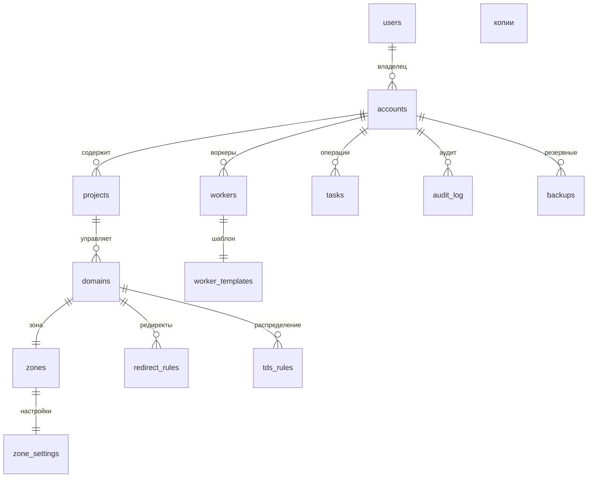

# Data Model (Модель данных)

## 1. Введение

Модель данных платформы 301.st описывает, как структурируются и взаимодействуют данные пользователей, доменов и системных объектов. Архитектура построена на серверлесс-подходе Cloudflare и обеспечивает масштабируемость, безопасность и изоляцию клиентов.

**Пример структуры БД можно посмотреть в файле [301.sql](./301.sql)** — он содержит актуальные определения таблиц D1 и комментарии к ним.

### Основные принципы

* Изоляция данных по `account_id` (multi-tenant модель).
* Разделение слоёв хранения: D1 (структурированные данные), KV (runtime-кэш), R2 (архивы), Queues (события).
* Все пользовательские ключи и чувствительные данные шифруются (AES-GCM).
* Все изменения фиксируются через `tasks` и `audit_log`.

### Уровни хранения

| Хранилище | Назначение                                               |
| --------- | -------------------------------------------------------- |
| D1 (SQL)  | Структурированные данные, основной источник истины       |
| KV        | Зашифрованные ключи и кэш исполнения (runtime snapshots) |
| R2        | Объектное хранилище для резервных копий, логов и отчётов |
| Queues    | Очереди событий для фоновых и асинхронных процессов      |

---

## 2. Взаимодействие KV и D1

### Общий принцип

D1 и KV работают как взаимодополняющие слои хранения:

* **D1** содержит метаданные, статусы и аудит изменений.
* **KV** содержит зашифрованные значения и JSON-кэш правил для быстрой обработки на Edge.

### Поток данных

1. Пользователь создаёт или изменяет данные (например, добавляет ключ API или обновляет правила редиректов).
2. API-воркер шифрует значение (AES-GCM, `MASTER_SECRET`) и сохраняет в KV.
3. D1 фиксирует метаданные: `kv_key`, `provider`, `status`, `created_at`.
4. Edge-воркер при выполнении извлекает данные из KV и расшифровывает их на лету.
5. При изменении правил API-воркер синхронизирует KV и D1 (обновление snapshot и статуса).

### Разделение ролей

* **KV** — быстрый runtime-кэш и безопасное хранилище секретов.
* **D1** — основная база данных и источник истины.

---

## 3. D1 — Реляционная база данных

### 3.1 Принципы проектирования

* D1 — основное долговременное хранилище данных.
* Все таблицы содержат `account_id` для изоляции данных клиентов.
* Изменения фиксируются в `tasks` и `audit_log`.
* Временные и крупные данные выносятся в KV или R2.

### 3.2 Основные группы таблиц

| Раздел                | Назначение                           | Таблицы                                                               |
| --------------------- | ------------------------------------ | --------------------------------------------------------------------- |
| Пользователи и сессии | Авторизация и аудит входов           | `users`, `sessions`                                                   |
| Аккаунты и интеграции | Изоляция, API-ключи, внешние сервисы | `accounts`, `account_keys`                                            |
| Проекты и домены      | Управление зонами и настройками      | `projects`, `domains`, `zones`, `zone_settings`                       |
| Редиректы и TDS       | Правила маршрутизации и шаблоны      | `redirect_rules`, `redirect_templates`, `tds_rules`                   |
| Воркеры               | Деплой и шаблоны воркеров            | `workers`, `worker_templates`                                         |
| Аналитика и аудит     | Логи и задачи                        | `redirect_logs`, `analytics_summary`, `tasks`, `audit_log`, `backups` |

### 3.3 Связи таблиц



### 3.4 Пример структуры БД

Подробное описание таблиц, связей и комментариев доступно в файле [301.sql](./301.sql).

---

## 4. KV — Key-Value хранилище

### 4.1 Назначение

KV используется для хранения зашифрованных данных (ключи, токены, runtime-снапшоты) и кэшированных структур правил. Доступ обеспечивается напрямую из Edge-воркеров без SQL-запросов.

### 4.2 Основные namespace

| Namespace      | Назначение                         | Пример ключа           |
| -------------- | ---------------------------------- | ---------------------- |
| KV_CREDENTIALS | Зашифрованные API-ключи            | `cred:cloudflare:UUID` |
| KV_RULES       | JSON-снапшоты активных редиректов  | `rules:account:123`    |
| KV_TDS         | Конфигурации распределения трафика | `tds:zone:abc123`      |
| KV_SESSIONS    | Refresh-токены и OAuth-состояния   | `refresh:sessionId`    |

### 4.3 Безопасность и TTL

* Все значения шифруются с использованием `MASTER_SECRET`.
* TTL задаётся при записи (`expirationTtl`).
* KV не требует фиксированной схемы и управляется воркерами динамически.
* Edge-воркеры имеют только права на чтение, API-воркеры создают и обновляют записи.

---

## 5. R2 — Object Storage

### 5.1 Назначение

R2 используется для долговременного хранения резервных копий, логов и аналитических отчётов. Бэкапы формируются воркерами (Jobs) и сохраняются автоматически.

### 5.2 Структура хранения

```
r2://301st-backups/
 ├─ d1/YYYY-MM-DD/backup.sql.gz
 ├─ kv/YYYY-MM-DD/rules.json.gz
 ├─ analytics/YYYY-MM-DD/report.csv
```

### 5.3 Политика хранения

* Срок хранения архивов — 30 дней.
* Очистка устаревших данных выполняется Cron-воркером.
* Все операции фиксируются в таблице `backups` в D1.

---

## 6. Queues — Очереди сообщений

### 6.1 Назначение

Очереди обеспечивают асинхронную передачу событий между воркерами (edge, api, jobs). Это снижает нагрузку и позволяет выполнять фоновые задачи независимо от запросов пользователей.

### 6.2 Основные очереди

| Очередь             | Назначение                      | Пример сообщения                  |
| ------------------- | ------------------------------- | --------------------------------- |
| QUEUE_LOGS          | Передача логов редиректов       | `{ domain_id, url, ip, ts }`      |
| QUEUE_ANALYTICS     | Ежедневная агрегация статистики | `{ account_id, date, stats }`     |
| QUEUE_NOTIFICATIONS | Уведомления и webhooks          | `{ user_id, message, channel }`   |
| QUEUE_ERRORS        | Обработка ошибок и ретраи       | `{ task_id, error, retry_after }` |

### 6.3 Принципы работы

* Сообщения формируются в формате JSON.
* Очереди изолированы по `account_id`.
* Jobs-воркеры слушают очереди и записывают результаты в D1.
* При ошибках сообщения отправляются в `QUEUE_ERRORS` для повторной обработки.

---

## 7. Жизненный цикл данных

1. Пользователь создаёт новое правило редиректа.
2. D1 фиксирует запись в `redirect_rules`.
3. API-воркер формирует JSON-snapshot и записывает в KV.
4. Edge-воркер применяет snapshot в runtime.
5. Переходы пишутся в очередь `QUEUE_LOGS`.
6. Jobs-воркер агрегирует данные в `analytics_summary`.
7. Backup-воркер ежедневно сохраняет D1 и KV в R2.

---

**Документ завершён.**

