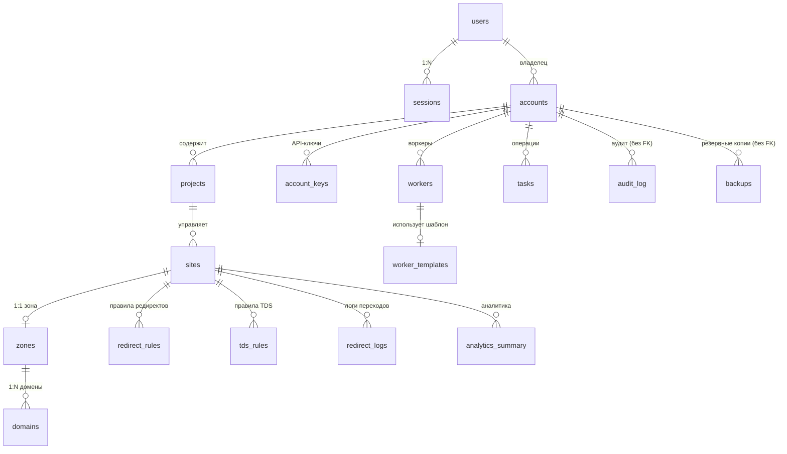

# Data Model (Модель данных)

## 1. Введение

Модель данных платформы 301.st описывает, как структурируются и взаимодействуют данные пользователей, доменов и системных объектов. Архитектура построена на серверлесс-подходе Cloudflare и обеспечивает масштабируемость, безопасность и изоляцию клиентов.

**📄 Схема БД доступна в файлах:**
- **[301.txt](./301.txt)** — полная схема с подробными комментариями
- **[301_d1.sql](./301_d1.sql)** — готовая к деплою версия для Cloudflare D1
- **[Appendix.md](./Appendix.md)** — подробное описание иерархии Projects → Sites → Zones → Domains

### Основные принципы

* **Multi-tenant изоляция:** все таблицы содержат `account_id` для строгой изоляции данных клиентов.
* **Разделение слоёв хранения:** D1 (структурированные данные), KV (runtime-кэш), R2 (архивы), Queues (события).
* **Шифрование:** все пользовательские ключи и чувствительные данные шифруются (AES-GCM).
* **Аудит и задачи:** все изменения фиксируются через `tasks` и `audit_log`.

### Уровни хранения

| Хранилище | Назначение                                               | Примеры данных |
| --------- | -------------------------------------------------------- | -------------- |
| **D1 (SQL)**  | Структурированные данные, основной источник истины   | users, accounts, domains, redirect_rules |
| **KV**        | Зашифрованные ключи и кэш исполнения (runtime snapshots) | API-ключи, refresh-токены, JSON-снапшоты правил |
| **R2**        | Объектное хранилище для резервных копий, логов и отчётов | backup.sql.gz, analytics.csv |
| **Queues**    | Очереди событий для фоновых и асинхронных процессов      | redirect_logs, notifications |

---

## 2. Взаимодействие KV и D1

### Общий принцип

D1 и KV работают как взаимодополняющие слои хранения:

* **D1** содержит метаданные, статусы и аудит изменений.
* **KV** содержит зашифрованные значения и JSON-кэш правил для быстрой обработки на Edge.

### Поток данных

1. **Пользователь создаёт данные** (например, добавляет API-ключ или обновляет правила редиректов).
2. **API-воркер:**
   - Шифрует значение (AES-GCM с `MASTER_SECRET`)
   - Сохраняет зашифрованное значение в **KV** (например, `cred:cloudflare:UUID`)
   - Записывает метаданные в **D1**: `kv_key`, `provider`, `status`, `created_at`
3. **Edge-воркер при выполнении:**
   - Извлекает данные из KV
   - Расшифровывает их на лету
   - Применяет правила без обращения к D1
4. **При изменении правил:**
   - API-воркер обновляет запись в D1
   - Синхронизирует snapshot в KV
   - Записывает событие в `audit_log`

### Разделение ролей

| Слой | Роль | Доступ |
|------|------|--------|
| **D1** | Основная база данных и источник истины | API-воркер (read/write), Jobs (read/write) |
| **KV** | Runtime-кэш и хранилище секретов | API-воркер (read/write), Edge-воркер (read-only) |

**⚠️ Важно для разработчиков:**
- Edge-воркеры **НЕ ИМЕЮТ** доступа к записи в KV
- Все изменения правил должны идти через API-воркер
- KV используется только для чтения в runtime

---

## 3. D1 — Реляционная база данных

### 3.1 Принципы проектирования

* D1 — основное долговременное хранилище данных.
* **Все рабочие таблицы** содержат `account_id` для multi-tenant изоляции.
* Исключения: `audit_log` и `backups` намеренно **БЕЗ FK** для сохранения истории.
* Изменения фиксируются в `tasks` и `audit_log`.
* Временные и крупные данные выносятся в KV или R2.

### 3.2 Основные группы таблиц

| Раздел                | Назначение                           | Таблицы                                                               |
| --------------------- | ------------------------------------ | --------------------------------------------------------------------- |
| Пользователи и сессии | Авторизация и аудит входов           | `users`, `sessions`                                                   |
| Аккаунты и интеграции | Изоляция, API-ключи, внешние сервисы | `accounts`, `account_keys`                                            |
| Проекты и структура   | Управление зонами и настройками      | `projects`, `sites`, `zones`, `domains`                               |
| Редиректы и TDS       | Правила маршрутизации и шаблоны      | `redirect_rules`, `redirect_templates`, `tds_rules`                   |
| Воркеры               | Деплой и шаблоны воркеров            | `workers`, `worker_templates`                                         |
| Аналитика и аудит     | Логи и задачи                        | `redirect_logs`, `analytics_summary`, `tasks`, `audit_log`, `backups` |

**⚠️ Важно для разработчиков фронтенда:**
- Таблицы `redirect_rules` и `tds_rules` связаны с **сайтами** (`site_id`)
- Правила применяются ко **всем доменам** сайта автоматически
- Каждая таблица также имеет `account_id` для дополнительной изоляции

### 3.3 Иерархия сущностей

```
Account (Аккаунт клиента)
  └─ Project (Проект/Кампания)
       └─ Site (Сайт)
            ├─ Zone (Зона Cloudflare) 1:1
            │    └─ Domain (Домены) 1:N
            │
            ├─ redirect_rules (Правила редиректов)
            └─ tds_rules (Правила распределения трафика)
```

**📖 Подробнее:** см. [Appendix.md](./Appendix.md) — детальное описание иерархии, вариантов использования и сценариев удаления.

**⚠️ Критично для понимания:**
- **1 Site = 1 Zone** (строгая привязка)
- **1 Zone = N Domains** (зона может содержать несколько доменов)
- **Domains имеют роли:**
  - `primary` — основной домен с TDS
  - `donor` — донорский домен для редиректов
- **Zone интегрирует настройки** (раньше была отдельная таблица `zone_settings`):
  - `auto_https`, `caching_level`, `waf_mode` — теперь поля в `zones`

### 3.4 Связи таблиц (ER-диаграмма)



**⚠️ Важные нюансы FK для разработчиков:**

| Связь | ON DELETE | Поведение |
|-------|-----------|-----------|
| `users` → `sessions` | **CASCADE** | Удаление user удаляет все сессии |
| `users` → `accounts` | **CASCADE** | Удаление user удаляет все аккаунты |
| `accounts` → `projects` | **CASCADE** | Удаление account удаляет все проекты |
| `projects` → `sites` | **CASCADE** | Удаление project удаляет все сайты |
| `sites` → `zones` | **SET NULL** | Удаление site освобождает зоны |
| `zones` → `domains` | **CASCADE** | Удаление zone удаляет все домены ⚠️ |
| `sites` → `domains` | **SET NULL** | Удаление site освобождает домены |

**📖 Подробнее про удаление:** см. раздел "Сценарии удаления" в [Appendix.md](./Appendix.md)

### 3.5 Пример структуры БД

**Полное описание таблиц, связей и комментариев:**
- **[301.txt](./301.txt)** — схема с подробными русскими комментариями
- **[301_d1.sql](./301_d1.sql)** — готовая к деплою версия (без комментариев, с PRAGMA)

**⚠️ Для деплоя используйте только `301_d1.sql`!**

---

## 4. KV — Key-Value хранилище

### 4.1 Назначение

KV используется для:
1. **Хранения зашифрованных секретов** (API-ключи, токены)
2. **Runtime-кэша правил** для Edge-воркеров (JSON-снапшоты)
3. **Refresh-токенов** для аутентификации

**⚠️ Важно:** KV не заменяет D1, а дополняет его для быстрого runtime-доступа без SQL-запросов.

### 4.2 Основные namespace

| Namespace      | Назначение                         | Пример ключа           | TTL | Шифрование |
| -------------- | ---------------------------------- | ---------------------- | --- | ---------- |
| **KV_CREDENTIALS** | Зашифрованные API-ключи        | `cred:cloudflare:UUID` | — | ✅ AES-GCM |
| **KV_RULES**       | JSON-снапшоты активных редиректов | `rules:site:123`    | — | ❌ |
| **KV_TDS**         | Конфигурации распределения трафика | `tds:site:abc123` | — | ❌ |
| **KV_SESSIONS**    | Refresh-токены и OAuth-состояния | `refresh:sessionId` | 7 дней | ❌ |

**⚠️ Важно для разработчиков воркеров:**
- Ключи в `KV_CREDENTIALS` **ВСЕГДА зашифрованы** → нужна расшифровка перед использованием
- Снапшоты в `KV_RULES` и `KV_TDS` **НЕ шифруются** → готовы к использованию
- Edge-воркер имеет **read-only** доступ ко всем KV

### 4.3 Безопасность и TTL

* **Шифрование:** Все секреты шифруются с использованием `MASTER_SECRET` (Workers Secret).
* **TTL:** Задаётся при записи через параметр `expirationTtl` (секунды).
* **Права доступа:**
  - **API-воркер:** read + write
  - **Edge-воркер:** read-only
  - **Jobs-воркер:** read + write (для cleanup)
* **Расшифровка:** Только на стороне воркера, никогда на клиенте.

**Пример использования в Edge-воркере:**
```javascript
// Получить снапшот правил для сайта
const rulesSnapshot = await env.KV_RULES.get(`rules:site:${siteId}`, 'json');
if (rulesSnapshot) {
    // Применить правила напрямую (не требует расшифровки)
    return applyRedirectRules(request, rulesSnapshot);
}
```

**Пример использования в API-воркере:**
```javascript
// Сохранить зашифрованный API-ключ
const encrypted = await encryptAES(apiKey, env.MASTER_SECRET);
const kvKey = `cred:cloudflare:${crypto.randomUUID()}`;
await env.KV_CREDENTIALS.put(kvKey, encrypted);

// Сохранить метаданные в D1
await env.DB301.prepare(
    "INSERT INTO account_keys (account_id, provider, kv_key) VALUES (?, ?, ?)"
).bind(accountId, 'cloudflare', kvKey).run();
```

---

## 5. R2 — Object Storage

### 5.1 Назначение

R2 используется для долговременного хранения:
- Резервных копий D1 (SQL dumps)
- Резервных копий KV (JSON exports)
- Логов и аналитических отчётов

**⚠️ Важно:** R2 не используется в runtime — только для архивирования и восстановления.

### 5.2 Структура хранения

```
r2://301st-backups/
 ├─ d1/
 │   ├─ 2025-01-15/backup.sql.gz
 │   ├─ 2025-01-16/backup.sql.gz
 │   └─ 2025-01-17/backup.sql.gz
 │
 ├─ kv/
 │   ├─ 2025-01-15/rules.json.gz
 │   └─ 2025-01-16/credentials.json.gz
 │
 └─ analytics/
     ├─ 2025-01-15/report.csv
     └─ 2025-01-16/report.csv
```

### 5.3 Политика хранения

* **Retention:** 30 дней для архивов, 90 дней для аналитики.
* **Cleanup:** Cron-воркер (`jobs.301.st`) ежедневно удаляет устаревшие файлы.
* **Audit:** Все операции фиксируются в таблице `backups` в D1.

**Пример записи в `backups`:**
```sql
INSERT INTO backups (account_id, backup_type, r2_path, size_mb)
VALUES (123, 'full', 'd1/2025-01-17/backup.sql.gz', 15.3);
```

---

## 6. Queues — Очереди сообщений

### 6.1 Назначение

Очереди обеспечивают **асинхронную передачу событий** между воркерами:
- Edge → Jobs (логи редиректов)
- API → Jobs (задачи на обработку)
- Jobs → Notifications (уведомления пользователей)

**⚠️ Важно:** Очереди снижают нагрузку на Edge-воркеры и позволяют обрабатывать фоновые задачи независимо.

### 6.2 Основные очереди

| Очередь             | Назначение                      | Источник | Обработчик | Пример сообщения                  |
| ------------------- | ------------------------------- | -------- | ---------- | --------------------------------- |
| **QUEUE_LOGS**          | Логи редиректов от Edge     | Edge     | Jobs       | `{ site_id, url, ip, country, ts }` |
| **QUEUE_ANALYTICS**     | Агрегация статистики        | Jobs     | Jobs       | `{ account_id, date, stats }`     |
| **QUEUE_NOTIFICATIONS** | Уведомления пользователям   | API/Jobs | Webhook    | `{ user_id, message, channel }`   |
| **QUEUE_ERRORS**        | Обработка ошибок и ретраи   | Any      | Jobs       | `{ task_id, error, retry_after }` |

### 6.3 Принципы работы

* **Формат:** JSON-сообщения.
* **Изоляция:** Все сообщения содержат `account_id` для мульти-тенантности.
* **Обработка:** Jobs-воркер слушает очереди и записывает результаты в D1.
* **Ретраи:** При ошибках сообщения отправляются в `QUEUE_ERRORS` с `retry_after`.

**Пример использования в Edge-воркере:**
```javascript
// Отправить лог в очередь (не блокирует ответ пользователю)
await env.QUEUE_LOGS.send({
    site_id: 123,
    source_url: request.url,
    target_url: redirectUrl,
    ip: request.headers.get('CF-Connecting-IP'),
    country: request.cf?.country,
    timestamp: Date.now()
});

// Сразу вернуть редирект пользователю
return Response.redirect(redirectUrl, 301);
```

**⚠️ Важно для производительности:**
- Edge-воркер **НЕ ЖДЁТ** подтверждения очереди
- Логи обрабатываются асинхронно
- Если очередь недоступна, логи теряются (допустимо для MVP)

---

## 7. Жизненный цикл данных

### 7.1 Создание правила редиректа

1. **Фронтенд:** Пользователь создаёт правило в UI.
2. **API-воркер:**
   - Валидирует данные
   - Записывает в D1: `INSERT INTO redirect_rules ...`
   - Создаёт task: `INSERT INTO tasks (task_type='rule_created') ...`
   - Формирует JSON-snapshot всех правил сайта
   - Записывает snapshot в KV: `KV_RULES.put('rules:site:123', ...)`
   - Записывает audit: `INSERT INTO audit_log ...`
3. **Edge-воркер:** При следующем запросе читает обновлённый snapshot из KV.

### 7.2 Обработка редиректа

1. **Edge-воркер:** Получает HTTP-запрос на домен.
2. Извлекает `site_id` по домену из KV или D1.
3. Загружает snapshot правил: `KV_RULES.get('rules:site:${siteId}')`.
4. Применяет правила (geo, device, UTM-параметры).
5. Возвращает редирект пользователю (301/302).
6. Отправляет лог в очередь: `QUEUE_LOGS.send(...)` (асинхронно).

### 7.3 Агрегация аналитики

1. **Jobs-воркер:** Слушает `QUEUE_LOGS`.
2. Батчит логи по 1000 записей.
3. Записывает в D1: `INSERT INTO redirect_logs ...`.
4. Ежедневно (Cron) агрегирует данные:
   ```sql
   INSERT INTO analytics_summary (site_id, date, redirects_count, ...)
   SELECT site_id, DATE(created_at), COUNT(*), ...
   FROM redirect_logs
   WHERE DATE(created_at) = '2025-01-17'
   GROUP BY site_id;
   ```
5. Отправляет отчёт в R2 (опционально).

### 7.4 Резервное копирование

1. **Jobs-воркер (Cron, 03:00 UTC):**
   - Экспортирует D1: `wrangler d1 export DB --output=backup.sql`
   - Экспортирует KV: `KV_CREDENTIALS.list() → JSON`
   - Сжимает: `gzip backup.sql`
2. Загружает в R2: `env.R2_BACKUPS.put('d1/2025-01-17/backup.sql.gz', ...)`
3. Записывает метаданные: `INSERT INTO backups ...`
4. Удаляет старые бэкапы (>30 дней).

---

## 8. Критичные нюансы для разработчиков

### 8.1 Для фронтенд-разработчиков

**✅ DO:**
- Всегда отправляйте `account_id` в API-запросах (берётся из JWT)
- Используйте `site_id` для привязки правил, а не `zone_id` или `domain_id`
- Помните: **1 Site = 1 Zone = N Domains**
- При создании правила редиректа указывайте `site_id`, правило применится ко всем доменам
- Домены имеют роли: `primary` (основной) и `donor` (для рекламы)

**❌ DON'T:**
- Не создавайте правила на уровне домена (нет такой сущности)
- Не пытайтесь привязать несколько зон к одному сайту (связь 1:1)
- Не используйте `zone_settings` (таблица больше не существует, поля в `zones`)

### 8.2 Для разработчиков воркеров

**✅ DO (Edge-воркер):**
- Читайте правила из KV, а не из D1 (быстрее)
- Отправляйте логи в очереди асинхронно (`QUEUE_LOGS.send()`)
- Используйте `request.cf?.country` для геотаргетинга
- Кэшируйте снапшоты правил в памяти воркера (между запросами)

**✅ DO (API-воркер):**
- Всегда синхронизируйте D1 и KV при изменении правил
- Шифруйте секреты перед записью в KV
- Записывайте все действия в `audit_log`
- Создавайте `task` для операций, требующих подтверждения

**❌ DON'T:**
- Не пытайтесь писать в KV из Edge-воркера (нет прав)
- Не храните незашифрованные API-ключи в KV
- Не делайте SQL-запросы из Edge-воркера (медленно)
- Не забывайте про `account_id` фильтры (multi-tenant!)

### 8.3 Для разработчиков Jobs-воркера

**✅ DO:**
- Обрабатывайте очереди батчами (1000 сообщений)
- Используйте transactions для батчевых INSERT
- Записывайте ошибки в `QUEUE_ERRORS` с retry
- Регулярно очищайте старые логи (>30 дней)

**❌ DON'T:**
- Не блокируйте обработку очереди долгими операциями
- Не забывайте про лимиты D1 (100k rows/batch)

---

## 9. Частые ошибки и решения

### Проблема: "Правило не применяется к домену"

**Причина:** Правило создано с `site_id`, но домен не привязан к этому сайту.

**Решение:**
```sql
-- Проверить привязку домена
SELECT site_id FROM domains WHERE domain_name = 'example.com';

-- Привязать домен к сайту
UPDATE domains SET site_id = 123 WHERE domain_name = 'example.com';
```

---

### Проблема: "KV возвращает null для правил"

**Причина:** Snapshot не создан или устарел.

**Решение (в API-воркере):**
```javascript
// Регенерация snapshot
const rules = await env.DB301
    .prepare("SELECT * FROM redirect_rules WHERE site_id = ? AND is_active = 1")
    .bind(siteId).all();

await env.KV_RULES.put(`rules:site:${siteId}`, JSON.stringify(rules.results));
```

---

### Проблема: "Foreign Key constraint failed при удалении"

**Причина:** Пытаетесь удалить родительскую сущность, у которой есть зависимые дочерние.

**Решение:** Проверьте ON DELETE поведение в схеме:
- `CASCADE` — дочерние удалятся автоматически
- `SET NULL` — дочерние освободятся
- Без действия — нужно удалить дочерние вручную

**Пример:**
```sql
-- Удалить зону → удалятся все домены (CASCADE)
DELETE FROM zones WHERE id = 20;

-- Удалить сайт → зоны освободятся (SET NULL)
DELETE FROM sites WHERE id = 10;
```


