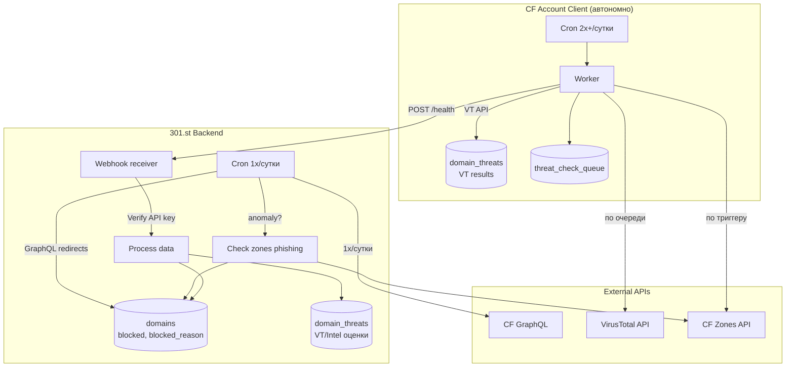
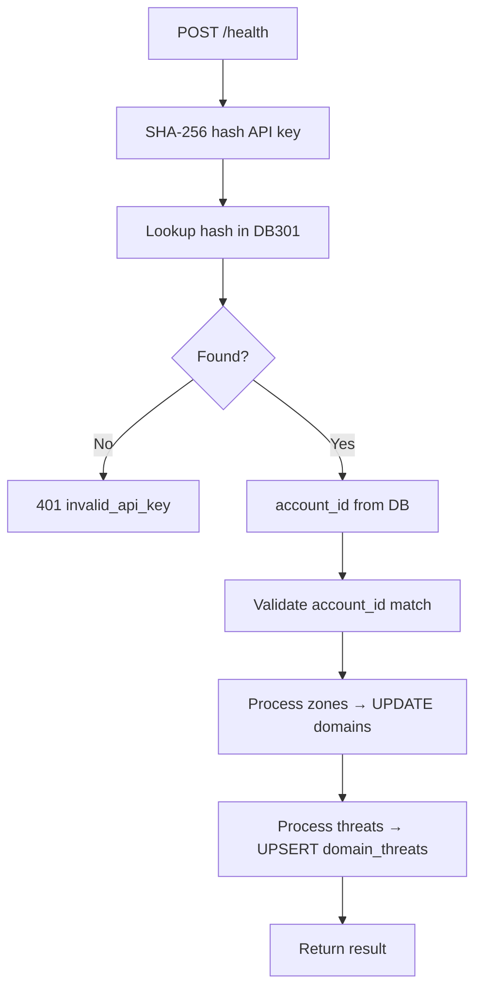
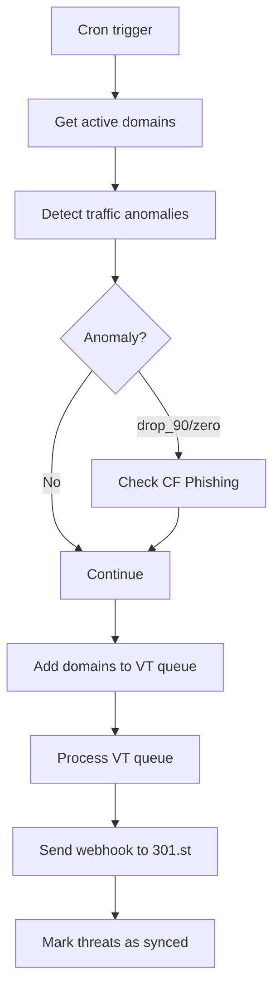
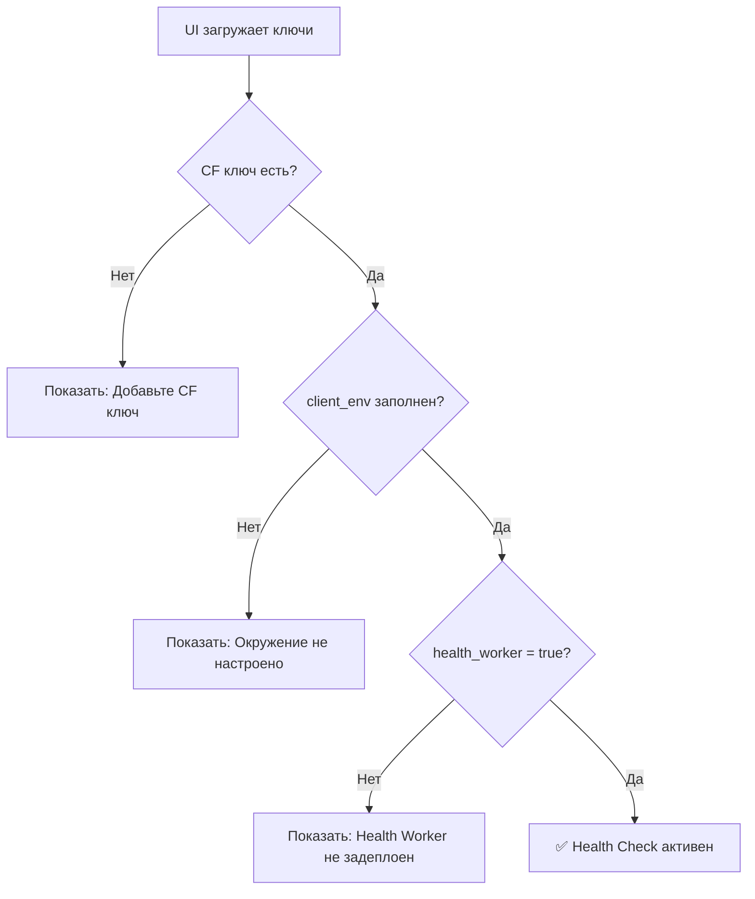

# ТЗ: Domain Health Check System

## Цель

Информирование клиента о проблемах с трафиком и минимальных угрозах для принятия решений о ротации.

**301.st = управление доменами, не система мониторинга.**

---

## Статус реализации

| Phase | Название | Статус |
|-------|----------|--------|
| 1 | CF Phishing Detection | ✅ Готово |
| 2 | Traffic Anomaly Detection | ✅ Готово |
| 3 | GET /domains (health в списке) | ✅ Готово |
| 4 | POST /webhook/health | ✅ Готово |
| 5 | VirusTotal Integration | ✅ Готово |
| 6 | Client Worker Setup | ✅ Готово |

---

## Архитектура (Push Model)



### Push Model — аутентификация через API key

```
Client Worker                              301.st Webhook
     │                                           │
     │  POST /health                             │
     │  Authorization: Bearer <WORKER_API_KEY>   │
     │  Body: { zones, threats }    ───────────► │
     │                                           │ SHA-256(key) → DB301 lookup
     │                                           │ → account_id
     │                                           │ Process data
     │  ◄─────────────────────────────────────── │
     │  { ok: true, result: {...} }              │
     │                                           │
```

**Безопасность:**
- API key генерируется при setup (nanoid 32)
- В DB301 хранится только SHA-256 хэш
- Plain key — только в CF Secrets на клиентском аккаунте
- API key бессрочный (не протухает как JWT)
- Shared auth для всех webhook: `src/webhook/auth.ts`

---

## Разделение ответственности

| Где | Действие | Частота |
|-----|----------|---------|
| **301.st** | Poll GraphQL redirects | 1x/сутки |
| **301.st** | Проверить zones phishing | По триггеру (anomaly) |
| **301.st** | Принять webhook данные | По событию |
| **301.st** | Хранить итоговые данные | — |
| **Клиент** | Проверить zones phishing | По триггеру (anomaly) |
| **Клиент** | Запросить VT | По очереди (cron) |
| **Клиент** | Отправить данные в webhook | После проверок |

**301.st и Client работают автономно.** Нет взаимных триггеров.

---

## Реализованные компоненты

### Файлы (301.st Backend)

| Файл | Назначение |
|------|------------|
| `schema/migrations/0009_health_check.sql` | Миграция: таблица `domain_threats` |
| `schema/migrations/0015_worker_api_keys.sql` | Миграция: таблица `worker_api_keys` |
| `schema/migrations/0016_hash_worker_api_keys.sql` | Миграция: `api_key` → `api_key_hash` |
| `src/api/domains/health.ts` | GET /domains/:id/health |
| `src/api/integrations/providers/cloudflare/zones.ts` | `checkZonePhishing()` |
| `src/api/integrations/providers/cloudflare/d1.ts` | D1 API для клиента |
| `src/api/integrations/providers/cloudflare/workers.ts` | Workers Secrets API |
| `src/api/integrations/providers/virustotal/initkey.ts` | VT key init |
| `src/api/health/setup.ts` | POST /health/client/setup |
| `src/api/jobs/redirect-stats.ts` | Anomaly detection |
| `src/api/client-env/setup.ts` | setupClientEnvironment() — полный setup |
| `src/api/health/bundle.ts` | Bundled JS для 301-health worker |
| `src/webhook/auth.ts` | Shared auth: API key → SHA-256 → DB301 |
| `src/webhook/health.ts` | POST /health handler |
| `src/webhook/deploy.ts` | POST /deploy handler |

---

## API Endpoints

### 301.st API

| Method | Path | Описание |
|--------|------|----------|
| GET | `/domains` | Список доменов с health.status |
| GET | `/domains/:id/health` | Детальная информация о здоровье |
| POST | `/integrations/virustotal/init` | Сохранить VT ключ |
| GET | `/integrations/virustotal/quota` | Проверить VT квоту |
| POST | `/health/client/setup` | Setup Client Worker |
| GET | `/health/client/status` | Статус настройки |

### 301.st Webhook (webhook.301.st)

| Method | Path | Auth | Описание |
|--------|------|------|----------|
| POST | `/deploy` | API key | Self-check после деплоя |
| POST | `/health` | API key | Данные от Health Worker (VT + phishing) |
| POST | `/tds` | API key | Статистика от TDS Worker (TODO) |

### Client Worker

| Method | Path | Описание |
|--------|------|----------|
| GET | `/health` | Health check (public) |
| POST | `/run` | Manual trigger |
| GET | `/stats` | Queue statistics |

---

## Webhook: Client → 301.st

### POST /health

**Request:**
```http
POST /health
Authorization: Bearer <WORKER_API_KEY>
Content-Type: application/json

{
  "account_id": "123",
  "timestamp": "2025-01-15T10:00:00Z",
  "zones": [
    {
      "zone_id": "abc123",
      "phishing_detected": true,
      "checked_at": "2025-01-15T10:00:00Z"
    }
  ],
  "threats": [
    {
      "domain_name": "example.com",
      "threat_score": 3,
      "categories": ["gambling", "spam"],
      "reputation": -15,
      "source": "virustotal",
      "checked_at": "2025-01-15T09:55:00Z"
    }
  ]
}
```

**Response:**
```json
{
  "ok": true,
  "result": {
    "zones_processed": 1,
    "domains_blocked": 5,
    "threats_upserted": 10,
    "errors": []
  }
}
```

### Обработка на 301.st



---

## Client Worker

### Bindings

| Тип | Имя | Назначение |
|-----|-----|------------|
| Secret | `WORKER_API_KEY` | Auth для webhook → 301.st (nanoid 32, бессрочный) |
| Env Var | `ACCOUNT_ID` | ID аккаунта в 301.st |
| Env Var | `WEBHOOK_URL` | `https://webhook.301.st/health` |
| Env Var | `DEPLOY_WEBHOOK_URL` | `https://webhook.301.st/deploy` |
| D1 | `DB` | Client D1 database (301-client) |
| KV | `KV` | Integration keys (VT_API_KEY, etc.) (301-keys) |

### Setup Flow (Автоматический)

При добавлении CF ключа (`POST /integrations/cloudflare/init`) или вручную (`POST /client-env/setup`) создаётся:

```
Client CF Account:
├── D1: 301-client              # Shared database
├── KV: 301-keys                # Integration keys (VT, etc.)
├── Worker: 301-health          # Health monitoring
│   ├── Bindings: D1, KV
│   ├── Crons: "*/1 * * * *", "0 */12 * * *"
│   └── Secrets: WORKER_API_KEY
└── Worker: 301-tds             # Traffic Distribution
    ├── Bindings: D1
    └── Secrets: WORKER_API_KEY
```

Self-check flow:
1. `*/1` cron → health worker проверяет D1 + KV + secrets
2. Отправляет `POST webhook.301.st/deploy` с результатом
3. При подтверждении записывает `setup_reported = 'ok'` в client D1
4. На следующих `*/1` — видит `'ok'`, пропускает

**Initial Sync:** Домены автоматически синхронизируются в client D1 при создании окружения.

**Auto-sync:** При создании/изменении/удалении домена на 301.st данные автоматически синхронизируются в client D1.

### Cron Flow



---

## Источники данных

| # | Источник | Тип | Где выполняется |
|---|----------|-----|-----------------|
| 1 | CF Phishing | ФАКТ | 301.st + Client |
| 2 | Traffic Anomaly | СИГНАЛ | 301.st + Client |
| 3 | VirusTotal | ОЦЕНКА | Client |
| 4 | HostTracker | ДОСТУПНОСТЬ | 🔜 Future |

---

## Схема БД

### 301.st — domain_threats

```sql
CREATE TABLE domain_threats (
    domain_id INTEGER PRIMARY KEY,
    threat_score INTEGER,
    categories TEXT,        -- JSON: ["gambling", "spam"]
    reputation INTEGER,     -- -100 to +100
    source TEXT,            -- 'virustotal' | 'cloudflare_intel'
    checked_at TEXT,
    updated_at TEXT DEFAULT CURRENT_TIMESTAMP,
    FOREIGN KEY (domain_id) REFERENCES domains(id) ON DELETE CASCADE
);
```

### Client D1

```sql
-- VT results
CREATE TABLE domain_threats (
    domain_name TEXT PRIMARY KEY,
    threat_score INTEGER,
    categories TEXT,
    reputation INTEGER,
    source TEXT,
    checked_at TEXT,
    updated_at TEXT DEFAULT CURRENT_TIMESTAMP,
    synced_at TEXT
);

-- Queue
CREATE TABLE threat_check_queue (
    domain_name TEXT PRIMARY KEY,
    priority INTEGER DEFAULT 0,
    source TEXT DEFAULT 'virustotal',
    added_at TEXT DEFAULT CURRENT_TIMESTAMP,
    status TEXT DEFAULT 'pending'
);
```

---

## VirusTotal Integration

### Rate Limits (Free Tier)

| Лимит | Значение |
|-------|----------|
| Requests/min | 4 |
| Requests/day | 500 |

### VT API Response

```json
{
  "last_analysis_stats": {
    "malicious": 3,
    "suspicious": 1,
    "harmless": 65
  },
  "categories": {
    "Forcepoint": "gambling",
    "Sophos": "spam"
  },
  "reputation": -15
}
```

### Endpoints

| Method | Path | Описание |
|--------|------|----------|
| POST | `/integrations/virustotal/init` | Сохранить VT API key |
| GET | `/integrations/virustotal/quota` | Текущее использование квоты |

---

## UI: Светофор

### Таблица доменов

| Цвет | Условие |
|------|---------|
| 🔴 | `blocked = 1` |
| 🟡 | `threat_score > 0` OR traffic anomaly |
| 🟢 | Всё OK |
| ⚪ | Нет данных |

### GET /domains/:id/health

```json
{
  "status": "warning",
  "blocked": false,
  "blocked_reason": null,
  "threats": {
    "score": 3,
    "categories": ["gambling"],
    "source": "virustotal",
    "checked_at": "2025-01-15T09:55:00Z"
  },
  "traffic": {
    "yesterday": 150,
    "today": 45,
    "change_percent": -70,
    "anomaly": true
  }
}
```

---

## Future: CF Intel

Структура `domain_threats` готова для CF Intel:

| Поле | VT | CF Intel |
|------|-----|----------|
| `threat_score` | malicious count | security_categories count |
| `categories` | VT categories | content_categories |
| `reputation` | VT reputation | popularity_rank |
| `source` | 'virustotal' | 'cloudflare_intel' |

---

## Data Sync (Push Model)

### Initial Sync

При `POST /integrations/cloudflare/init`:
1. Создаётся client environment (D1, KV, Worker)
2. Все домены аккаунта синхронизируются в client D1

### Auto-Sync

| Событие | Sync действие |
|---------|---------------|
| Создание домена | `syncDomainToClient()` |
| Batch создание | `syncDomainToClient()` для каждого |
| Изменение role/blocked | `syncDomainToClient()` |
| Удаление домена | `deleteDomainFromClient()` |

### Файлы

| Файл | Функции |
|------|---------|
| `cloudflare/d1-sync.ts` | `syncDomainToClient()`, `deleteDomainFromClient()`, `syncAllDomainsToClient()` |
| `client-env/setup.ts` | Initial sync в `setupClientEnvironment()` |
| `domains/domains.ts` | Вызов sync в handlers |

### Client D1 Schema (domain_list)

```sql
CREATE TABLE domain_list (
    domain_name TEXT PRIMARY KEY,
    role TEXT,
    zone_id TEXT,
    active INTEGER DEFAULT 1,
    synced_at TEXT DEFAULT CURRENT_TIMESTAMP
);
```

---

## 🖥️ UI: Проверка статуса клиентского окружения

### ⚠️ КРИТИЧЕСКИ ВАЖНО

**Health Check работает ТОЛЬКО если клиентское окружение настроено!**

UI должен проверять поле `client_env` в ключах CF перед отображением health-функций.

### Проверка готовности Health Check



### API для проверки

**GET /integrations/keys** — возвращает все ключи с `client_env`:

```json
{
  "id": 18,
  "provider": "cloudflare",
  "client_env": "{\"d1_id\":\"xxx\",\"kv_id\":\"yyy\",\"health_worker\":true}"
}
```

### Что UI должен показывать

| client_env статус | UI отображение |
|-------------------|----------------|
| `null` | 🔴 "Клиентское окружение не создано. Health Check недоступен" |
| `health_worker: false` | 🟡 "Health Worker не задеплоен. Данные о здоровье доменов не собираются" |
| `health_worker: true` | 🟢 "Health Check активен. Данные обновляются каждые 12 часов" |

### Зависимости функций от client_env

| Функция | Требует client_env | Без client_env |
|---------|-------------------|----------------|
| GET /domains | Нет | Работает |
| GET /domains/:id/health | Да | Частичные данные (только blocked) |
| Webhook /health | Да | 401/403 |
| VT проверки | Да (kv_id для VT key) | Не работают |
| Traffic anomaly detection | Да | Не работает |

### Рекомендации для UI

1. **При загрузке страницы доменов:**
   - Проверить `client_env` у активного CF ключа
   - Если не настроен — показать banner с инструкцией

2. **При отображении health статуса домена:**
   - Если `client_env` отсутствует — показать "⚪ Нет данных" вместо статуса
   - Добавить tooltip "Требуется настройка клиентского окружения"

3. **Страница настроек интеграций:**
   - Выделить секцию "Клиентское окружение"
   - Показать статус каждого компонента (D1, KV, Health Worker)
   - Кнопка "Пересоздать окружение" для troubleshooting
