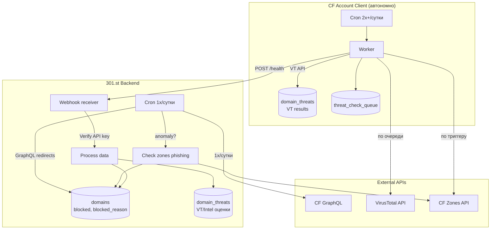
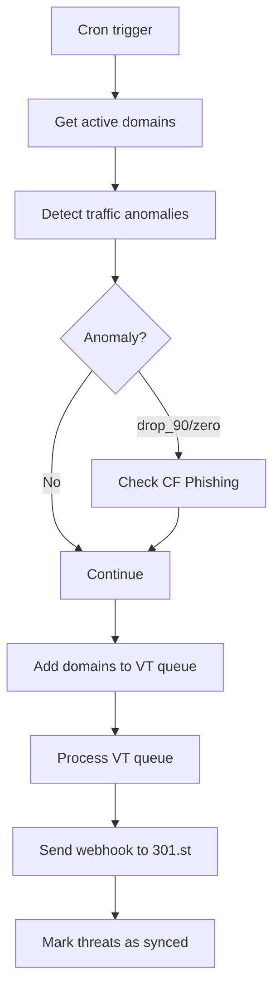

# Domain Health Check System

## Цель

Информирование клиента о проблемах с трафиком и минимальных угрозах для принятия решений о ротации.

**301.st = управление доменами, не система мониторинга.**

> **API endpoints:** см. [API_Health](API_Health)
> **Клиентское окружение:** см. [API_ClientEnvironment](API_ClientEnvironment)

---

## Архитектура (Push Model)



### Push Model — аутентификация через API key

```
Client Worker                              301.st Webhook
     │                                           │
     │  POST /health                             │
     │  Authorization: Bearer <WORKER_API_KEY>   │
     │  Body: { zones, threats }    ───────────► │
     │                                           │ SHA-256(key) → DB301 lookup
     │                                           │ → account_id
     │                                           │ Process data
     │  ◄─────────────────────────────────────── │
     │  { ok: true, result: {...} }              │
     │                                           │
```

**Безопасность:**
- API key генерируется при setup (nanoid 32)
- В DB301 хранится только SHA-256 хэш
- Plain key — только в CF Secrets на клиентском аккаунте
- API key бессрочный (не протухает как JWT)
- Shared auth для всех webhook: `src/webhook/auth.ts`

---

## Разделение ответственности

| Где | Действие | Частота |
|-----|----------|---------|
| **301.st** | Poll GraphQL redirects | 1x/сутки |
| **301.st** | Проверить zones phishing | По триггеру (anomaly) |
| **301.st** | Принять webhook данные | По событию |
| **301.st** | Хранить итоговые данные | — |
| **Клиент** | Проверить zones phishing | По триггеру (anomaly) |
| **Клиент** | Запросить VT | По очереди (cron) |
| **Клиент** | Отправить данные в webhook | После проверок |

**301.st и Client работают автономно.** Нет взаимных триггеров.

---

## Источники данных

| # | Источник | Тип | Где выполняется |
|---|----------|-----|-----------------|
| 1 | CF Phishing | ФАКТ | 301.st + Client |
| 2 | Traffic Anomaly | СИГНАЛ | 301.st + Client |
| 3 | VirusTotal | ОЦЕНКА | Client |
| 4 | HostTracker | ДОСТУПНОСТЬ | Future |

---

## Cron Flow (Client Worker)



---

## Схема БД

### 301.st — domain_threats

```sql
CREATE TABLE domain_threats (
    domain_id INTEGER PRIMARY KEY,
    threat_score INTEGER,
    categories TEXT,        -- JSON: ["gambling", "spam"]
    reputation INTEGER,     -- -100 to +100
    source TEXT,            -- 'virustotal' | 'cloudflare_intel'
    checked_at TEXT,
    updated_at TEXT DEFAULT CURRENT_TIMESTAMP,
    FOREIGN KEY (domain_id) REFERENCES domains(id) ON DELETE CASCADE
);
```

### Client D1

```sql
-- VT results
CREATE TABLE domain_threats (
    domain_name TEXT PRIMARY KEY,
    threat_score INTEGER,
    categories TEXT,
    reputation INTEGER,
    source TEXT,
    checked_at TEXT,
    updated_at TEXT DEFAULT CURRENT_TIMESTAMP,
    synced_at TEXT
);

-- Queue
CREATE TABLE threat_check_queue (
    domain_name TEXT PRIMARY KEY,
    priority INTEGER DEFAULT 0,
    source TEXT DEFAULT 'virustotal',
    added_at TEXT DEFAULT CURRENT_TIMESTAMP,
    status TEXT DEFAULT 'pending'
);
```

---

## VirusTotal Integration

### Rate Limits (Free Tier)

| Лимит | Значение |
|-------|----------|
| Requests/min | 4 |
| Requests/day | 500 |

### VT API Response

```json
{
  "last_analysis_stats": {
    "malicious": 3,
    "suspicious": 1,
    "harmless": 65
  },
  "categories": {
    "Forcepoint": "gambling",
    "Sophos": "spam"
  },
  "reputation": -15
}
```

---

## Data Sync (Push Model)

### Initial Sync

При `POST /integrations/cloudflare/init`:
1. Создаётся client environment (D1, KV, Worker)
2. Все домены аккаунта синхронизируются в client D1

### Auto-Sync

| Событие | Sync действие |
|---------|---------------|
| Создание домена | `syncDomainToClient()` |
| Batch создание | `syncDomainToClient()` для каждого |
| Изменение role/blocked | `syncDomainToClient()` |
| Удаление домена | `deleteDomainFromClient()` |

### Client D1 Schema (domain_list)

```sql
CREATE TABLE domain_list (
    domain_name TEXT PRIMARY KEY,
    role TEXT,
    zone_id TEXT,
    active INTEGER DEFAULT 1,
    synced_at TEXT DEFAULT CURRENT_TIMESTAMP
);
```

---

## UI: Светофор

### Таблица доменов

| Цвет | Условие |
|------|---------|
| 🔴 | `blocked = 1` |
| 🟡 | `threat_score > 0` OR traffic anomaly |
| 🟢 | Всё OK |
| ⚪ | Нет данных |

### Пример ответа GET /domains/:id/health

```json
{
  "status": "warning",
  "blocked": false,
  "blocked_reason": null,
  "threats": {
    "score": 3,
    "categories": ["gambling"],
    "source": "virustotal",
    "checked_at": "2025-01-15T09:55:00Z"
  },
  "traffic": {
    "yesterday": 150,
    "today": 45,
    "change_percent": -70,
    "anomaly": true
  }
}
```

---

## Будущее развитие

### Cloudflare Intel

Структура `domain_threats` готова для CF Intel:

| Поле | VT | CF Intel |
|------|-----|----------|
| `threat_score` | malicious count | security_categories count |
| `categories` | VT categories | content_categories |
| `reputation` | VT reputation | popularity_rank |
| `source` | 'virustotal' | 'cloudflare_intel' |

### Дополнительные источники

- **HostTracker** — мониторинг доступности доменов (ping, HTTP check)
- **CF Security Events** — WAF events, DDoS incidents
- **Domain Expiry** — предупреждение об истечении срока регистрации
- **SSL/TLS** — статус сертификатов, expiry warnings

---

## Реализованные файлы

| Файл | Назначение |
|------|------------|
| `schema/migrations/0009_health_check.sql` | Миграция: таблица `domain_threats` |
| `schema/migrations/0015_worker_api_keys.sql` | Миграция: таблица `worker_api_keys` |
| `schema/migrations/0016_hash_worker_api_keys.sql` | Миграция: `api_key` → `api_key_hash` |
| `src/api/domains/health.ts` | GET /domains/:id/health |
| `src/api/integrations/providers/cloudflare/zones.ts` | `checkZonePhishing()` |
| `src/api/integrations/providers/cloudflare/d1.ts` | D1 API для клиента |
| `src/api/integrations/providers/cloudflare/d1-sync.ts` | Domain sync to client |
| `src/api/integrations/providers/virustotal/initkey.ts` | VT key init |
| `src/api/health/setup.ts` | POST /health/client/setup |
| `src/api/health/bundle.ts` | Bundled JS для 301-health worker |
| `src/api/jobs/redirect-stats.ts` | Anomaly detection |
| `src/api/client-env/setup.ts` | setupClientEnvironment() |
| `src/webhook/auth.ts` | Shared auth: API key → SHA-256 → DB301 |
| `src/webhook/health.ts` | POST /health handler |
| `src/webhook/deploy.ts` | POST /deploy handler |
