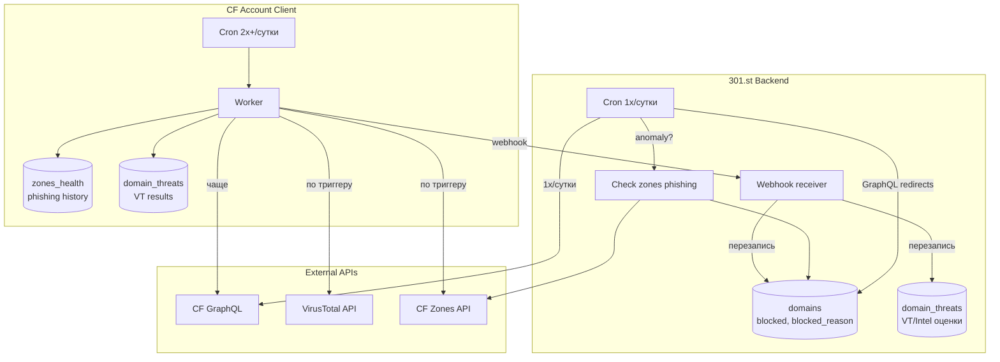
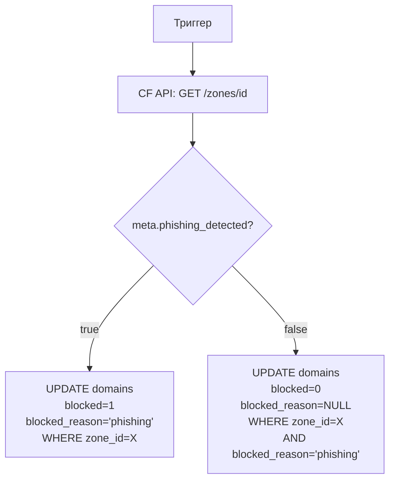
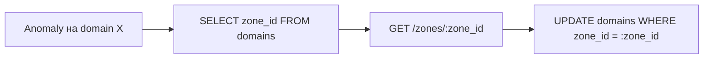
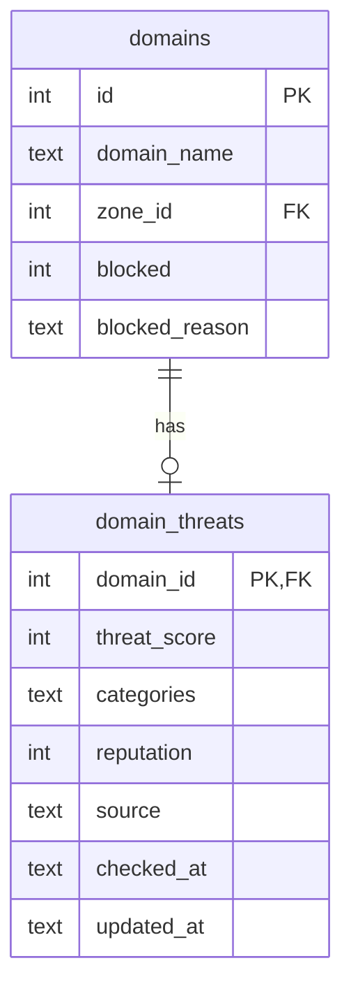
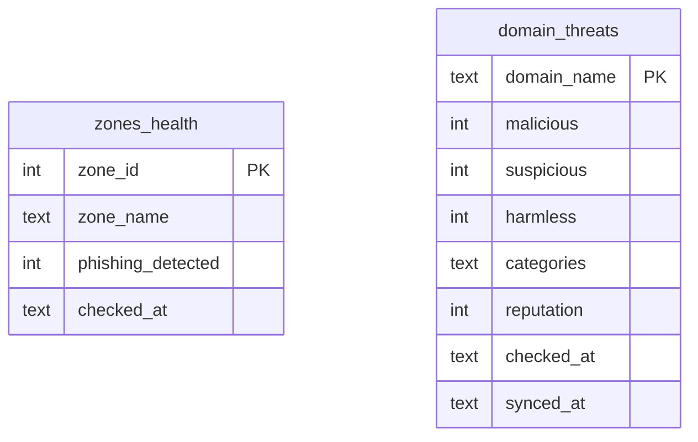
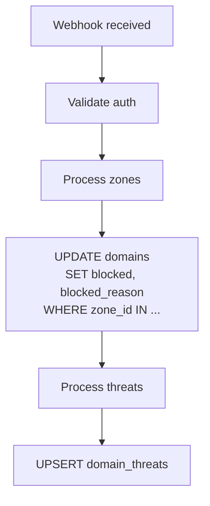

# ТЗ: Domain Health Check System

## Цель

Информирование клиента о проблемах с трафиком и минимальных угрозах для принятия решений о ротации.

**301.st = управление доменами, не система мониторинга.**

---

## Статус реализации

| Phase | Название | Статус |
|-------|----------|--------|
| 1 | CF Phishing Detection | ✅ Готово |
| 2 | Traffic Anomaly Detection | ✅ Готово |
| 3 | GET /domains (health в списке) | ✅ Готово |
| 4 | POST /webhook/health | ⏳ Pending |

---

## Реализованные компоненты (Phase 1-2)

### Файлы

| Файл | Назначение |
|------|------------|
| `schema/migrations/0009_health_check.sql` | Миграция: таблица `domain_threats` |
| `schema/301.sql` | Схема: `domain_threats`, `blocked_reason` += 'phishing' |
| `src/api/domains/health.ts` | Модуль health: функции и API handler |
| `src/api/integrations/providers/cloudflare/zones.ts` | `checkZonePhishing()`, phishing в sync/create |
| `src/api/jobs/redirect-stats.ts` | Anomaly detection + phishing trigger |

### Функции

```
src/api/domains/health.ts
├── updateDomainsPhishingStatus()  — UPDATE domains SET blocked для зоны
├── detectAnomaly()                — drop_50 / drop_90 / zero_traffic
├── shouldCheckPhishing()          — true для drop_90 / zero_traffic
├── upsertDomainThreat()           — UPSERT в domain_threats
├── handleGetDomainHealth()        — GET /domains/:id/health
└── computeDomainHealthStatus()    — расчёт статуса для списка

src/api/integrations/providers/cloudflare/zones.ts
├── checkZonePhishing()            — CF API meta.phishing_detected
├── handleCreateZone()             — проверка phishing при создании
├── handleSyncZone()               — обновление phishing при sync
└── syncZonesInternal()            — phishing при массовой синхронизации
```

### Триггеры CF Phishing

| Событие | Где срабатывает | Действие |
|---------|-----------------|----------|
| Создание зоны | `handleCreateZone()` | Проверка `meta.phishing_detected` → blocked |
| Sync zone (UI) | `handleSyncZone()` | Проверка + UPDATE domains |
| Sync all zones | `syncZonesInternal()` | Проверка для каждой зоны |
| Traffic anomaly | `redirect-stats.ts` | drop_90/zero_traffic → checkZonePhishing |

### Логика Anomaly Detection

```typescript
function detectAnomaly(yesterday: number, today: number): AnomalyType {
  if (today === 0 && yesterday >= 20) return "zero_traffic";
  if (yesterday > 0 && today < yesterday * 0.1) return "drop_90";
  if (yesterday > 0 && today < yesterday * 0.5) return "drop_50";
  return null;
}
```

При `drop_90` или `zero_traffic` в cron job `redirect-stats.ts`:
1. Вызывается `checkZonePhishing(cf_zone_id, token)`
2. Если `phishing_detected = true` → `updateDomainsPhishingStatus(zone_id, true)`

### API Endpoints

| Method | Path | Описание |
|--------|------|----------|
| GET | `/domains` | Список доменов с `health.status` |
| GET | `/domains/:id/health` | Детальная информация о здоровье |
| POST | `/zones/:id/sync` | Синхронизация зоны + phishing check |

---

## Источники данных

| # | Источник | Тип | Статус |
|---|----------|-----|--------|
| 1 | CF Phishing | ФАКТ | ✅ MVP |
| 2 | Traffic Anomaly | СИГНАЛ | ✅ MVP |
| 3 | VirusTotal | ОЦЕНКА | ✅ MVP |
| 4 | HostTracker | ДОСТУПНОСТЬ | 🔜 Future |

---

## Архитектура



---

## Разделение ответственности

| Где | Действие | Частота |
|-----|----------|---------|
| **301.st** | Poll GraphQL redirects | 1x/сутки |
| **301.st** | Проверить zones phishing | По триггеру (anomaly) |
| **301.st** | Принять webhook | По событию |
| **301.st** | Хранить итоговые данные | — |
| **Клиент** | Poll GraphQL | 2x+/сутки |
| **Клиент** | Проверить zones phishing | По триггеру (anomaly) |
| **Клиент** | Запросить VT | По триггеру |
| **Клиент** | Отправить webhook | После проверок |

---

## Источник #1: CF Phishing

### Суть

CF Trust & Safety блокирует зону → все домены зоны мертвы.

### Хранение

В таблице `domains` (существующие поля):

```sql
blocked INTEGER DEFAULT 0
blocked_reason TEXT CHECK(blocked_reason IN (
    'unavailable', 
    'ad_network', 
    'hosting_registrar', 
    'government', 
    'manual',
    'phishing'  -- ← добавить
))
```

### Триггеры проверки

| Триггер | Где |
|---------|-----|
| Создание зоны | 301.st |
| Кнопка "Sync zone" | 301.st (UI) |
| Traffic anomaly | 301.st (при poll) |
| Traffic anomaly | Клиент → webhook |

### Логика



### Синхронизация данных

**Чтобы не было рассинхрона:**

1. **При создании зоны** → пишем статус phishing в root домен и все субдомены:
```sql
UPDATE domains 
SET blocked = 1, blocked_reason = 'phishing'
WHERE zone_id = :zone_id
```

2. **При аномалии на любом домене зоны** → узнаём zone_id, опрашиваем CF API, обновляем ВСЕ домены зоны:


### Снятие блокировки

Только по кнопке "Sync zone" в UI → проверяем CF API → если `phishing_detected = false` → снимаем блок.

---

## Источник #2: Traffic Anomaly

### Суть

Падение трафика = сигнал, что что-то случилось.

### Получение данных

| Где | Частота | Источник |
|-----|---------|----------|
| 301.st | 1x/сутки | GraphQL клиента (уже сделано) |
| Клиент | 2x+/сутки | GraphQL → webhook в 301.st |

### Логика детекции

| Условие | Anomaly |
|---------|---------|
| `today < yesterday * 0.5` | drop_50 |
| `today < yesterday * 0.1` | drop_90 |
| `today = 0` AND `yesterday >= 20` | zero_traffic |

### Триггер

При обнаружении anomaly (drop_90 / zero_traffic):

**На 301.st (при poll 1x/сутки):**
1. Проверить zones phishing → UPDATE domains

**На клиенте (при poll 2x+/сутки):**
1. Проверить zones phishing
2. Запустить VT check
3. Отправить webhook → 301.st

---

## Источник #3: VirusTotal

### Суть

Оценка репутации домена. Выполняется на клиенте.

### Данные VT API

| Блок | Что даёт | Надёжность |
|------|----------|------------|
| `last_analysis_stats` | malicious/suspicious/harmless | Высокая |
| `categories` | gambling, spam, adult | Средняя |
| `reputation` | Голоса сообщества | Низкая |

### Пример ответа

```json
{
  "last_analysis_stats": {
    "malicious": 3,
    "suspicious": 1,
    "harmless": 65,
    "undetected": 5
  },
  "categories": {
    "Forcepoint": "gambling",
    "Sophos": "spam"
  },
  "reputation": -15
}
```

### Триггеры

| Триггер | Приоритет |
|---------|-----------|
| Traffic anomaly (drop_90+) | Высокий |
| Cron (периодический) | Низкий |

### Rate Limits (Free tier)

- 4 requests/min
- ~500 requests/day

---

## Схема БД

### 301.st



### Таблица domain_threats (301.st)

```sql
CREATE TABLE domain_threats (
    domain_id INTEGER PRIMARY KEY,
    threat_score INTEGER,           -- VT malicious count / CF security score
    categories TEXT,                -- JSON: ["gambling", "spam"]
    reputation INTEGER,             -- -100 to +100
    source TEXT,                    -- 'virustotal' | 'cloudflare_intel'
    checked_at TEXT,
    updated_at TEXT DEFAULT CURRENT_TIMESTAMP,
    FOREIGN KEY (domain_id) REFERENCES domains(id) ON DELETE CASCADE
);
```

### CF Client



### Таблица zones_health (Client D1)

```sql
CREATE TABLE zones_health (
    zone_id TEXT PRIMARY KEY,
    zone_name TEXT,
    phishing_detected INTEGER DEFAULT 0,
    checked_at TEXT DEFAULT CURRENT_TIMESTAMP
);
```

### Таблица domain_threats (Client D1)

```sql
CREATE TABLE domain_threats (
    domain_name TEXT PRIMARY KEY,
    malicious INTEGER DEFAULT 0,
    suspicious INTEGER DEFAULT 0,
    harmless INTEGER DEFAULT 0,
    categories TEXT,
    reputation INTEGER,
    checked_at TEXT,
    synced_at TEXT
);
```

---

## Webhook: Client → 301.st

### POST /webhook/health

```json
{
  "account_id": 123,
  "timestamp": "2025-01-15T10:00:00Z",
  
  "zones": [
    {
      "zone_id": "abc123",
      "phishing_detected": true,
      "checked_at": "2025-01-15T10:00:00Z"
    }
  ],
  
  "threats": [
    {
      "domain_name": "example.com",
      "threat_score": 3,
      "categories": ["gambling", "spam"],
      "reputation": -15,
      "source": "virustotal",
      "checked_at": "2025-01-15T09:55:00Z"
    }
  ]
}
```

### Обработка на 301.st



---

## UI: Светофор

### Таблица доменов

| Цвет | Условие |
|------|---------|
| 🔴 | `blocked = 1` |
| 🟡 | `threat_score > 0` OR traffic anomaly |
| 🟢 | Всё OK |
| ⚪ | Нет данных |

### Drawer → Security Tab

| Секция | Данные |
|--------|--------|
| Status | blocked / warning / healthy |
| Reason | phishing / ad_network / etc |
| Threats | VT score, categories |
| Traffic | Trend, anomaly |

---

## API Endpoints (301.st)

> **Важно для UI:** Все данные о домене включая health получаем в одном запросе. Не нужны отдельные запросы для светофора.

### GET /domains

```
GET /domains
```

Response (health данные включены по умолчанию):
```json
{
  "id": 123,
  "domain_name": "example.com",
  "zone_id": 456,
  "blocked": 0,
  "blocked_reason": null,
  "health": {
    "status": "warning",
    "threat_score": 3,
    "categories": ["gambling"],
    "checked_at": "2025-01-15T09:55:00Z"
  }
}
```

### GET /domains/:id/health

> Детальная информация для Drawer → Security Tab

```json
{
  "status": "warning",
  "blocked": false,
  "blocked_reason": null,
  
  "threats": {
    "score": 3,
    "categories": ["gambling", "spam"],
    "reputation": -15,
    "source": "virustotal",
    "checked_at": "2025-01-15T09:55:00Z"
  },
  
  "traffic": {
    "yesterday": 150,
    "today": 45,
    "change_percent": -70,
    "anomaly": true
  }
}
```

### POST /webhook/health

См. выше.

---

## Миграции

### 301.st

```sql
-- 1. Добавить 'phishing' в blocked_reason
-- (требует пересоздания таблицы или CHECK constraint)

-- 2. Создать domain_threats
CREATE TABLE domain_threats (
    domain_id INTEGER PRIMARY KEY,
    threat_score INTEGER,
    categories TEXT,
    reputation INTEGER,
    source TEXT,
    checked_at TEXT,
    updated_at TEXT DEFAULT CURRENT_TIMESTAMP,
    FOREIGN KEY (domain_id) REFERENCES domains(id) ON DELETE CASCADE
);
```

### CF Client (при деплое)

```sql
-- zones_health
CREATE TABLE zones_health (
    zone_id TEXT PRIMARY KEY,
    zone_name TEXT,
    phishing_detected INTEGER DEFAULT 0,
    checked_at TEXT DEFAULT CURRENT_TIMESTAMP
);

-- domain_threats
CREATE TABLE domain_threats (
    domain_name TEXT PRIMARY KEY,
    malicious INTEGER DEFAULT 0,
    suspicious INTEGER DEFAULT 0,
    harmless INTEGER DEFAULT 0,
    categories TEXT,
    reputation INTEGER,
    checked_at TEXT,
    synced_at TEXT
);
```

---

## Future: CF Intel

Структура `domain_threats` готова для CF Intel:

| Поле | VT | CF Intel |
|------|-----|----------|
| `threat_score` | malicious count | security_categories count |
| `categories` | VT categories | content_categories |
| `reputation` | VT reputation | popularity_rank |
| `source` | 'virustotal' | 'cloudflare_intel' |

Один формат — переключаем источник.
