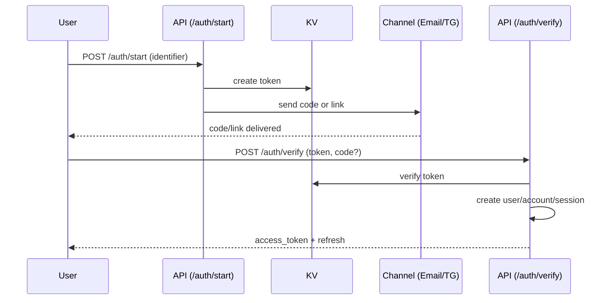

# Роли и типы пользователей (комбинированная модель)

| **user_type** | **account_role** | **Комбинированно** | **Где используется** |
|---------------|------------------|--------------------|-----------------------|
| `client`      | `owner`          | `client:owner`     | **Создатель аккаунта** — полный доступ к своему аккаунту |
| `client`      | `editor`         | `client:editor`    | **Приглашённый редактор** — редактирование TDS, доменов, редиректов |
| `client`      | `viewer`         | `client:viewer`    | **Приглашённый наблюдатель** — только просмотр |
| `client`      | `none`           | `client:none`      | **Регистрация / вход без аккаунтов** — временный доступ (анонимный) |
| `admin`       | `none`           | `admin:none`       | **Вход в админку** — доступ к панели управления платформой |
| `admin`       | `viewer`         | `admin:viewer`     | **Глобальный админ смотрит аккаунт клиента** — чтение любых данных |


##  Глобальная модель ролей

 ```
users (1) ----- (1) accounts
users (N) ----- (N) account_members ----- accounts
users (N) ----- (N) account_invites ----- accounts

 ```

## 1.1 Глобальный тип пользователя (users.user_type)

Хранится в таблице `users`, не зависит от аккаунтов.

**Значения:**

* `admin`  — администратор платформы 301.st
* `client` — обычный пользователь

Создание аккаунта НЕ меняет user_type.
Приглашение в чужой аккаунт НЕ меняет user_type.

---

## 1.2 Роль внутри аккаунта (account_role)

Определяется по таблицам `accounts` и `account_members`.

### Правила:

1. Если `accounts.user_id == user.id` → `owner`
2. Если запись в `account_members` → `editor` или `viewer`
3. Иначе → `none`

**user_type и account_role независимы.**

---

## 1.3 Комбинированная роль в audit_log

В таблицу `audit_log.user_type` записывается:

```
<user_type>:<account_role>
```

**Примеры:**

* `client:owner`
* `client:editor`
* `client:viewer`
* `client:none`
* `admin:none`
* `admin:viewer`

---

# Identity Flow (OmniAuth Model) — 301.st

## 0. Введение

Единая модель идентификации пользователей в 301.st. Поддерживает **email**, **телефон**, **Telegram**, **OAuth**. Все механики построены вокруг универсальных токенов и универсального канального модуля доставки.

Документ определяет основные процессы:

* регистрация
* вход
* подтверждение личности
* приглашения
* восстановление пароля
* подтверждение критичных операций

И описывает связь OmniAuth с существующими endpoint’ами `/auth/*`.

---

## 1. OmniAuth — Единая модель

OmniAuth — это единый поток проверки личности с различными каналами доставки.

### 1.1 Поддерживаемые каналы

* Email (ссылка или OTP-код)
* Telegram (OTP-код)
* SMS (будущий канал)
* OAuth (Google)

### 1.2 Идентификатор пользователя

Пользователь вводит **одну строку**:

```
identifier = email | phone | tg_username | oauth_provider
```

Система автоматически определяет тип.

### 1.3 Устройство токена

KV хранит универсальные записи:

```
auth:<token> = {
  type: "email_verify" | "phone_verify" | "oauth" | "invite" | "reset" | "action",
  channel: "email" | "telegram" | "sms",
  identifier: "email or phone or tg_id",
  payload: {...},
  exp: timestamp
}
```

---

## 2. Основные сценарии

| Сценарий               | Хранилище | TTL       | Назначение               |
| ---------------------- | --------- | --------- | ------------------------ |
| Регистрация            | KV        | 5–10 мин  | Подтверждение личности   |
| Логин                  | KV        | 5–10 мин  | Вход по email/телефону   |
| OAuth вход             | KV        | 5 мин     | Завершение OAuth FlOW    |
| Восстановление пароля  | KV        | 1 час     | Разрешение смены пароля  |
| Приглашение            | D1        | 72 часа   | Присоединение к аккаунту |
| Подтверждение операции | KV        | 10–15 мин | Деплои, ревоки, биллинг  |

---

## 3. Основные шаги OmniAuth

### 3.1 `/auth/start`

Входные данные:

```
{ identifier: "email or phone or tg" }
```

Алгоритм:

1. Проверить формат: email / phone / telegram.
2. Создать универсальный токен в KV.
3. Отправить код/ссылку через нужный канал.
4. Вернуть `{ status: "pending", token }`.

---

### 3.2 `/auth/verify`

Входные данные:

```
{ token: "...", code?: "123456" }
```

Алгоритм:

1. Прочитать KV-запись auth:token.
2. Проверить код (если требуется).
3. Определить сценарий:

   * регистрация → create user + account
   * логин → load user
   * reset → разрешить смену пароля
   * invite → принять приглашение
4. Создать сессию, выдать JWT + refresh_id.

---

## 4. Регистрация

### 4.1 Регистрация по email

1. Пользователь вводит email.
2. `/auth/start` → channel=email.
3. Ссылка приходит на email.
4. `/auth/verify?token=...` → user создан, email_verified=1.
5. Создаётся аккаунт.
6. Выполняется автоматический вход.

### 4.2 Регистрация по телефону (Telegram)

1. Пользователь вводит номер.
2. `/auth/start` → channel=telegram.
3. Бот отправляет код.
4. Пользователь вводит код в UI.
5. `/auth/verify` → user создан, phone_verified=1.
6. Создаётся аккаунт.

### 4.3 Регистрация через Google OAuth

1. Пользователь выбирает Google.
2. Редирект на Google.
3. Callback → токен в KV.
4. `/auth/verify` → user создан (email_verified=1).
5. Создаётся аккаунт.

---

## 5. Логин

### 5.1 Логин по email

1. Пользователь вводит email.
2. `/auth/start` отправляет код/ссылку.
3. `/auth/verify` выдаёт сессию.

### 5.2 Логин по телефону

1. Пользователь вводит телефон.
2. `/auth/start` отправляет код в TG.
3. `/auth/verify` выдаёт сессию.

### 5.3 Логин через Google OAuth

Стандартный OAuth Flow.

---

## 6. Приглашения

### 6.1 Создание приглашения

Старый endpoint `/auth/invite` создаёт запись в D1.

### 6.2 Принятие

Теперь происходит через `/auth/verify`:

* `type = invite`
* payload содержит `account_id`, `role`, `email`

---

## 7. Восстановление пароля

1. `/auth/reset_password` вызывает OmniAuth START.
2. Канал email или telegram.
3. `/auth/verify` разрешает смену пароля.

---

## 8. Подтверждение операций

Критичные действия (деплой, revoke):

1. API → OmniAuth START → отправлен код.
2. Пользователь вводит код в UI.
3. `/auth/verify` подтверждает действие.

---

## 9. Канальная система доставки

`message_sender.ts`:

* отправка email
* отправка telegram сообщений
* отправка SMS (в будущем)

Email теперь отдельный *канал*, а не основной механизм.

---

## 10. Универсальные токены

Вместо разных KV-namespace:

* KV_AUTH (единый)

Ключ:

```
auth:<token>
```

---

## 11. Архитектура модулей Auth

### 11.1 Новые модули

```
lib/message_sender.ts     # email / tg / sms
lib/omni_tokens.ts        # генерация/проверка токенов
api/auth/start.ts         # универсальный старт
api/auth/verify.ts        # завершение OmniAuth
```

### 11.2 Связь с существующими модулями

| Старый модуль     | Статус   | Новый механизм                                 |
| ----------------- | -------- | ---------------------------------------------- |
| register.ts       | остаётся | вызывает OmniAuth START (channel=email)        |
| login.ts          | остаётся | вызывает START (login mode)                    |
| reset_password.ts | остаётся | вызывает OmniAuth START с type=reset           |
| accept_invite.ts  | заменён  | теперь `/auth/verify` обрабатывает type=invite |
| confirm_action.ts | остаётся | вызывает START с type=action                   |

### 11.3 Минимальные изменения

* все старые endpoint остаются совместимыми
* всё, что проверяет email-токен → теперь вызывает `/auth/verify`
* email_sender.ts → остаётся, но теперь вызывается из message_sender как канал "email"

---

## 12. Работа с D1

D1 структура не изменяется:

* users
* sessions
* accounts
* account_invites
* audit_log

OmniAuth создаёт пользователя только после подтверждения токена.

---

## 13. Диаграмма OmniAuth

### 13.1 Последовательность вызовов с указанием модулей

```mermaid
digraph G {
  rankdir=LR;

  subgraph cluster_api {
    label="API Endpoints";
    style=filled; color=lightgrey;
    start[shape=box, label="/auth/start.ts"];
    verify[shape=box, label="/auth/verify.ts"];
  }

  subgraph cluster_lib {
    label="Lib Modules";
    style=filled; color=lightyellow;
    sender[shape=box, label="message_sender.ts"];
    tokens[shape=box, label="omni_tokens.ts"];
    d1[shape=box, label="d1.ts"];
    kv[shape=box, label="kv.ts"];
    jwt[shape=box, label="jwt.ts"];
  }

  user[shape=oval, label="User"];
  channel[shape=oval, label="Email/TG/SMS"];

  user -> start[label="identifier"];
  start -> tokens[label="createToken()"];
  tokens -> kv[label="KV.put(auth:token)"];
  start -> sender[label="sendCode()/sendLink()"];
  sender -> channel;

  user -> verify[label="token + code"];
  verify -> tokens[label="verifyToken()"];
  tokens -> kv[label="KV.get(auth:token)"];

  verify -> d1[label="create user/account"];
  verify -> jwt[label="issueTokens()"];
  verify -> user[label="access + refresh"];
}
```

### 13.2 Исходная диаграмма



```

---

## 14. Ошибки
- invalid_token
- expired_token
- invalid_code
- email_in_use
- phone_in_use
- oauth_denied
- invite_expired
- access_denied

---

## 15. Глоссарий
- OmniAuth
- Identity Provider
- Verification Channel
- Delivery Channel
- Universal Token
- Account Role
- Combined Role

```

