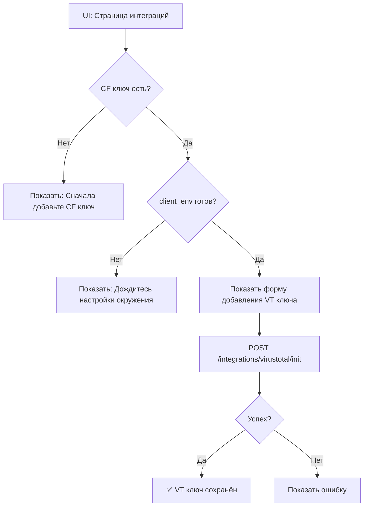

# Интеграции ключей

---

# VirusTotal

### Что делает VT ключ

VirusTotal API используется для проверки репутации доменов. Ключ хранится на 301.st и используется Client Worker для запросов к VT API.

| Функция | Описание |
|---------|----------|
| Domain reputation | Проверка репутации домена (malicious, suspicious, harmless) |
| Categories | Категоризация домена (gambling, spam, etc.) |
| Threat score | Оценка угрозы (количество malicious detections) |

### ⚠️ Лимиты Free Tier

| Лимит | Значение |
|-------|----------|
| Requests/min | 4 |
| Requests/day | 500 |

**💡 Для большего объёма** нужен Premium ключ от VirusTotal.

---

### 📋 API Endpoints для VT

| Method | Endpoint | Описание |
|--------|----------|----------|
| POST | `/integrations/virustotal/init` | Сохранить VT API key |
| GET | `/integrations/virustotal/quota` | Проверить использование квоты |
| GET | `/integrations/keys?account_id=X` | Список ключей (фильтр по provider) |
| DELETE | `/integrations/keys/:id` | Удалить ключ |

### POST /integrations/virustotal/init

**Request:**
```json
{
  "account_id": 1,
  "api_key": "your-virustotal-api-key",
  "key_alias": "VT Free Tier"
}
```

**Response:**
```json
{
  "ok": true,
  "key_id": 19
}
```

---

## 🖥️ UI: Проверка VT ключа

### ⚠️ ВАЖНО: VT ключ хранится на 301.st

В отличие от CF, VT ключ:
- Хранится **только на 301.st** (в `account_keys`)
- **НЕ имеет `client_env`** — это нормально
- Используется Client Worker через KV на CF клиента

### Проверка наличия VT ключа

```typescript
// GET /integrations/keys?account_id=X
const keys = await fetch('/integrations/keys?account_id=1').then(r => r.json());

// Найти активный VT ключ
const vtKey = keys.keys.find(k =>
  k.provider === 'virustotal' && k.status === 'active'
);

const hasVTKey = !!vtKey;
```

### Что UI должен показывать

| Статус | UI отображение |
|--------|----------------|
| VT ключ отсутствует | 🔴 "Добавьте VirusTotal API ключ для проверки репутации доменов" |
| VT ключ есть, status=active | 🟢 "VirusTotal подключен" |
| VT ключ есть, status=expired | 🟡 "VT ключ истёк. Обновите ключ" |
| VT ключ есть, status=revoked | 🔴 "VT ключ отозван" |

### Пример ответа GET /integrations/keys

```json
{
  "ok": true,
  "keys": [
    {
      "id": 18,
      "provider": "cloudflare",
      "key_alias": "Main CF Account",
      "status": "active",
      "client_env": "{\"d1_id\":\"xxx\",\"health_worker\":true}"
    },
    {
      "id": 19,
      "provider": "virustotal",
      "key_alias": "VT Free Tier",
      "status": "active",
      "external_account_id": null,
      "client_env": null,
      "expires_at": null,
      "last_used": "2025-01-15T12:00:00Z"
    }
  ]
}
```

### UI компоненты для отображения

**Карточка VT ключа:**
```
┌─────────────────────────────────────────────┐
│ 🔑 VT Free Tier                             │
│ Provider: VirusTotal                        │
│ Status: ✅ Active                           │
│                                             │
│ 📊 Использование:                           │
│   • Последнее использование: 15 янв 12:00   │
│   • Лимит: 500 req/day (Free Tier)          │
│                                             │
│ [Проверить квоту] [Удалить]                 │
└─────────────────────────────────────────────┘
```

**Список ключей (компактный вид):**
```
┌──────────────────────────────────────────────────────────┐
│ Ключ              │ Провайдер  │ Статус │ Окружение      │
├───────────────────┼────────────┼────────┼────────────────┤
│ Main CF Account   │ cloudflare │ ✅     │ 🟢 Готово      │
│ VT Free Tier      │ virustotal │ ✅     │ — (на 301.st)  │
└──────────────────────────────────────────────────────────┘
```

### Зависимости VT от CF

**VT работает только если:**
1. Есть активный CF ключ с `client_env`
2. `client_env.kv_id` существует (KV для хранения VT key на клиенте)
3. `client_env.health_worker = true` (Worker для VT запросов)

```typescript
function canUseVT(keys: Key[]): { ready: boolean; reason?: string } {
  const vtKey = keys.find(k => k.provider === 'virustotal' && k.status === 'active');
  if (!vtKey) {
    return { ready: false, reason: 'VT ключ не добавлен' };
  }

  const cfKey = keys.find(k => k.provider === 'cloudflare' && k.status === 'active');
  if (!cfKey) {
    return { ready: false, reason: 'CF ключ не добавлен' };
  }

  const clientEnv = cfKey.client_env ? JSON.parse(cfKey.client_env) : null;
  if (!clientEnv?.kv_id) {
    return { ready: false, reason: 'Клиентское KV не создано' };
  }
  if (!clientEnv?.health_worker) {
    return { ready: false, reason: 'Health Worker не задеплоен' };
  }

  return { ready: true };
}
```

### UI Flow: Добавление VT ключа



---

# Cloudflare


### Что 301.st делает на вашем Cloudflare

| Сервис | Действие |
|--------|----------|
| **Worker** | Деплой TDS-воркера (шаблон + ваши переменные) |
| **KV** | Запись правил TDS (конфиг, UTM-матчинг, условия) |
| **D1** | База для статистики воркера и воронки |
| **Zones/DNS** | Управление зонами и записями |
| **SSL** | Настройка сертификатов |
| **Redirect Rules** | Простые редиректы (без воркера) |
| **Workers Routes** | Привязка воркера к домену |
| **Cache Rules** | Управление кешированием |
| **WAF/Firewall** | Блокировка по IP, geo, User-Agent |

---

### ⚠️ Лимиты Free Plan (важно знать)

| Сервис | Лимит | Комментарий |
|--------|-------|-------------|
| **Worker** | 100K req/день | При превышении → Workers Paid ($5/мес) |
| **KV Write** | 1,000/день | Достаточно (правила пишутся 1-5 раз) |
| **KV Read** | 100K/день | Достаточно |
| **D1 Read** | 5M rows/день | Для статистики хватит |
| **D1 Write** | 100K rows/день | Для воронки хватит |
| **D1 Storage** | 500 MB/база | Достаточно для старта |

**💡 При высоком трафике** (>100K кликов/день) понадобится Workers Paid ($5/мес)

---

### 📋 Необходимые Permissions

**Account Level**

| Permission | Уровень | Зачем |
|------------|---------|-------|
| Account Settings | Read | Информация об аккаунте клиента |
| Account API Tokens | Read | Проверка scope токена (самодиагностика) |
| D1 | Read + Write | База данных для статистики и воронки |
| Workers Scripts | Read + Write | Деплой TDS-воркера и редирект-воркера |
| Workers KV Storage | Read + Write | Хранение правил TDS и конфигураций |
| Workers Routes | Read + Write | Привязка воркеров к доменам |

**Zone Level**

| Категория | Permission | Уровень | Зачем |
|-----------|------------|---------|-------|
| **Зоны** | Zone | Read + Write | Создание/удаление зон, список доменов |
| **Зоны** | Zone Settings | Read + Write | Настройки зоны (SSL mode, caching) |
| **DNS** | DNS | Read + Write | Управление A, CNAME, TXT записями |
| **SSL** | SSL and Certificates | Write | Управление SSL/TLS сертификатами |
| **Редиректы** | Dynamic URL Redirects | Read + Write | Single Redirects (правила редиректов 301/302) |
| **Редиректы** | Mass URL Redirects | Read + Write | Bulk Redirects (массовые редиректы) |
| **Кеш** | Cache Settings | Read + Write | Cache Rules (управление кешированием) |
| **Конфиг** | Config Settings | Read + Write | Configuration Rules (настройки по условиям) |
| **Transform** | Transform Rules | Read + Write | Request/Response модификации |
| **Transform** | Zone Transform Rules | Read + Write | Transform Rules на уровне зоны |
| **Firewall** | Zone WAF | Read + Write | Web Application Firewall правила |
| **Firewall** | Firewall Services | Read + Write | Блокировка по IP/geo/UA, rate limiting |

---

## 🔑 Создание API-токена Cloudflare для 301.st (account level)

### 1. Создать Bootstrap Token 

Чтобы автоматизировать создание рабочено токена нужен токен с правами - API Tokens: Edit

1. [Cloudflare Dashboard](https://dash.cloudflare.com) → **Manage account** → **Account API tokens**
2. **Create Token** → **Create Custom Token**
3. Имя: `301st Bootstrap`

### 2. Добавить Account Permissions

```
Account │ Account Settings     │ Read
Account │ Account API Tokens   │ Edit
```

### 5. Создать и сохранить

1. **Continue to summary** → проверить
2. **Create Token**
3.  **Скопировать токен** — показывается один раз!
```
curl "https://api.cloudflare.com/client/v4/accounts/ACCOUNT_ID/tokens/verify" \
-H "Authorization: Bearer YOUR_TOKEN"
```

# Проверка Bootstrap Token
```
Verify токен
curl "https://api.cloudflare.com/client/v4/accounts/$CF_ACCOUNT_ID/tokens/verify" \
  -H "Authorization: Bearer $CF_KEY_BOOTSTRAP"

Проверка доступа к permission_groups
curl "https://api.cloudflare.com/client/v4/accounts/$CF_ACCOUNT_ID/tokens/permission_groups" \
  -H "Authorization: Bearer $CF_KEY_BOOTSTRAP"
```
При проверке permissio будед выведено N количество разрешений - возможна проверка по наличию необходимых нам.

**Bootstrap — одноразовый, не хранится, не используется для фоновой ротации.**

---

## Создание рабочего токена
Для создания токена сос всеми необходимыми разрешениями загрузить в ЛК 301.st
- ACCOUNT_ID
- YOUR_TOKEN (Bootstrap)
Система сама сформирует новый токен, который отобразиться у вас в кабинете CF.
Все выданные разрешения вы сожеде посмотреть через контекстное меню View summary.


## 🔒 Безопасность
- Bootastap token передавайте только в 301.st
- После создания основного токена удалите Bootstrap
- Ротация основного токена производится также как и получение.

## Алгоритм создания 

1. Проверка полученнгого Bootstrap token
Устанавливаем полученные переменные
export CF_KEY_BOOTSTRAP="xxx"
export CF_ACCOUNT_ID="ххххххххххххх"

Verify токен
```
curl "https://api.cloudflare.com/client/v4/accounts/$CF_ACCOUNT_ID/tokens/verify" \
  -H "Authorization: Bearer $CF_KEY_BOOTSTRAP"
```

Проверка permission_groups
```
curl "https://api.cloudflare.com/client/v4/accounts/$CF_ACCOUNT_ID/tokens/permission_groups" \
  -H "Authorization: Bearer $CF_KEY_BOOTSTRAP"
```
В ответе должны получить полный перечень разрешений с id.

2. Формирование payload для рабочего ключа - create_token_payload.json

```
{
  "name": "301st-test-two-policies",
  "policies": [
    {
      "effect": "allow",
      "resources": {
        "com.cloudflare.api.account.7fadeb365dc925694b8dcfb313433189": "*"
      },
      "permission_groups": [
        { "id": "c1fde68c7bcc44588cbb6ddbc16d6480", "name": "Account Settings Read" },
        { "id": "eb56a6953c034b9d97dd838155666f06", "name": "Account API Tokens Read" },
        { "id": "192192df92ee43ac90f2aeeffce67e35", "name": "D1 Read" },
        { "id": "09b2857d1c31407795e75e3fed8617a1", "name": "D1 Write" },
        { "id": "429a068902904c5a9ed9fc267c67da9a", "name": "Mass URL Redirects Read" },
        { "id": "abe78e2276664f4db588c1f675a77486", "name": "Mass URL Redirects Write" },
        { "id": "a9a99455bf3245f6a5a244f909d74830", "name": "Transform Rules Read" },
        { "id": "ae16e88bc7814753a1894c7ce187ab72", "name": "Transform Rules Write" },
        { "id": "8b47d2786a534c08a1f94ee8f9f599ef", "name": "Workers KV Storage Read" },
        { "id": "f7f0eda5697f475c90846e879bab8666", "name": "Workers KV Storage Write" },
        { "id": "1a71c399035b4950a1bd1466bbe4f420", "name": "Workers Scripts Read" },
        { "id": "e086da7e2179491d91ee5f35b3ca210a", "name": "Workers Scripts Write" }
      ]
    },
    {
      "effect": "allow",
      "resources": {
        "com.cloudflare.api.account.7fadeb365dc925694b8dcfb313433189": {
          "com.cloudflare.api.account.zone.*": "*"
        }
      },
      "permission_groups": [
        { "id": "c8fed203ed3043cba015a93ad1616f1f", "name": "Zone Read" },
        { "id": "e6d2666161e84845a636613608cee8d5", "name": "Zone Write" },
        { "id": "517b21aee92c4d89936c976ba6e4be55", "name": "Zone Settings Read" },
        { "id": "3030687196b94b638145a3953da2b699", "name": "Zone Settings Write" },
        { "id": "82e64a83756745bbbb1c9c2701bf816b", "name": "DNS Read" },
        { "id": "4755a26eedb94da69e1066d98aa820be", "name": "DNS Write" },
        { "id": "c03055bc037c4ea9afb9a9f104b7b721", "name": "SSL and Certificates Write" },
        { "id": "d8e12db741544d1586ec1d6f5d3c7786", "name": "Dynamic URL Redirects Read" },
        { "id": "74e1036f577a48528b78d2413b40538d", "name": "Dynamic URL Redirects Write" },
        { "id": "3245da1cf36c45c3847bb9b483c62f97", "name": "Cache Settings Read" },
        { "id": "9ff81cbbe65c400b97d92c3c1033cab6", "name": "Cache Settings Write" },
        { "id": "20e5ea084b2f491c86b8d8d90abff905", "name": "Config Settings Read" },
        { "id": "06f0526e6e464647bd61b63c54935235", "name": "Config Settings Write" },
        { "id": "211a4c0feb3e43b3a2d41f1443a433e7", "name": "Zone Transform Rules Read" },
        { "id": "0ac90a90249747bca6b047d97f0803e9", "name": "Zone Transform Rules Write" },
        { "id": "dbc512b354774852af2b5a5f4ba3d470", "name": "Zone WAF Read" },
        { "id": "fb6778dc191143babbfaa57993f1d275", "name": "Zone WAF Write" },
        { "id": "4ec32dfcb35641c5bb32d5ef1ab963b4", "name": "Firewall Services Read" },
        { "id": "43137f8d07884d3198dc0ee77ca6e79b", "name": "Firewall Services Write" },
        { "id": "2072033d694d415a936eaeb94e6405b8", "name": "Workers Routes Read" },
        { "id": "28f4b596e7d643029c524985477ae49a", "name": "Workers Routes Write" }
      ]
    }
  ],
  "not_before": "2025-12-01T16:00:00Z",
  "expires_on": "2026-12-01T16:00:00Z"
}

```
При автоматизации нзвание ключа должно формироваться как - `TOKEN_NAME="301st-$(date +%Y%m%d-%H%M%S)"`

3. Создание рабочего ключа

```
curl -s -X POST "https://api.cloudflare.com/client/v4/accounts/$CF_ACCOUNT_ID/tokens"    -H "Authorization: Bearer $CF_KEY_BOOTSTRAP"\
     -H "Content-Type: application/json"    -d @create_token_payload.json

```


Сохранит только токен

```
curl -s -X POST "https://api.cloudflare.com/client/v4/accounts/$CF_ACCOUNT_ID/tokens" \
  -H "Authorization: Bearer $CF_KEY_BOOTSTRAP" \
  -H "Content-Type: application/json" \
  -d @create_token_payload.json | jq -r '.result.value' | tee token_value.txt
```

Сохранит весь ответ
```
curl -s -X POST "https://api.cloudflare.com/client/v4/accounts/$CF_ACCOUNT_ID/tokens" \
  -H "Authorization: Bearer $CF_KEY_BOOTSTRAP" \
  -H "Content-Type: application/json" \
  -d @create_token_payload.json | jq -r '.result.value' | \
  jq -r '.result | {id, name, status, value, expires_on}' | tee token_data.json"
```

После создания рабочего ключа

Проверка рабочего ключа

```
Получаем  token_id

curl "https://api.cloudflare.com/client/v4/accounts/$CF_ACCOUNT_ID/tokens/verify" -H "Authorization: Bearer $CF_KEY"

Проверка разрешений рабочего ключа

curl "https://api.cloudflare.com/client/v4/accounts/$CF_ACCOUNT_ID/tokens/$token_id" -H "Authorization: Bearer $CF_KEY" 
```

Удаление Bootstrap Token
```
Получаем ID Bootstrap Token
BOOTSTRAP_ID=$(curl -s "https://api.cloudflare.com/client/v4/accounts/$CF_ACCOUNT_ID/tokens/verify" \
  -H "Authorization: Bearer $CF_KEY_BOOTSTRAP" | grep -o '"id":"[^"]*' | cut -d'"' -f4)

# Удаляем
curl -X DELETE "https://api.cloudflare.com/client/v4/accounts/$CF_ACCOUNT_ID/tokens/$BOOTSTRAP_ID" \
  -H "Authorization: Bearer $CF_KEY_BOOTSTRAP"
```

## Логика создания

```
UI Парсим request (cf_account_id, bootstrap_token, key_alias)
  ↓
verify bootstrap → получаем token_id
  ↓
GET /permission_groups → полный список (300+)
  ↓
resolvePermissions() — сверяем permissions по name, берём актуальные ID из CF
  ↓
buildCreateTokenPayload() — формируем payload с двумя policies (account + zone)
  ↓
POST /user/tokens → создаём working
  ↓
verify working → проверяем что работает
  ↓
createKey() → сохраняем в KV + D1
  ↓
DELETE bootstrap
  ↓
syncZones() → синхронизируем зоны и домены
  ↓
setupClientEnvironment() → создаём D1, KV, Workers на CF клиента
  ↓
initialSync() → пушим домены в client D1
  ↓
Успех
```

### Client Environment (автоматически)

При добавлении CF ключа на CF аккаунте клиента создаётся:

| Ресурс | Имя | Назначение |
|--------|-----|------------|
| D1 Database | `301-client` | Локальный кеш для workers |
| KV Namespace | `301-keys` | Ключи интеграций (VT, etc.) |
| Worker | `301-health` | Health monitoring (cron 2x/день) |
| Worker | `301-tds` | TDS (planned) |

**IDs ресурсов** сохраняются в поле `client_env` таблицы `account_keys`:

```json
{
  "d1_id": "uuid-of-client-d1",
  "kv_id": "uuid-of-client-kv",
  "health_worker": true,
  "tds_worker": false
}
```

### Особенности

- Если ID в CF отличаются от permissions.ts — берём актуальные из CF (логируем warning)
- При ошибке сохранения — удаляем созданный working token
- При ошибке удаления bootstrap — не критично, продолжаем
- При ошибке client env setup — логируем warning, ключ всё равно создаётся

---

## 🖥️ UI: Проверка клиентского окружения

### ⚠️ ВАЖНО: client_env — это статус ресурсов на CF клиента!

Поле `client_env` показывает, какие ресурсы **созданы на Cloudflare аккаунте клиента**.
Это НЕ настройки 301.st, а реальные D1/KV/Workers на стороне клиента.

### API Endpoints для UI

| Method | Endpoint | Описание |
|--------|----------|----------|
| GET | `/integrations/keys` | Список всех ключей с `client_env` |
| GET | `/integrations/keys/:id` | Детали ключа с `client_env` |

### Пример ответа GET /integrations/keys

```json
[
  {
    "id": 18,
    "provider": "cloudflare",
    "key_alias": "Main CF Account",
    "status": "active",
    "external_account_id": "abc123...",
    "client_env": "{\"d1_id\":\"xxx\",\"kv_id\":\"yyy\",\"health_worker\":true,\"tds_worker\":false}",
    "created_at": "2025-01-15T10:00:00Z"
  }
]
```

### Интерпретация client_env для UI

| Значение | Статус | UI отображение |
|----------|--------|----------------|
| `null` | Окружение не создано | ⚪ "Требуется настройка" |
| `{}` или частично | Частичная настройка | 🟡 "Настройка не завершена" |
| Все поля заполнены | Окружение готово | 🟢 "Клиентское окружение активно" |

### Парсинг client_env

```typescript
interface ClientEnv {
  d1_id?: string;        // ID D1 базы на CF клиента
  kv_id?: string;        // ID KV namespace на CF клиента
  health_worker?: boolean; // Health worker задеплоен
  tds_worker?: boolean;    // TDS worker задеплоен
}

function parseClientEnv(raw: string | null): ClientEnv | null {
  if (!raw) return null;
  try {
    return JSON.parse(raw);
  } catch {
    return null;
  }
}

function getClientEnvStatus(clientEnv: ClientEnv | null): 'ready' | 'partial' | 'none' {
  if (!clientEnv) return 'none';

  const hasD1 = !!clientEnv.d1_id;
  const hasKV = !!clientEnv.kv_id;
  const hasHealthWorker = clientEnv.health_worker === true;

  if (hasD1 && hasKV && hasHealthWorker) return 'ready';
  if (hasD1 || hasKV || hasHealthWorker) return 'partial';
  return 'none';
}
```

### UI компоненты для отображения

**Карточка ключа CF:**
```
┌─────────────────────────────────────────────┐
│ 🔑 Main CF Account                          │
│ Provider: Cloudflare                        │
│ Status: ✅ Active                           │
│                                             │
│ 📦 Клиентское окружение:                    │
│   • D1 Database: ✅ Создана                 │
│   • KV Namespace: ✅ Создан                 │
│   • Health Worker: ✅ Задеплоен             │
│   • TDS Worker: ⚪ Не задеплоен             │
└─────────────────────────────────────────────┘
```

**Список ключей (компактный вид):**
```
┌──────────────────────────────────────────────────────┐
│ Ключ              │ Провайдер  │ Статус │ Окружение  │
├───────────────────┼────────────┼────────┼────────────┤
│ Main CF Account   │ cloudflare │ ✅     │ 🟢 Готово  │
│ Backup CF         │ cloudflare │ ✅     │ 🟡 Частично│
│ VT API Key        │ virustotal │ ✅     │ —          │
└──────────────────────────────────────────────────────┘
```

### Действия UI при проблемах с client_env

| Проблема | Действие |
|----------|----------|
| `client_env = null` | Показать кнопку "Настроить окружение" |
| `health_worker = false` | Показать warning "Health мониторинг не активен" |
| `d1_id` есть, но worker нет | Показать "Окружение создано, worker не задеплоен" |

### Переинициализация окружения

Если окружение повреждено или требует пересоздания:

```
POST /integrations/cloudflare/reinit
{
  "key_id": 18,
  "force": true  // пересоздать даже если существует
}
```

**UI должен подтверждать** эту операцию, т.к. она пересоздаёт ресурсы на CF клиента.


