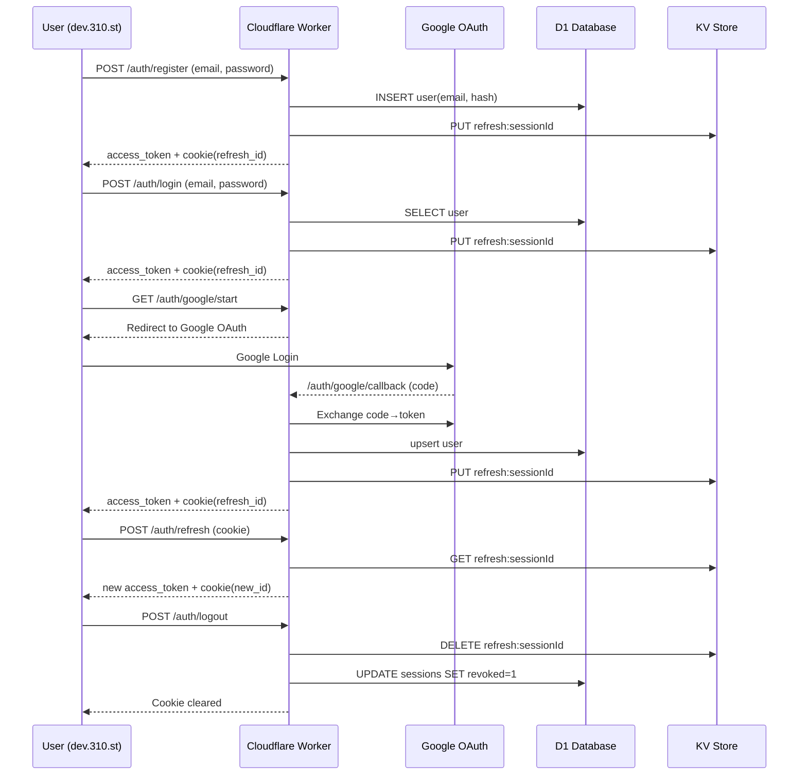
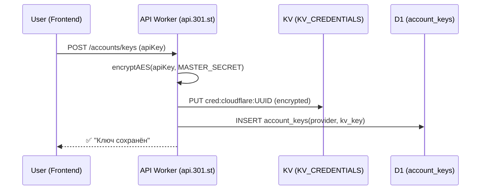
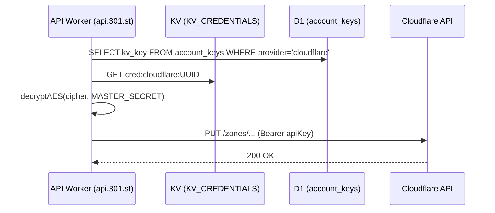
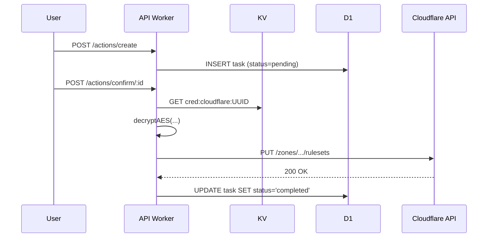

#  Безопасность и аутентификация в 301.st

## Введение

Система 301.st использует многоуровневую архитектуру безопасности:

* **Edge-уровень (Cloudflare Workers)** — фильтрация, проверка токенов, выдача сессий.
* **D1 (SQL)** — хранение пользователей и аудита.
* **KV** — хранение временных refresh-токенов и OAuth состояний.
* **R2** — резервное копирование логов и архивов.

Для аутентификации применяются два метода:

1. **Classic Auth** — email + пароль.
2. **OAuth 2.0 (Google Sign-In)** — безопасный вход через аккаунт Google.

Все запросы выполняются исключительно по HTTPS, все чувствительные данные передаются в защищённых cookie (`HttpOnly`, `Secure`, `SameSite=Lax`).

---

##  0. Подготовка

1. Зарегистрировать проект в **Google Cloud Console → OAuth 2.0 Client ID**
2. Redirect URI:

   ```
   https://api.301.st/auth/google/callback
   ```
3. Сохранить параметры в **Workers Secrets**:

   * `GOOGLE_CLIENT_ID`
   * `GOOGLE_CLIENT_SECRET`

---

##  1. Регистрация (Classic Sign-Up)

**Поток:**

1. Пользователь заполняет форму (`email + password`).
2. Фронт отправляет запрос:

   ```http
   POST /auth/register
   Content-Type: application/json
   {"email":"user@site.com","password":"secret123"}
   ```
3. Worker:

   * проверяет Turnstile (антибот);
   * проверяет уникальность e-mail (D1);
   * хэширует пароль:

     ```js
     const hash = await bcrypt.hash(password, 10);
     ```
   * сохраняет запись пользователя:

     ```sql
     INSERT INTO users (email, password_hash) VALUES (?, ?);
     ```
4. Создаёт refresh-токен, сохраняет в KV:

   ```js
   await env.KV_SESSIONS.put(`refresh:${sessionId}`, userId, { expirationTtl: 604800 });
   ```
5. Отправляет пользователю:

   * `access_token` (JWT, TTL 15 мин);
   * cookie:

     ```
     Set-Cookie: refresh_id=<sessionId>; HttpOnly; Secure; SameSite=Lax; Path=/; Max-Age=604800
     ```

## 🔹 Проверка Cloudflare Turnstile

### Назначение

Cloudflare Turnstile применяется в проекте **301.st** для защиты всех публичных форм регистрации, логина и восстановления доступа от автоматических ботов без необходимости показа капчи пользователю.

Turnstile работает полностью на стороне Cloudflare и не требует визуальных тестов — проверка проходит в фоновом режиме, не влияя на UX.

---

### Настройка и интеграция

#### Регистрация ключей

1. Перейти в панель Cloudflare → **Turnstile → Create Site**.
2. Выбрать тип интеграции **“Managed”**.
3. Указать домены:

   * `auth.301.st`
   * `api.301.st`
   * `dev.301.st`
4. Скопировать выданные ключи:

   * `TURNSTILE_SITE_KEY`
   * `TURNSTILE_SECRET`
5. Добавить их в **Workers Secrets**:

   ```bash
   npx wrangler secret put TURNSTILE_SITE_KEY
   npx wrangler secret put TURNSTILE_SECRET
   ```

---

##### Добавление на фронтенд (Webstudio)

На страницах **регистрации и логина** вставить HTML Embed:

```html
<div class="cf-turnstile" data-sitekey="YOUR_SITE_KEY" data-theme="light"></div>
```

Для SPA можно добавить через Custom Code в Project Settings Webstudio:

```html
<script src="https://challenges.cloudflare.com/turnstile/v0/api.js" async defer></script>
```

Формы `register` и `login` должны при отправке добавлять поле:

```js
const formData = {
  email, password,
  turnstile_token: document.querySelector('[name="cf-turnstile-response"]').value
};
```

---

#### Проверка на стороне Cloudflare Worker

```ts
const resp = await fetch("https://challenges.cloudflare.com/turnstile/v0/siteverify", {
  method: "POST",
  body: new URLSearchParams({
    secret: env.TURNSTILE_SECRET,
    response: form.turnstile_token,
    remoteip: client_ip
  }),
});
const data = await resp.json();
if (!data.success) return new Response("Bot verification failed", { status: 403 });
```

**Особенности:**

* Проверка выполняется **до обращения к D1** и перед созданием пользователя.
* TTL токена — **120 секунд**.
* При ошибке проверки возвращается HTTP 403.

---

##### Логика в рамках проекта

| Этап             | Действие                                         | Где выполняется         |
| ---------------- | ------------------------------------------------ | ----------------------- |
| Регистрация      | Проверка токена Turnstile перед валидацией email | Worker `/auth/register` |
| Логин            | Проверка Turnstile перед сверкой пароля          | Worker `/auth/login`    |
| Refresh / Logout | Turnstile не применяется (cookie авторизация)    | —                       |

**Преимущества:**

* Защита от спам-регистраций и брутфорса без нагрузки на пользователя.
* Не требует сторонних сервисов типа reCAPTCHA.
* Полностью совместим с Cloudflare Workers.

---

### Алгоритм регистрации пользователя с Turnstile

1. Пользователь вводит email и пароль в форме Webstudio.
2. Виджет Turnstile автоматически генерирует токен проверки.
3. Фронт отправляет `email`, `password`, `turnstile_token` на `/auth/register`.
4. Worker выполняет `siteverify` запрос к Turnstile API.
5. Если проверка успешна — создаётся пользователь в D1, хэш пароля (bcrypt) и KV-сессия.
6. Возвращается `access_token` (15 мин) и `refresh_id` cookie (7 дней).
7. Если проверка не прошла — ответ `403 Bot verification failed`.

---

**Turnstile** — обязательный элемент безопасности аутентификации в 301.st. Он интегрирован в Worker Flow и Webstudio UI, обеспечивает невидимую защиту от ботов и атак при регистрации и входе.


---

##  2. Логин (Classic Sign-In)

1. `POST /auth/login` (email, пароль)
2. Worker:

   * находит пользователя в D1;
   * сверяет хэш;
   * создаёт новую сессию в D1;
   * генерирует `access_token` и `refresh_id`.
3. Устанавливает cookie `refresh_id`.

---

##  3. OAuth Google Sign-In

### Шаг 1. Инициация

Фронт вызывает:

```js
window.location.href = "https://api.301.st/auth/google/start";
```

### Шаг 2. Перенаправление на Google

Worker:

```js
const redirect = new URL("https://accounts.google.com/o/oauth2/v2/auth");
redirect.search = new URLSearchParams({
  client_id: env.GOOGLE_CLIENT_ID,
  redirect_uri: "https://api.301.st/auth/google/callback",
  response_type: "code",
  scope: "openid email profile",
  state: crypto.randomUUID(),
});
await env.KV_SESSIONS.put(`oauth_state:${state}`, "1", { expirationTtl: 300 });
return Response.redirect(redirect.toString(), 302);
```

### Шаг 3. Callback от Google

```
GET /auth/google/callback?code=...&state=...
```

Worker:

1. проверяет `state` в KV;
2. обменивает `code` → `id_token`:

   ```js
   const token = await fetch("https://oauth2.googleapis.com/token", {...});
   ```
3. декодирует `id_token` → получает `email`, `name`, `sub`.

### Шаг 4. Проверка / создание пользователя

```js
const user = await env.DB301.prepare(
  "SELECT * FROM users WHERE google_sub=? OR email=?"
).bind(sub, email).first();

if (!user) {
  await env.DB301.prepare(
    "INSERT INTO users (email, google_sub, name) VALUES (?, ?, ?)"
  ).bind(email, sub, name).run();
}
```

### Шаг 5. Создание сессии

* создаётся `session` в D1;
* генерируются `access_token` (15 мин) и `refresh_id` (в KV, 7 дней);
* устанавливается cookie `refresh_id`;
* пользователь перенаправляется в панель 301.st.

---

##  4. Обновление токена (Refresh Flow)

1. `POST /auth/refresh`
2. Worker:

   * проверяет наличие `refresh:<id>` в KV;
   * если валиден — создаёт новый `access_token` и новый `refresh_id`;
   * удаляет старый refresh-токен.
3. Ответ:

   ```
   Set-Cookie: refresh_id=<new_id>; HttpOnly; Secure; SameSite=Lax; Path=/;
   ```

---

##  5. Logout / Revoke

`POST /auth/logout`

* Worker удаляет refresh-токен из KV;
* помечает сессию `revoked=1` в D1;
* очищает cookie:

  ```
  Set-Cookie: refresh_id=; Max-Age=0; Path=/;
  ```

---

##  6. Безопасность и TTL

| Объект         | Хранилище               | TTL       | Назначение               |
| -------------- | ----------------------- | --------- | ------------------------ |
| **Access JWT** | только в памяти клиента | 15 мин    | авторизация API-запросов |
| **Refresh ID** | KV + HttpOnly-cookie    | 7 дней    | продление сессии         |
| **Users**      | D1                      | постоянно | учётные записи           |
| **Sessions**   | D1                      | до отзыва | аудит и безопасность     |

---

##  7. Основные принципы защиты

* Пароли передаются только по HTTPS и хэшируются на Edge (bcrypt/scrypt).
* Токены не хранятся в `localStorage` или `sessionStorage`.
* Все cookie имеют флаги `HttpOnly`, `Secure`, `SameSite=Lax`.
* Ротация refresh-токенов при каждом обновлении (`rotation`).
* Возможность полного отзыва (`/auth/revoke_all`).
* Проверка и ротация ключей JWT (`kid`, JWKS).
* Rate-limit на `/auth/login` и `/auth/refresh`.
* Верификация пользователя через Cloudflare Turnstile.
* Логирование всех событий аутентификации (D1 + R2).

---

##  8. Диаграмма потоков



#  Security_Credentials

##  Назначение

Хранение и использование пользовательских API-ключей и других чувствительныех данных при взаимодействии с внешними сервисами (Cloudflare, регистраторы, аналитика и т.д.).

---

##  Общие принципы

1. **Ключи пользователей никогда не хранятся в открытом виде.**
2. **Secrets (Workers Secrets)** содержат только глобальные ключи проекта 301.st (например `MASTER_SECRET`), задаваемые разработчиком вручную через `wrangler secret put`.
3. Все пользовательские токены и API-ключи сохраняются только в **KV-хранилище** — в зашифрованном виде.
4. **D1 (SQL)** хранит только метаданные: тип ключа, статус, и ссылку на запись в KV.
5. Шифрование выполняется на Edge при помощи **AES-GCM (256 bit)** с использованием мастер-ключа из `Secrets`.

---

##  Архитектура хранения

| Слой | Хранилище               | Назначение                                        |
| ---- | ----------------------- | ------------------------------------------------- |
| 1  | **D1**                  | Метаданные (account_id, provider, kv_key, статус) |
| 2  | **KV (KV_CREDENTIALS)** | Зашифрованные токены и ключи                      |
| 3  | **Secrets (Workers)**   | Мастер-ключ шифрования `MASTER_SECRET`            |

---

##  Поток записи ключа



---

## Поток использования ключа



---

## Безопасность и политика хранения

| Механизм                  | Описание                                                             |
| ------------------------- | -------------------------------------------------------------------- |
| 🔸 **Шифрование на Edge** | AES-GCM 256 bit, ключ хранится только в Secrets                      |
| 🔸 **TTL / Rotation**     | Поддержка сроков действия и ротации ключей                           |
| 🔸 **Аудит**              | Все операции (создание, чтение, отзыв) логируются в D1 (`audit_log`) |
| 🔸 **Изоляция данных**    | Каждая запись привязана к `account_id` (multi-tenant)                |
| 🔸 **Удаление**           | При удалении аккаунта все KV-записи (`cred:*`) очищаются             |

---

## Поток акцепта команд

Когда пользователь инициирует операцию (например, деплой правил редиректа), система действует так:

1. API Worker создаёт запись в `tasks` (статус `pending`) и сохраняет JSON с изменениями.
2. Пользователь нажимает **Акцепт**, после чего воркер:

   * извлекает зашифрованный токен из KV;
   * расшифровывает его через `MASTER_SECRET`;
   * выполняет действие в Cloudflare API.
3. После успешного ответа задача помечается как `completed`, ключ в памяти уничтожается.



---

## ✅ Итоговые принципы

* Пользовательские API-ключи **никогда не хранятся в Secrets**.
* Хранятся в **KV** только в зашифрованном виде.
* Расшифровка и использование происходят **только на Edge** в момент вызова API.
* Все действия фиксируются в D1 для аудита и восстановления истории.

