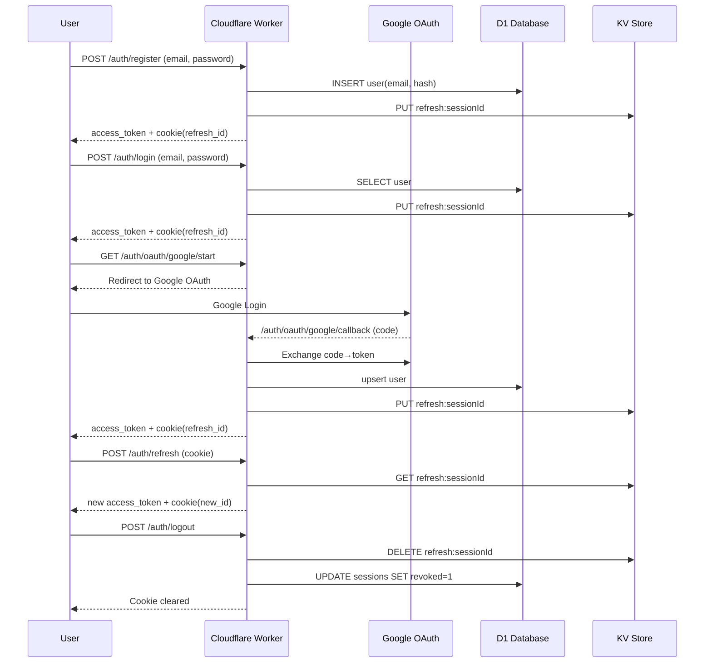
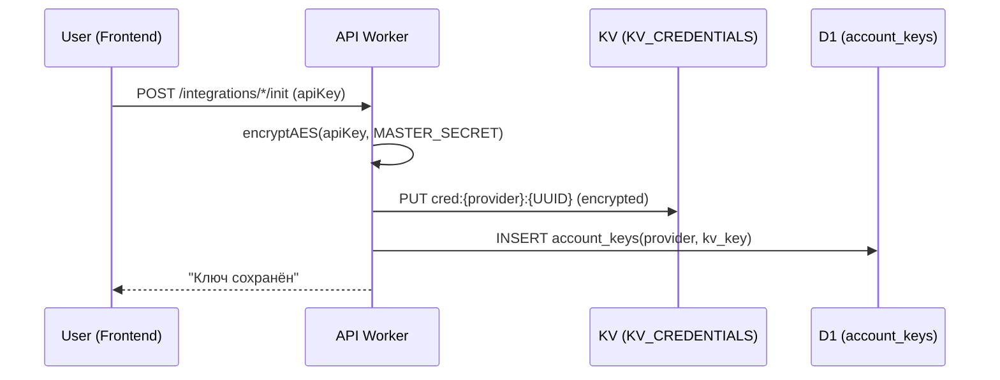
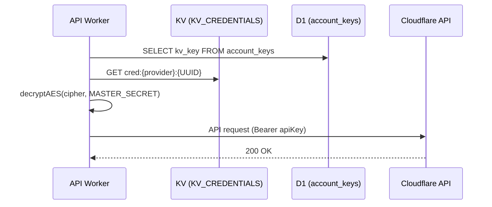

# Безопасность в 301.st

## 1. Принципы защиты

### Turnstile — первая линия защиты

Cloudflare Turnstile проверяется **до любых других операций**. Принцип: "ни один бот не должен пройти первую линию" — даже базовые ошибки валидации могут дать информацию для разведки.

**Порядок проверок:**
1. Turnstile (антибот)
2. Валидация входных данных
3. Проверка в БД
4. Бизнес-логика

### Разделение ответственности в коде

Утилиты безопасности вынесены в `src/lib/`:

**Auth-модули:**

| Модуль | Назначение |
|--------|------------|
| `lib/auth.ts` | Helper `requireAuth()` для защищённых endpoints |
| `lib/jwt.ts` | Подпись и верификация JWT |
| `lib/password.ts` | PBKDF2 хэширование паролей |
| `lib/session.ts` | Управление сессиями |
| `lib/fingerprint.ts` | JWT fingerprint (IP + UA) |
| `lib/turnstile.ts` | Проверка Turnstile токенов |
| `lib/omni_tokens.ts` | OmniFlow токены (register/reset) |

**Общие модули:**

| Модуль | Назначение |
|--------|------------|
| `lib/crypto.ts` | AES-GCM шифрование |
| `lib/cors.ts` | CORS middleware |

### OmniFlow (lib/omni_tokens.ts)

Универсальный механизм подтверждения критичных действий (register, reset). 

**Принцип работы:**
1. Создаётся токен с payload (type, identifier, channel, данные)
2. Токен сохраняется в KV с TTL 15 минут
3. Отправляется email/SMS со ссылкой или кодом
4. При верификации токен извлекается, проверяется, удаляется
5. Выполняется целевое действие (создание user, сброс пароля)

**Ключевые функции:**
- `createOmniToken()` — создание токена в KV
- `verifyOmniToken()` — проверка и извлечение payload
- `deleteOmniToken()` — удаление после использования

> **Note:** Login НЕ использует OmniFlow — только register и reset_password.

### Основные принципы

- **HTTPS only** — все запросы только по HTTPS
- **Токены в памяти** — access_token не хранится в localStorage/sessionStorage
- **HttpOnly cookies** — refresh_id недоступен из JavaScript
- **SameSite=Strict** — защита от CSRF
- **Multi-tenant изоляция** — все данные привязаны к `account_id`

---

## 2. Аутентификация

### 2.1 Classic Auth (email + password)

**Регистрация:**
1. Пользователь отправляет `email`, `password`, `turnstile_token`
2. Worker проверяет Turnstile
3. Проверяет уникальность email в D1
4. Хэширует пароль (PBKDF2, 100k iterations)
5. Создаёт user, account, membership
6. Генерирует access_token + refresh_cookie

**Логин:**
1. Пользователь отправляет `email`, `password`, `turnstile_token`
2. Worker проверяет Turnstile
3. Находит пользователя в D1
4. Сверяет хэш пароля
5. Создаёт сессию
6. Генерирует access_token + refresh_cookie

### 2.2 OAuth 2.0 (Google, GitHub)

**Google OAuth:**
1. `GET /auth/oauth/google/start` — редирект на Google
2. Пользователь авторизуется в Google
3. `GET /auth/oauth/google/callback` — обмен code → id_token
4. Верификация id_token через Google JWKS
5. Создание/обновление пользователя
6. Генерация access_token + refresh_cookie

**GitHub OAuth:**
1. `GET /auth/oauth/github/start` — редирект на GitHub
2. Пользователь авторизуется в GitHub
3. `GET /auth/oauth/github/callback` — обмен code → access_token
4. Запрос профиля `/user` и email `/user/emails`
5. Создание/обновление пользователя
6. Генерация access_token + refresh_cookie

**Важно:** GitHub не поддерживает PKCE — используется только `state` для CSRF protection.

### 2.3 Account Linking

Если пользователь:
1. Зарегистрировался с email + password
2. Позже вошёл через OAuth с тем же email

Система автоматически связывает аккаунты:
- Обновляет `oauth_provider` и `oauth_id` в users
- Пользователь получает **два способа входа**
- Существующие данные сохраняются

---

## 3. Сессии и токены

### JWT Access Token

| Параметр | Значение |
|----------|----------|
| TTL | 15 минут |
| Хранение | Только в памяти клиента |
| Алгоритм | HS256 |
| Подпись | Ключ из `jwt_keys` (D1) |

**Структура payload:**
```json
{
  "sub": 5,
  "type": "client",
  "fp": "a1b2c3...",
  "iat": 1234567890,
  "exp": 1234568790
}
```

| Поле | Описание |
|------|----------|
| `sub` | user_id |
| `type` | user_type (client / admin) |
| `fp` | fingerprint hash |
| `iat` | issued at |
| `exp` | expires at |

> **Note:** `active_account_id` и `role` возвращаются в ответе API, но не включаются в JWT payload.

### Fingerprint

JWT содержит хэш fingerprint для защиты от кражи токена:
```
fingerprint = SHA256(IP + User-Agent)
```

При каждом запросе сравнивается fingerprint из токена с текущим. Несовпадение → 401.

### Refresh Cookie

| Параметр | Значение |
|----------|----------|
| TTL | 7 дней |
| Хранение | KV (`refresh:{session_id}`) + HttpOnly cookie |
| Флаги | `HttpOnly; Secure; SameSite=Strict; Path=/` |

### Ротация ключей JWT

Ключи хранятся в таблице `jwt_keys` (D1):
- `status`: active / revoked
- `kid`: идентификатор ключа
- Зашифрованы `MASTER_SECRET`

Фоновая задача `jobs/rotate_keys.ts` выполняет ротацию.

---

## 4. Identity Flows

### Общая диаграмма



### Refresh Flow

1. `POST /auth/refresh` с cookie `refresh_id` (HttpOnly, отправляется автоматически)
2. Worker проверяет `refresh:{id}` в KV
3. Проверяет fingerprint
4. Генерирует новый access_token
5. Ротирует refresh_id (новый UUID)
6. Удаляет старый refresh из KV

### Logout Flow

1. `POST /auth/logout`
2. Удаление refresh из KV
3. Пометка сессии `revoked=1` в D1
4. Очистка cookie: `Set-Cookie: refresh_id=; Max-Age=0`

### Password Reset Flow

1. `POST /auth/reset_password` — запрос сброса
2. Проверка Turnstile
3. Генерация токена, сохранение в KV (TTL 1 час)
4. Отправка email со ссылкой
5. `POST /auth/confirm_password` — установка нового пароля
6. Проверка токена + CSRF
7. Обновление password_hash в D1
8. Инвалидация всех сессий пользователя

**Важно:** Для OAuth-only пользователей (без пароля) reset_password возвращает ошибку.

---

## 5. Хранение секретов

### Архитектура

| Слой | Хранилище | Назначение |
|------|-----------|------------|
| 1 | **D1** | Метаданные (account_id, provider, kv_key, статус) |
| 2 | **KV** | Зашифрованные токены и ключи |
| 3 | **Secrets** | Мастер-ключ `MASTER_SECRET` |

### Принципы

1. **Ключи пользователей никогда не хранятся в открытом виде**
2. **Workers Secrets** — только глобальные ключи платформы
3. **Пользовательские токены** — только в KV, зашифрованы
4. **D1** — только метаданные и ссылки на KV
5. **Шифрование** — AES-GCM 256 bit

### Поток записи ключа



### Поток использования ключа



### Безопасность хранения

| Механизм | Описание |
|----------|----------|
| **Шифрование на Edge** | AES-GCM 256 bit |
| **TTL / Rotation** | Поддержка сроков действия |
| **Аудит** | Все операции в `audit_log` |
| **Изоляция** | Привязка к `account_id` |
| **Удаление** | При удалении аккаунта очищаются KV-записи |

---

## 6. Защита API

### CORS Policy

Разрешённые origins:
- `https://api.301.st`
- `https://301.st`
- `https://301st.pages.dev`
- `http://localhost:8787` (dev)
- `http://localhost:3000` (dev)

### Rate Limiting

| Endpoint | Лимит |
|----------|-------|
| `/auth/login` | 5 req/min per IP |
| `/auth/register` | 3 req/min per IP |
| `/auth/reset_password` | 3 req/hour per email |
| `/auth/refresh` | 10 req/min per session |

### Коды ошибок безопасности

| Код | error | Описание |
|-----|-------|----------|
| 401 | `token_expired` | Access token истёк |
| 401 | `token_invalid` | Невалидная подпись |
| 401 | `fingerprint_mismatch` | IP/UA изменился |
| 401 | `session_revoked` | Сессия отозвана |
| 403 | `turnstile_failed` | Не прошёл проверку бота |
| 403 | `csrf_invalid` | Невалидный CSRF токен |
| 429 | `rate_limit` | Превышен лимит запросов |

---

## 7. Workers Secrets (справочник)

### Установка

```bash
npx wrangler secret put MASTER_SECRET
npx wrangler secret put GOOGLE_CLIENT_ID
npx wrangler secret put GOOGLE_CLIENT_SECRET
npx wrangler secret put GITHUB_CLIENT_ID
npx wrangler secret put GITHUB_CLIENT_SECRET
npx wrangler secret put TURNSTILE_SECRET
npx wrangler secret put EMAIL_API_KEY
npx wrangler secret put TG_BOT_TOKEN
```

### Использование в коде

| Переменная | Назначение |
|------------|------------|
| `env.MASTER_SECRET` | Шифрование ключей (AES-GCM) |
| `env.GOOGLE_CLIENT_ID` | OAuth Google |
| `env.GOOGLE_CLIENT_SECRET` | OAuth Google |
| `env.GITHUB_CLIENT_ID` | OAuth GitHub |
| `env.GITHUB_CLIENT_SECRET` | OAuth GitHub |
| `env.TURNSTILE_SECRET` | Верификация Turnstile |
| `env.TURNSTILE_SITEKEY` | Turnstile (public) |
| `env.EMAIL_API_KEY` | MailerSend API |
| `env.EMAIL_FROM` | Адрес отправителя |
| `env.TG_BOT_TOKEN` | Telegram Bot |

---

## 8. Turnstile (детали реализации)

### Настройка

1. Cloudflare Dashboard → Turnstile → Create Site
2. Тип: **Managed**
3. Домены: `301.st`, `api.301.st`
4. Сохранить `TURNSTILE_SITE_KEY` и `TURNSTILE_SECRET`

### Frontend интеграция

```html
<script src="https://challenges.cloudflare.com/turnstile/v0/api.js" async defer></script>
<div class="cf-turnstile" data-sitekey="YOUR_SITE_KEY"></div>
```

```javascript
const formData = {
  email,
  password,
  turnstile_token: document.querySelector('[name="cf-turnstile-response"]').value
};
```

### Backend проверка

```typescript
const resp = await fetch("https://challenges.cloudflare.com/turnstile/v0/siteverify", {
  method: "POST",
  body: new URLSearchParams({
    secret: env.TURNSTILE_SECRET,
    response: turnstile_token,
    remoteip: client_ip
  }),
});
const data = await resp.json();
if (!data.success) {
  return c.json({ ok: false, error: "turnstile_failed" }, 403);
}
```

### Где применяется

| Endpoint | Turnstile |
|----------|-----------|
| `POST /auth/register` | ✅ |
| `POST /auth/login` | ✅ |
| `POST /auth/reset_password` | ✅ |
| `POST /auth/refresh` | ❌ |
| `POST /auth/logout` | ❌ |
| `GET /auth/oauth/*/start` | ❌ |

---

## 9. Безопасность на стороне UI

> **Аудитория:** Frontend-разработчики

### 9.1 Хранение access_token

| ✅ Разрешено | ❌ Запрещено |
|-------------|-------------|
| Vuex / Pinia (Vue) | localStorage |
| Redux / Zustand (React) | sessionStorage |
| Svelte stores | IndexedDB |
| Переменная в памяти | URL параметры |
| | Cookies (только refresh!) |

### 9.2 Хранение CSRF токена

| ✅ Разрешено | ❌ Запрещено |
|-------------|-------------|
| Переменная в памяти | localStorage |
| React/Vue state | Cookies |
| | URL параметры |

### 9.3 Session Hijacking — реакция UI

При получении ошибки `session_hijack_detected`:
1. Очистить access_token из памяти
2. Показать предупреждение о подозрительной активности
3. Redirect на login
4. Предложить сменить пароль

### 9.4 OTP Flow — требования

| Действие | Поведение |
|----------|-----------|
| Отправка OTP | Блокировать кнопку на 60 сек |
| Ввод кода | Максимум 6 цифр, auto-submit |
| Истёк токен | Показать "Запросить новую ссылку" |
| 3 неверных кода | Предложить запросить новый |

© 301.st — Security Documentation

