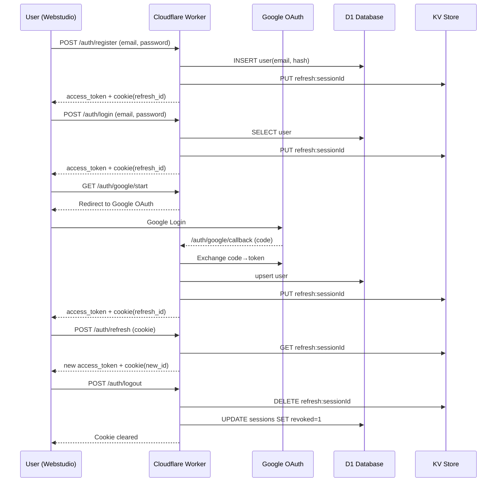

# 🔒 Безопасность и аутентификация в 301.st

## 📘 Введение

Система 301.st использует многоуровневую архитектуру безопасности:

* **Edge-уровень (Cloudflare Workers)** — фильтрация, проверка токенов, выдача сессий.
* **D1 (SQL)** — хранение пользователей и аудита.
* **KV** — хранение временных refresh-токенов и OAuth состояний.
* **R2** — резервное копирование логов и архивов.

Для аутентификации применяются два метода:

1. **Classic Auth** — email + пароль.
2. **OAuth 2.0 (Google Sign-In)** — безопасный вход через аккаунт Google.

Все запросы выполняются исключительно по HTTPS, все чувствительные данные передаются в защищённых cookie (`HttpOnly`, `Secure`, `SameSite=Lax`).

---

## ⚙️ 0. Подготовка

1. Зарегистрировать проект в **Google Cloud Console → OAuth 2.0 Client ID**
2. Redirect URI:

   ```
   https://api.301.st/auth/google/callback
   ```
3. Сохранить параметры в **Workers Secrets**:

   * `GOOGLE_CLIENT_ID`
   * `GOOGLE_CLIENT_SECRET`

---

## 🧩 1. Регистрация (Classic Sign-Up)

**Поток:**

1. Пользователь заполняет форму (`email + password`) на Webstudio.
2. Фронт отправляет запрос:

   ```http
   POST /auth/register
   Content-Type: application/json
   {"email":"user@site.com","password":"secret123"}
   ```
3. Worker:

   * проверяет Turnstile (антибот);
   * проверяет уникальность e-mail (D1);
   * хэширует пароль:

     ```js
     const hash = await bcrypt.hash(password, 10);
     ```
   * сохраняет запись пользователя:

     ```sql
     INSERT INTO users (email, password_hash) VALUES (?, ?);
     ```
4. Создаёт refresh-токен, сохраняет в KV:

   ```js
   await env.KV_SESSIONS.put(`refresh:${sessionId}`, userId, { expirationTtl: 604800 });
   ```
5. Отправляет пользователю:

   * `access_token` (JWT, TTL 15 мин);
   * cookie:

     ```
     Set-Cookie: refresh_id=<sessionId>; HttpOnly; Secure; SameSite=Lax; Path=/; Max-Age=604800
     ```

---

## 🔑 2. Логин (Classic Sign-In)

1. `POST /auth/login` (email, пароль)
2. Worker:

   * находит пользователя в D1;
   * сверяет хэш;
   * создаёт новую сессию в D1;
   * генерирует `access_token` и `refresh_id`.
3. Устанавливает cookie `refresh_id`.

---

## 🌐 3. OAuth Google Sign-In

### Шаг 1. Инициация

Фронт вызывает:

```js
window.location.href = "https://api.301.st/auth/google/start";
```

### Шаг 2. Перенаправление на Google

Worker:

```js
const redirect = new URL("https://accounts.google.com/o/oauth2/v2/auth");
redirect.search = new URLSearchParams({
  client_id: env.GOOGLE_CLIENT_ID,
  redirect_uri: "https://api.301.st/auth/google/callback",
  response_type: "code",
  scope: "openid email profile",
  state: crypto.randomUUID(),
});
await env.KV_SESSIONS.put(`oauth_state:${state}`, "1", { expirationTtl: 300 });
return Response.redirect(redirect.toString(), 302);
```

### Шаг 3. Callback от Google

```
GET /auth/google/callback?code=...&state=...
```

Worker:

1. проверяет `state` в KV;
2. обменивает `code` → `id_token`:

   ```js
   const token = await fetch("https://oauth2.googleapis.com/token", {...});
   ```
3. декодирует `id_token` → получает `email`, `name`, `sub`.

### Шаг 4. Проверка / создание пользователя

```js
const user = await env.DB301.prepare(
  "SELECT * FROM users WHERE google_sub=? OR email=?"
).bind(sub, email).first();

if (!user) {
  await env.DB301.prepare(
    "INSERT INTO users (email, google_sub, name) VALUES (?, ?, ?)"
  ).bind(email, sub, name).run();
}
```

### Шаг 5. Создание сессии

* создаётся `session` в D1;
* генерируются `access_token` (15 мин) и `refresh_id` (в KV, 7 дней);
* устанавливается cookie `refresh_id`;
* пользователь перенаправляется в панель 301.st.

---

## ♻️ 4. Обновление токена (Refresh Flow)

1. `POST /auth/refresh`
2. Worker:

   * проверяет наличие `refresh:<id>` в KV;
   * если валиден — создаёт новый `access_token` и новый `refresh_id`;
   * удаляет старый refresh-токен.
3. Ответ:

   ```
   Set-Cookie: refresh_id=<new_id>; HttpOnly; Secure; SameSite=Lax; Path=/;
   ```

---

## 🚪 5. Logout / Revoke

`POST /auth/logout`

* Worker удаляет refresh-токен из KV;
* помечает сессию `revoked=1` в D1;
* очищает cookie:

  ```
  Set-Cookie: refresh_id=; Max-Age=0; Path=/;
  ```

---

## 🧱 6. Безопасность и TTL

| Объект         | Хранилище               | TTL       | Назначение               |
| -------------- | ----------------------- | --------- | ------------------------ |
| **Access JWT** | только в памяти клиента | 15 мин    | авторизация API-запросов |
| **Refresh ID** | KV + HttpOnly-cookie    | 7 дней    | продление сессии         |
| **Users**      | D1                      | постоянно | учётные записи           |
| **Sessions**   | D1                      | до отзыва | аудит и безопасность     |

---

## 🔐 7. Основные принципы защиты

* Пароли передаются только по HTTPS и хэшируются на Edge (bcrypt/scrypt).
* Токены не хранятся в `localStorage` или `sessionStorage`.
* Все cookie имеют флаги `HttpOnly`, `Secure`, `SameSite=Lax`.
* Ротация refresh-токенов при каждом обновлении (`rotation`).
* Возможность полного отзыва (`/auth/revoke_all`).
* Проверка и ротация ключей JWT (`kid`, JWKS).
* Rate-limit на `/auth/login` и `/auth/refresh`.
* Верификация пользователя через Cloudflare Turnstile.
* Логирование всех событий аутентификации (D1 + R2).

---

## 🧭 8. Диаграмма потоков




